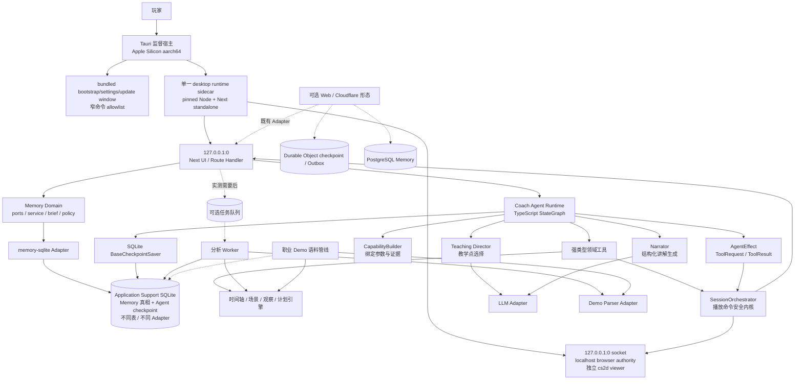
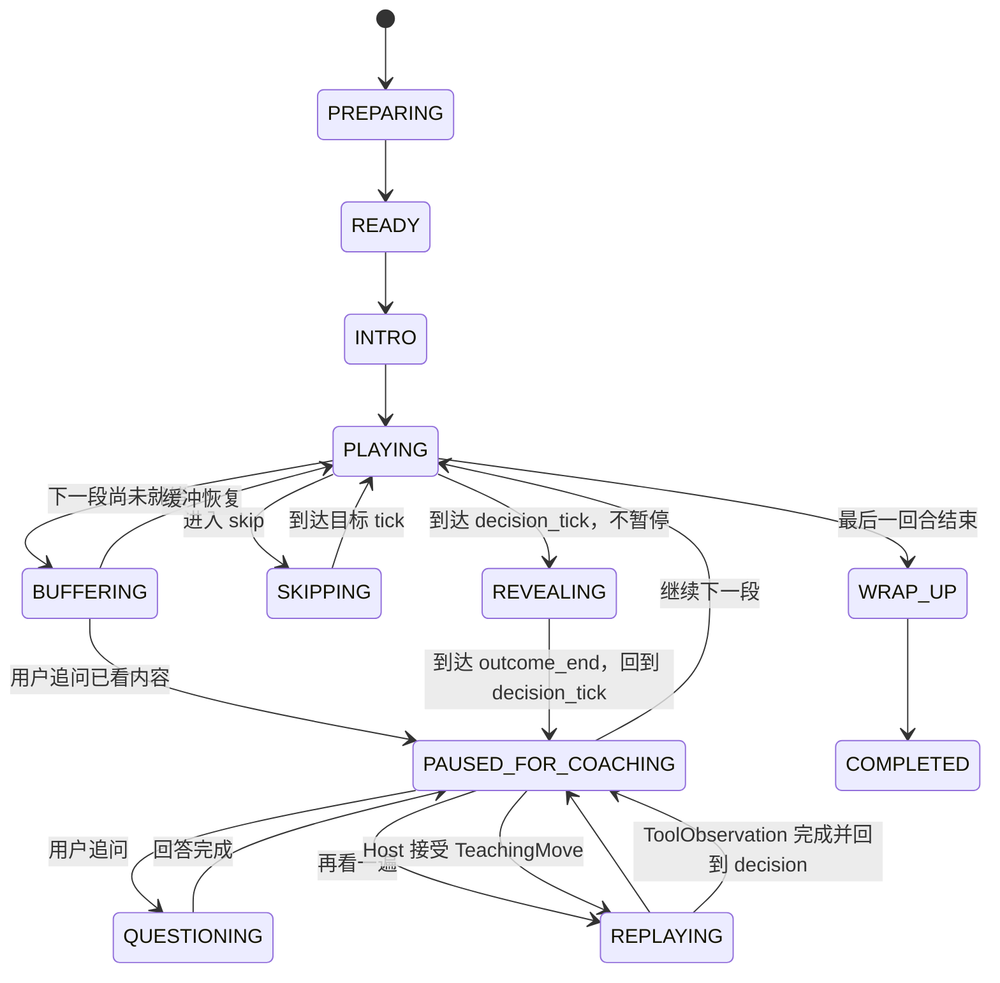
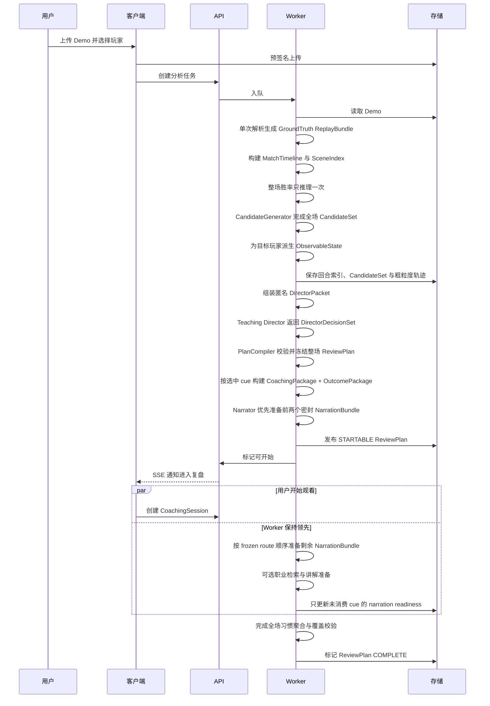

# CS2 AI Demo Coach 长期架构设计

> **文档状态：长期维护、架构唯一事实来源（Normative）**
> 版本：5.2.0
> 最后更新：2026-08-31
> 适用范围：Web 2D 到桌面端长期产品
> 产品定义：[PRD.md](./PRD.md)
> 当前产品范围：[MVP_SCOPE.md](./MVP_SCOPE.md)

## 0. 文档治理

### 0.1 维护责任

本文是项目唯一要求持续维护的设计文档。PRD 和产品范围文档用于产品范围，完成后可以冻结或归档；它们不覆盖本文的架构契约。

下列变化合并前必须更新本文，重大取舍同时新增 ADR：

- 改变核心领域模块、运行单元或信任边界；
- 改变标准时间轴、复盘计划、讲解点、播放器或个人记忆契约；
- 改变数据库、对象存储、队列、缓存或本地存储；
- 改变模型、规则、职业语料和 LLM 的职责；
- 增加新的播放载体，例如本地 CS2 Demo 控制；
- 改变隐私、版权、安全、数据保留和版本复现策略。

版本规则：Patch 用于澄清；Minor 用于兼容性扩展；Major 用于改变系统边界或不兼容契约。ADR 存放于 `/docs/adr/ADR-NNNN-title.md`，已接受的 ADR 不覆盖，使用后续 ADR 取代。

### 0.2 长期契约与实现记录分离

长期契约包括：事实模型、观察信息边界、教学决策与讲解的职责、`ReviewPlan`/`CoachingSession`/播放器协议、状态机、版本化和验证规则。实现可以替换，只要继续满足这些契约。

以下内容不是长期架构事实，只能出现在“当前实现快照”、ADR 或代码文档中：具体上游 commit、CSS 尺寸/颜色/镜头倍率、当前测试 Demo 的数量，以及迁移期间保留的旧 renderer 或某次迁移的规则实现。模块化单体、浏览器 Worker、内容寻址事实、可恢复的 LangGraph Checkpoint、桌面适配器和 Memory Domain 属于长期能力边界。

运行形态必须显式区分：Web/Cloudflare 形态可继续使用 Durable Object checkpoint、PostgreSQL Memory 和 Cloudflare 部署 Adapter；Apple Silicon 桌面形态默认使用 Tauri 监督宿主、自包含 Node/Next sidecar、同一 SQLite 文件中的独立 Memory 与 checkpoint Adapter，不要求 Cloudflare、Durable Object 或 PostgreSQL。两种 Adapter 都满足既有领域 interface；任何部署产品都不得成为 Parser、Renderer、`CoachingSession` reducer 或 Memory Domain 的第二实现。LangGraph 是 CoachingRuntime 的长期编排边界，不是这些领域模块的替代品。

[ADR-0007](./docs/adr/ADR-0007-local-first-tauri-desktop.md) 保留桌面架构在实现前的冻结历史；[ADR-0008](./docs/adr/ADR-0008-desktop-runtime-implementation-amendments.md) 记录首次实现修订；[ADR-0009](./docs/adr/ADR-0009-ipv4-loopback-browser-authorities.md) 进一步取代其中 `[::1]` Viewer、宽 `frame-src` 与 Ready v1 的具体细节。当前架构事实以本文、ADR-0008 未被取代部分和 ADR-0009 为准。

### 0.3 架构审查问题

任何重要变更必须能回答：

1. 是否仍以“带用户过 Demo 的会话”为主产品，而非退化为报告生成？
2. 每个讲解能否追溯到 Demo 事实、教练规则或职业证据？
3. 决策讲解是否泄漏了玩家当时不可能知道的信息？
4. 同一输入和同一版本能否复现时间轴、复盘路线和结构化事实？
5. 新播放器是否无需改写分析内核和讲解协议？
6. 个人记忆是否由用户控制、默认关闭云同步且可以删除？
7. 是否增加了个人开发者不必要的基础设施和运维负担？

## 1. 架构目标

系统核心不是“大模型读 Demo 后写分析”，而是把比赛事实编排成一场可执行、可追问、可恢复的复盘会话：

```text
Demo
  → 单次解析的 GroundTruth ReplayBundle
  → 回合场景索引与 ObservableState
  → Deterministic CandidateGenerator 产生 CandidateSet
  → Teaching Director 从 CandidateSet 选择教学候选
  → PlanCompiler 生成并校验 ReviewPlan
  → Narrator 根据分离的 CoachingPackage 与 OutcomePackage 构建密封讲解
  → 播放器执行＋SessionOrchestrator 主持
  → Coach Agent 在完成的 cue 内从合法 TeachingCapability 选择至多一个附加演示
  → 用户追问、回看与交互
  → SessionTheme 聚合与有引用的会后总结
  → Memory Service 生成候选、授权后写入长期个人记忆（可选）
```

优先级从高到低：

1. 时间轴和回放事实正确；
2. Teaching Director 选择的教学时刻可解释且可复现；
3. Narrator 的讲解只使用允许的决策侧证据；
4. 复盘会话连贯，关键时刻讲得清楚；
5. 播放载体可从 Web 2D 演进到本地 CS2；
6. 个人开发者可实现、测试和运维；
7. 长期记忆、学习模型和规模扩展。

## 2. 架构不变量

### 2.1 会话是主产物

`ReviewPlan` 和 `CoachingSession` 是核心领域对象。会后总结是已完成会话的派生产物，不得用一组问题卡或静态报告替代带看流程。

### 2.2 完整覆盖，显式跳过

复盘计划必须无缝覆盖从第一回合开始到最后一回合结束的比赛时间。每段都有明确处理方式和原因；跳过只能缩短观看时间，不能在产品上伪装成未发生。`FREEZE_TIME` 等完全确定、没有用户选择价值的系统等待段由 `SessionOrchestrator` 自动消费，不向用户询问，但仍保留在 `ReviewPlan` 覆盖和会话事件日志中；基于教学价值判断的普通 `SKIP` 仍显式说明原因并允许展开。

### 2.3 播放器与分析解耦

分析层只面向标准时间轴、`PlaybackPort` 和 `AnnotationPort`。在线 2D、本地 CS2 Demo 或未来视频播放器都只是适配器，不能拥有独立的教学逻辑。

### 2.4 完整处理先播放，结果结束后讲解

讲解点区分 `decision_tick`、`reveal_tick` 和 `outcome_range`，并满足 `decision_tick <= outcome_start_tick < reveal_tick <= outcome_end_tick`。播放器从决策点前约 1 秒进入片段，不在决策前暂停，也不要求用户先猜；它连续播放用户的真实选择与结果，到达 `outcome_end_tick` 后自动暂停并回到 `decision_tick`，再一次性展示三段式复盘：`当前状态`、`这样做的问题（动作、风险与结果）`、`可以怎么改进`。内部仍保留可验证动作、核心问题、替代处理和结果影响的独立引用字段，不因 UI 合并而串线。在结果窗口完成前，任何用户可见讲解与问答都不得泄漏结果；决策侧判断始终只能读取 `decision_tick` 之前的 `ObservableState`。前置上下文和自动回看不得改变这些事实时间边界。

`OutcomeCompletionGate` 是**呈现授权**，不是后台计算授权。最终 Narrator 可以在用户播放前读取严格分离、已校验的 `CoachingPackage` 与 `OutcomePackage`，提前生成密封的 `NarrationBundle`；该 bundle 在 gate 完成前只能处于 `PREPARED`，Host、问答、总结和可见事件不得读取其正文。播放器确认到达 `outcome_end_tick` 后，Session 才把对应 bundle 标记为 `PRESENTABLE`。字段级引用防火墙仍保证当前情况和建议不以结果倒推玩家当时的认知。

### 2.5 事实、推断、建议分层

- `Fact`：Demo 可直接验证；
- `Inference`：已知信息、意图、角色、危险程度等带置信度的判断；
- `Advice`：在事实和推断基础上的替代选择；
- `Evidence`：职业样本、规则或历史习惯依据。

四者分别存储并引用稳定 ID。CandidateGenerator 只提名可验证窗口；Teaching Director 只能返回候选 ID、一个主要教学重点、优先级和理由引用；Narrator 可以组织和构建讲解，但不能创造事实、样本、数值、建议语义或引用。所有模型输出都必须经过 Schema、引用和时间边界校验。

### 2.6 回放全知显示与教练证据边界

浏览器主地图始终显示 cs2d 在当前 canonical tick 的全知事实：双方位置、存活、装备、道具、C4、投掷物和事件不因会话阶段隐藏，也不向用户暴露“玩家已知 / 全知”模式切换。地图的职责是让用户看懂教练正在讲哪一段，不承担信息考试或 POV 模拟。

教学判断仍必须遵守独立的 `ObservableState` 边界。`.dem` 只完整解析一次，Adapter 从同一份结构化 Replay 派生 `MatchTimeline`、场景索引和 `ObservableState`，再由 CandidateGenerator、Teaching Director 与 PlanCompiler 生成冻结的 `ReviewPlan`，不得二次解析 Demo，也不得把全知敌人坐标送入 decision_context 或建议字段。地图显示全知不等于教练可以使用全知推理。

`ObservableState` 不是“可见圆”或 `observed: boolean`，也不是用户可见的第二套 renderer 输入。它是内部证据白名单，由带时间、来源、空间精度、身份精度、置信度和过期规则的 `ObservationClaim` 组成：直视可以形成较精确位置；脚步、枪声和伤害方向通常只形成区域或方向信息；最后已知位置随时间衰减；队友看见不自动等于所选玩家知道。Director 可以使用完整回合来判断教学价值，但其输出只能引用候选和证据 ID；Narrator 的 `CoachingPackage.decision_context` 只能引用 decision tick 之前的 claim/fact。Outcome Fact 单独标记为 `OUTCOME`，不进入 observable refs 或 decision_context；它只进入独立 OutcomePackage，并且只在播放器确认完成结果区间后进入用户可见解释。

### 2.7 原始数据不可变，派生物版本化

原始 Demo 按内容哈希寻址且不原地修改。解析器、地图、信息重建、局面检测、计划编排、职业检索、讲解模板、Prompt、模型和总结均独立版本化。

### 2.8 结构化事实优先，LLM 负责教学判断与表达

Parser、SceneIndex、ObservationBuilder、CandidateGenerator 和 PlanCompiler 先提供可追溯的结构化事实与执行计划。Director LLM 在受限候选摘要上判断教学价值；Narrator LLM 只对 PlanCompiler 已锁定的候选和主要重点，在分离的 `CoachingPackage`/`OutcomePackage` 上构建结构化讲解。模型不能读取原始 Demo、任意数据库或直接控制播放器。学习排序器、视觉模型和端到端模型只能替换明确的 Director 子模块，并且必须有黄金集、版本、回滚和确定性校验。

### 2.9 长期记忆用户控制与部署内唯一真相

长期记忆由独立 `Memory Domain` 管理，真相源按运行形态唯一：桌面默认是 Application Support 下的 SQLite；Web/Cloudflare 保留 PostgreSQL Adapter。两者都实现既有 `MemoryRepository`/`AuthorizationStore` interface，同一运行实例不得同时把两个 Adapter 当作真相源。Host Recovery、Session 快照、Agent checkpoint 和浏览器缓存都不是长期记忆库。Memory 默认关闭，且 principal 必须明确 consent opt-in；任一门关闭时不执行教学 recall、proposal、embedding 或 write/outbox。撤回后仅保留最小化的隐私删除通道（只枚举 opaque memory ID，不把内容重新召回）。

单 cue 诊断首先只能形成 `CANDIDATE` proposal。至少两个不同 Demo content hash 的证据或用户明确确认后，才可形成跨 Demo active memory。用户可以查看来源、置信度和限制，提交纠正或删除；纠正产生不可变 revision，删除产生 tombstone，迟到事件不得复活记录。记忆只能影响教学模式、候选优先级和习惯复查，不能改写当前 Demo 的事实、canonical tick、Outcome Gate、ReviewPlan 顺序或 Session 状态机。

Web 匿名 principal 使用服务端生成的 opaque cookie；桌面在 sidecar 已验证 `cs_agent_runtime` cookie 的单用户 loopback 边界使用稳定、非 secret 的本地 principal，不读取云端签名 secret，也不签发第二个身份 cookie。macOS Keychain 只保存 Provider API Key 等运行 secret。内部 `userId` 只存在于授权、Memory Event 和当前 Memory Adapter，不加入既有 `CoachAgentIdentity`，不进入 Director/Narrator/Coach Policy 输入。Web 清 cookie 不恢复该 principal；正式认证另行建模。

### 2.10 模块化单体优先

在有量化扩展信号前，服务端采用模块化单体加异步 Worker，不使用微服务或 Kubernetes。模块边界通过契约和测试维持，而不是通过网络拆分。

### 2.11 渐进式就绪

用户无需等待整场讲解全部完成。上传结束后系统先完成整场快速索引和廉价 CandidateSet，再由 Director 与 PlanCompiler 一次性冻结整场路线；前 `min(2, cue_count)` 个候选的 NarrationBundle 达到 `READY` 或可追溯 `FALLBACK` 即可启动会话，后续候选按播放顺序在后台持续准备。

渐进式就绪不降低事实门槛：CandidateSet 未完整索引时不能调用 Director；ReviewPlan 未经 PlanCompiler 校验和冻结时不能启动。后台只允许为未消费 cue 补充 narration，不得重排、增删或改写 segment、cue、canonical tick、主要教学重点和引用集合；用户开始观看的 cue 立即冻结。缓冲追上准备头时停在自然 segment 边界，进入显式 `BUFFERING`，优先准备下一个 cue 后自动恢复。未知或失败区间不得被当成低价值 `SKIP`。

### 2.12 Coach Agent 的受限自主性

Coach Agent 只在 `ReviewPlan` 已冻结、完整 outcome 已播放、`OutcomeCompletionGate=COMPLETE` 且 `NarrationBundle` 已可呈现后决定“是否需要一个额外视觉演示，以及选择哪一个”。它不能生成或修改 candidate、segment、顺序、canonical tick、主要教学重点、NarrationBundle、事实或引用，也不能直接写 React state、播放器 tick 或 `CoachingSession.phase`。

确定性的 `CapabilityBuilder` 根据当前 cue 与合法证据预先绑定 `TeachingCapability` 的全部参数；Policy 只能返回已有 `capabilityId` 或 `FINISH_CUE`。普通回合、`FREEZE_TIME`、确定性 `SKIP`、播放器自然推进和只有规则能唯一决定的动作不调用 Policy LLM。每个 cue 默认最多一个成功 `TeachingMove`；工具失败后最多尝试一个不同的合法替代，预算耗尽后确定性结束 cue。

Graph 通过 `AgentEffect` 请求 Host 执行外部动作。Host 必须重新校验当前 session/cue/gate/播放事实、按稳定 `callId` 去重并把结构化 `ToolObservation` 返回 Graph；Graph 不直接操作 iframe。播放桥丢失、用户自由跳转或取消时停在自然边界，旧 ToolResult、Narration 或 READY 事件不得继续推进已经失效的 run。Agent 失败永远不能阻断基础回放。

Coach Agent、Director、Narrator 和 Policy 没有长期记忆写权限。它们最多产生受限、可审计的 `MemoryProposal`；Memory Service 负责授权、跨 Demo 晋级、纠正/删除策略，当前运行形态的 Adapter 负责唯一写入（桌面 `memory-sqlite`，Web `memory-postgres`）。Memory sink 或 Brief 故障必须回退 Baseline，不得阻断 Session 或 Outcome Gate。

### 2.13 重新选择同一 Demo 后恢复

页面刷新或关闭不会持久化 Replay；用户重新进入时，浏览器如果找到未完成 `SessionRecoveryRecord`，只能先进入 `DORMANT` 并提示重新选择同一 Demo。`ReplayAvailability=ABSENT/LOADING` 时不得调用 Director、Narrator、Coach Policy 或推进 Graph。用户选择的 File 继续只进入 cs2d iframe/Worker，由它在浏览器内计算 SHA-256 并解析；File、Demo bytes、raw Replay 与 frames 不进入 Host record、Durable Object 或网络请求。

恢复采用双状态 `RecoveryHandshake`：浏览器 Host Recovery Store 拥有冻结 `ReviewPlan`、合法 Session 进度、讲解产物和工具 ledger 摘要；Agent checkpoint 则由运行形态 Adapter 拥有——桌面为 SQLite `BaseCheckpointSaver`，Web/Cloudflare 可为每 session 一个 Durable Object。两侧以会话唯一 `sessionId/runId`、Demo hash、selected player、route id/hash、parser/planner/graph/state/session/recovery 版本、`RecoveryBoundary` 与最近 checkpoint id 精确校验。任一项不匹配都拒绝恢复，用户可以重选文件或创建具有新身份的新复盘。

`RecoveryBoundary` 只允许 `ROUTE_START`、`CUE_PAUSED` 和 `WRAP_UP`。`CUE_PAUSED` 必须对应已完成的 OutcomeCompletionGate，并在冻结 cue 的 decision point 呈现；播放、结果、重播、缓冲、工具执行和自由跳转只更新瞬时状态，不覆盖最近稳定边界。`libs/session` 是 boundary capture/rehydrate 的唯一 seam，Host 不得直接写 phase、current tick、revealed/consumed cue 或 gate。恢复 seek 由 Session 从冻结计划推导并通过 Playback bridge 确认，成功后停在稳定教学画面等待用户继续。

工具 ledger 必须先持久化 `POSTED` 再产生 iframe 副作用。刷新时只有 `POSTED` 的调用按 `CANCELLED` 收敛且不重发；已持久化合法成功结果只 resume Graph；`RESUMED` 调用保持去重。旧页面的 effect epoch、ACK、Narration 和 READY 事件不能推进新页面。IndexedDB 或当前 checkpoint Adapter 恢复失败只使恢复降级，基础回放始终可用。

当前实现把这些规则收敛在 `SessionRecoveryRuntime`、`libs/session` capture/rehydrate seam 与 Host Recovery Adapter：本地分析的 `demo_id` 由 Demo content hash 稳定派生，新会话另行生成并保留随机 `recoveryId/sessionId/runId`；`POSTED` 以一次稳定边界更新原子写入 waiting checkpoint，`RESULTED/RESUMED` 分别写回结构化结果与完成 checkpoint。checkpoint 只有与当前 frozen cue/phase/route cursor 精确匹配时才可绑定 boundary；前一 cue 的活动 checkpoint 不能复用到下一 cue 或 `WRAP_UP`，`WRAP_UP` 只接受同 route cursor 的完成态 session checkpoint。记录仅保留当前 cue 与后两个 narration 摘要；恢复后由 narration-only 队列补齐后续 cue，绝不重新调用 Director/PlanCompiler。

### 2.14 默认顺序路线与用户点播 cue

默认带看与用户点播是两种不同的会话意图。`DefaultRouteCursor` 只表示冻结 `ReviewPlan` 按 segment 顺序推进的进度；用户自由 seek、切换回合或发起 `ManualCueVisit` 都不能修改它。`ManualCueVisit` 是一个带稳定 visit ID 的临时讲解过程，只能引用 frozen cue ID；Host 从当前播放头和 frozen plan 选择最近 cue，`CoachingSession` 再从 plan 推导合法 pre-roll、outcome window、decision point 与 Gate，调用方不能提供任意播放 tick。

`PresentedCue` 与默认路线消费进度分开记录。只有 cue 已完整播放 outcome、完成 `OutcomeCompletionGate`、展示既有 `NarrationBundle` 且 Coach Agent 正常收敛，才形成一次 `PresentedCue`；取消中的 visit、PENDING narration、自由 seek 和仅到达时间段都不算。Manual visit 成功后，SessionTheme 与 Agent 完成摘要只聚合一次；默认路线以后经过这个 cue 时仍保留完整时间线，但通过确定性“已呈现 cue 经过”事件推进 `DefaultRouteCursor`，不得再次调用 Narrator、Coach Policy 或教学工具。重看 PresentedCue 复用已有 Narration 和结果。

Coach Agent 对 manual visit 使用独立的结构化事件和 visit ID。该事件可以在 `USER_TAKEOVER` 后处理一个合法 frozen cue，但不能写 `routeCursor`；默认 `START_CUE` 与普通 segment observer 继续执行严格顺序校验。Controller 不得调用 `queueObserversUntil` 为 manual target 补齐前置路线，也不得因中间存在尚未观看的教练 cue 设置 `lifecycleDegraded`。默认路线恢复和 manual visit 结束后，只有显式返回默认路线才能重新启用顺序事件。

用户每次自由跳转都会立即使当前 manual visit、工具请求、ACK、ToolResult、Narration 更新与 effect epoch 失效；pending 工具按 Host ledger 收敛。目标 cue narration 为 `PENDING` 时只在手动复查界面等待，零 Agent/Policy/工具调用。刷新发生在未完成 manual visit 中时不创建新的 RecoveryBoundary，也不把该 visit 标记为 Presented；恢复仍落到最近合法稳定边界。

### 2.15 长期记忆与会话边界

`libs/session` 和 `libs/coach-agent` 中的 `CueCase`、`LearningThread(scope=SESSION)`、SessionTheme 和 Agent checkpoint 只记录当前带看过程。它们不得直接充当跨 Demo 记忆表；Memory Domain 通过版本化 proposal envelope 复用 `LearningThread`、`UserClaim`、`CoachVerdict` 和 `TransferRule` 的语义，并携带 principal、Session、Demo content hash、cue/case provenance、typed evidence refs、consent、lifecycle、revision 和 idempotency key。

长期记忆继续区分 USER claim、推断、Advice 和 Evidence。不得复制 `CueCase`、`Fact` 或 `ObservableState`；不得保存 raw Demo、frames、完整 tick 流或播放器缓存。Memory Brief 是结构化优先的只读投影，最多包含 2 个 active thread、3 条 memory 和 2 条 correction；进入 Agent 前还要去除身份/provenance ID，并按确定性近似裁剪到不超过 800 tokens。Web 的可选 pgvector 或桌面的 bounded exact cosine 都只能补充语义召回，失败时回到结构化结果；桌面首发不加载 `sqlite-vec`。

## 3. 系统上下文与演进



### 3.1 两种产品运行形态

**桌面默认形态**：首发目标为 Apple Silicon `aarch64`，使用 Tauri `2.11.5` 作为监督宿主。Tauri 只负责受控启动、窗口、Keychain、更新和进程退出；它不是第二个 Parser、Session、Agent 或 Memory module。产品仍在既有 Next UI/Route Handler 中运行，主交付仍是覆盖整场、显式跳过、先看结果再回到决策点讲解的 coaching session。

桌面随 app 打包一个自包含 desktop runtime sidecar：固定 Node `24.19.0` binary 与 Next standalone traced resources 在同一 sidecar 进程内运行。该进程拥有两个由操作系统分配的随机端口，两个 TCP socket 都只绑定 `127.0.0.1:0`；App browser origin 使用 `127.0.0.1:<port>`，Viewer browser origin 使用隐藏的 `localhost:<port>`，以不同 Cookie host 保持跨源隔离。`localhost` 不是额外监听；禁止 IPv6、LAN、`0.0.0.0` 和通配地址。sidecar 使用精确 filesystem permission、`--jitless` 与 child permission deny，不 spawn grandchildren。Next 仍通过 iframe/bridge 驱动 cs2d 的 File → Worker/WASM 单次解析、Playback bridge 与 Outcome Gate；raw Demo、raw Replay 和逐帧数据不跨 iframe。

**Web/Cloudflare 形态**：现有 Web 2D、Cloudflare Worker/DO、PostgreSQL 与对象存储 Adapter 可以继续维护或部署，但它们不再是桌面默认链路或桌面前置条件。Web 历史契约保留；相同领域 interface 在不同运行形态选择不同 Adapter，不在桌面上叠一层远程透传。

桌面端仅用于离线 Demo 复盘，不服务于实时比赛；不得读取或修改游戏进程内存，不注入 DLL，不规避反作弊。正式发布还受第三方权利、Apple 签名/公证和 updater 安全门禁约束。

### 3.2 信任边界

- 用户 Demo、压缩包和职业语料都是不可信输入；
- Parser 在资源受限、默认无外网的 Worker 中运行；
- Web 客户端只通过授权 interface 或短期签名 URL 访问远程对象；桌面默认不需要对象存储；
- LLM 只接收最小化的结构化上下文，不接收原始 Demo 和非必要身份；
- Tauri 是高信任监督宿主，但 main coaching remote origin 拥有零 Tauri capability；只有 bundled bootstrap/settings/update window 可以调用 AppManifest allowlist 中的窄命令；
- 前端没有 shell、filesystem、HTTP、process、dialog 或 opener 的 broad permission。Demo 继续由 WKWebView 原生 HTML File chooser 选择，使路径与 bytes 不跨 Rust seam；
- sidecar readiness、health、backup 与 shutdown 使用严格版本 envelope；session token 只由 Rust 写入 App host 的 HttpOnly/Strict cookie store，不进入 URL、argv、environment、disk、log 或 WebView 可读 JavaScript 状态；admin token 只驻留 Rust/sidecar 内存，完全不进入 WebView。protected sidecar 只有在严格 Host 与唯一 43 字符 cookie 都通过后才覆盖注入可信 `x-cs-agent-app-origin`，客户端同名 header 不可冒充；所有 desktop coaching 与 Memory mutating Route Handler 复用同一 trusted-origin helper。Rust 只通过 sidecar stdin 传入初始化包（data/cache/log 标准目录与 Keychain Provider secret），并通过带 token 的 admin transport 监督；
- 长期记忆只在 `MEMORY_ENABLED` 与匿名 principal consent 同时开启时访问；服务端用签名 opaque token 作为无语义内部 `userId`，客户端不得提交可信 userId；
- 桌面 SQLite 是桌面 Memory 的唯一真相，SQLite saver 是桌面 Agent checkpoint；二者同文件但使用不同表和 Adapter，Memory Domain 与 Session/Agent 领域不合并。Web 可继续以 PostgreSQL 为 Memory 真相、Durable Object 保存 Agent checkpoint/Outbox，pgvector 只保存可重建派生索引。

### 3.3 教学分析主链路

这是长期架构的核心数据流。`GroundTruth ReplayBundle` 只产生一次；Renderer 使用全知事实，CandidateGenerator 使用结构化事实与整场信号，Director 只使用候选摘要，Narrator 使用 PlanCompiler 锁定候选的两份分离证据包；这些输入不能互换。

```mermaid
flowchart LR
    Demo[".dem"] --> Parser["Parser Adapter\n单次解析"]
    Parser --> Replay["GroundTruth ReplayBundle"]
    Replay --> Renderer["统一 Playback Renderer\n全知当前 tick"]
    Replay --> Index["SceneIndex\n回合 / 事件 / 事实窗口"]
    Replay --> Obs["ObservationBuilder\n玩家当时可知信息"]
    Replay --> Visual["VisualSceneSampler\n可选地图关键帧"]
    Index --> Candidate["Deterministic CandidateGenerator\n廉价全场提名"]
    Obs --> Candidate
    Replay --> Signal["全场胜率 / 经济 / 死亡信号\n只计算一次"]
    Signal --> Candidate
    Candidate --> CandidateSet["CandidateSet\n稳定 candidateId / 窗口 / refs"]
    CandidateSet --> DirectorPacket["DirectorPacket\n匿名紧凑候选摘要"]
    Visual --> DirectorPacket
    DirectorPacket --> Director["Teaching Director LLM\n只返回候选与教学意图"]
    Director --> Decisions["DirectorDecisionSet\n候选 / 唯一重点 / 优先级"]
    Decisions --> Compiler["PlanCompiler\n覆盖 / tick / 引用 / 预算校验"]
    CandidateSet --> Compiler
    Replay --> Compiler
    Obs --> Compiler
    Compiler --> Plan["ReviewPlan\n整场路线冻结"]
    Plan --> Evidence["NarrationPackageBuilder"]
    CandidateSet --> Evidence
    Obs --> Evidence
    Evidence --> CoachingPackage["CoachingPackage\n决策局面 / 实际动作 / Advice"]
    Evidence --> OutcomePackage["OutcomePackage\n结果事实 / 胜率影响"]
    CoachingPackage --> Narrator["Narrator LLM\n构建五字段讲解"]
    OutcomePackage --> Narrator
    Narrator --> Sealed["NarrationBundle\nPREPARED / 密封"]
    Sealed --> Session["SessionOrchestrator"]
    Session --> Renderer
    Session --> Reveal["OutcomeCompletionGate\n播放至 outcome_end"]
    Reveal --> Presentable["NarrationBundle\nPRESENTABLE"]
    Presentable --> Session
    Session --> Summary["SummaryBuilder\n全场结束后"]
```



`CandidateSet`、`DirectorPacket`、`CoachingPackage` 和 `OutcomePackage` 是四个不同契约。Director 可以使用结果信号判断教学价值，但只能返回已存在的 `candidateId`、唯一主要重点、优先级和引用；PlanCompiler 不信任 Director 的顺序或 tick。Narrator 可以提前同时读取严格分离的 Coaching/Outcome 包，但每个输出字段只能引用其允许集合；完整 `NarrationBundle` 在 OutcomeCompletionGate 完成前保持密封。模型可以更换，CandidateGenerator、PlanCompiler、Renderer 和 SessionOrchestrator 的深模块接口不能被模型绕过。

## 4. 技术基线

### 4.1 运行单元

1. `desktop`：Tauri `2.11.5` 监督宿主；只拥有 bootstrap/settings/update 窗口、Keychain、sidecar 生命周期和 updater 的窄 interface；
2. `desktop-runtime`：唯一 sidecar 进程，包含 pinned Node `24.19.0` 与 Next standalone traced resources；App/Viewer socket 都只监听 `127.0.0.1:0`，Viewer 仅以 `localhost:<port>` 作为浏览器 authority，使用精确 FS allow-list、`--jitless` 与 child deny，不创建后代进程；
3. `web`：既有 Next Host/Route Handler、2D 回放、教练侧栏、受控工具执行、问答和总结；既是 desktop runtime 的应用 module，也可由 Web/Cloudflare Adapter 承载；
4. `coach-agent`：`@langchain/langgraph` TypeScript `StateGraph`；桌面由 SQLite `BaseCheckpointSaver` 持久化，Web/Cloudflare 可继续使用每 session Durable Object；
5. `worker`：cs2d iframe 内的 Parser/胜率 Worker 负责单次解析、结构化 Replay、场景索引、Observation 和本地模型推理；raw Replay 不跨 iframe；
6. `memory`：长期记忆领域模型、proposal/lifecycle policy、Memory Brief、consent 和 recall/write interfaces；
7. `memory-sqlite`：桌面默认 `MemoryRepository`/`AuthorizationStore` Adapter、迁移、结构化召回与 bounded exact cosine；
8. `memory-postgres`：保留给 Web/Cloudflare 的 PostgreSQL typed SQL Adapter、核心/可选向量 migration、Outbox consumer 与 `NoopCacheProvider`；
9. `corpus-cli`：职业语料导入与离线批处理，复用领域库。

### 4.2 默认技术选型

| 层 | 基线 | 说明 |
|---|---|---|
| Web | Next.js、React、TypeScript | 上传、会话 UI 和总结 |
| 2D 回放 | 固定版本 `zenojunior/cs2d` Vue/Canvas renderer | 浏览器内真实雷达、多楼层、10 人 HUD、投掷物、事件与时间轴；主仓库保存 patch，不复制整仓源码 |
| API | Next.js Route Handler；Cloudflare custom Worker 为可选 Web Adapter | 桌面 Route Handler 在 sidecar；Provider secret 只在可信 runtime 内存，浏览器只发送白名单 JSON 包与紧凑 Agent 事件 |
| 教练运行时 | `@langchain/langgraph` TypeScript `StateGraph`＋确定性领域节点 | Graph API 显式节点/条件边；不用 ReAct、多 Agent 模板或 Provider 绑定领域化 |
| LLM 接口 | Provider-neutral JSON/Schema Adapter | Director、Narrator 与 Coach Policy 是不同调用和不同白名单数据包，可使用同一 Provider |
| LLM 可观测性 | LangSmith（可选） | 只用于调用追踪、成本和质量观测，不成为运行时依赖 |
| Worker | 浏览器 Web Worker/WASM；服务端异步任务按实测需要后置 | Parser、Replay 和本地胜率模型留在数据所有者页面，不为 Agent 新增 Redis 队列 |
| Demo 解析 | 固定版本 `zenojunior/cs2d` Worker/WASM | `.dem` 在浏览器内解析一次；结构化 Replay 通过内部 Adapter 生成教练领域对象 |
| Desktop Agent Checkpoint | SQLite 自定义 `BaseCheckpointSaver` | 与 Memory 同一数据库文件但不同表/Adapter；Host Recovery 仍在 IndexedDB，必须精确双状态握手 |
| Web Agent Checkpoint | Cloudflare Durable Object storage 自定义 `BaseCheckpointSaver` | 保留的 Web Adapter；每 session 一个对象，桌面不依赖 |
| 桌面长期记忆数据库 | Node built-in SQLite | Application Support 下单一文件；`memory-sqlite` 是桌面 Memory 真相 Adapter，不是 Session Domain |
| Web 长期记忆数据库 | PostgreSQL | 保留给 Web/Cloudflare 的 `memory-postgres` Adapter；不是桌面前置条件 |
| 语义索引 | 桌面 Float32 BLOB exact cosine；Web 可选 pgvector | 桌面 bounded exact scan，首发不加载 `sqlite-vec`；Web pgvector 仍是可选派生索引 |
| 轨迹文件 | Parquet + PyArrow / DuckDB | 不把全量 tick 塞入关系库 |
| 对象存储 | S3 兼容接口 | 本地 MinIO，生产可替换 |
| 实时状态 | REST + SSE | 控制请求走 REST，进度和会话事件走 SSE |
| 契约 | JSON Schema / OpenAPI | 生成 TypeScript 与 Python 类型 |
| 桌面壳 | Tauri `2.11.5`，Apple Silicon `aarch64` 首发 | 监督唯一 sidecar、窄 capability、Keychain 与更新；不实现 Parser/Session/Memory |
| Desktop runtime | pinned Node `24.19.0`＋Next standalone traced resources | 同一进程的 App/Viewer socket 都只 bind `127.0.0.1:0`；App browser host 为 literal IPv4、Viewer 为隐藏 `localhost` authority；host/cookie 隔离、精确 FS permission、`--jitless`、child deny，不使用 LAN/通配监听，不 spawn grandchildren |
| Desktop updater | Tauri Updater check/download/minisign＋受审查的 macOS 原子交换 | 用户分别确认下载/安装；busy gate；不能安全交换时保持当前 app 并打开 DMG |
| 缓存 | `NoopCacheProvider` | 首版不实现 Redis；缓存不能成为记忆真相或删除状态来源 |

整体采用“模块化单体＋浏览器 Worker＋可替换 checkpoint/Memory Adapter＋Teaching Director/Narrator＋确定性播放器控制”。桌面由一个 Tauri 监督宿主和一个自包含 sidecar 承载，不拆微服务；Web/Cloudflare 仍可使用 Durable Object/PostgreSQL Adapter。LangGraph 编排有状态的教学动作选择与恢复；模型只产生受限结构化提案，`CoachingSession` reducer、PlanCompiler 与领域服务负责事实、时间和执行。

若后续实测需要服务端异步调度，优先级语义固定为：`interactive` 处理 frozen route 上即将观看的 cue，`normal` 处理后续候选讲解，`batch` 处理职业语料和非紧急重算；实现不预设 Redis。用户会话优先维持下一个 cue 的 narration 水位；水位下降时只提升未就绪候选，不为普通回合启动深度 LLM 任务，也不抢占已经开始的幂等任务。

不把微服务、Kubernetes、独立向量数据库、全量 tick 入关系库、LLM 任意 SQL/数据库权限或端到端模型控制产品作为架构前提。Memory 只能通过当前运行形态的 Adapter 接入；桌面使用 `memory-sqlite`，Web 可使用 `memory-postgres`，两者不在同一实例中争夺真相。Redis 只保留 `NoopCacheProvider` seam。LangGraph 是当前 CoachingRuntime 的编排基线，但 Graph 外的领域模块不依赖它；只有测量到瓶颈或出现明确能力收益时，才在不改变领域契约的前提下替换实现。

### 4.3 当前实现快照（非规范）

当前主产品运行形态是 Apple Silicon Desktop：Tauri 监督自包含 sidecar，复用固定 cs2d Worker/WASM、iframe bridge 和 Next 模块化单体，并由 SQLite 提供本地 Memory/checkpoint 真相。localhost 双进程保留为开发/调试 Adapter；单 Worker Cloudflare 形态保留为可选 Web 部署 Adapter，可把同一 Viewer 构建挂在同源 `/cs2d/`。两者都不能反向成为普通桌面用户前置。上游源码不进入主仓库；权利状态和可重放 patch 记录在 `THIRD_PARTY_NOTICES.md` 与 ADR-0002。

5.1.0 已实现 Tauri 宿主、pinned Node/Next sidecar、SQLite Memory/checkpoint Adapter、Keychain Provider、窄 capability、受限日志、资源准备、真实 sidecar smoke seam，以及带 quiescent backup/atomic swap/rollback 的 updater。最终本机 `.app`/DMG 已重建并通过 prepared＋bundled 双启动、SQLite consent/export/persistence/delete、完整 Demo GUI 旅程、资源/架构/完整性审计；CI signature verifier 为 Cargo feature-gated 工具且未进入 App。这些是本机候选产物证据，不是 public distribution 许可：third-party rights、正式 updater 公钥、Developer ID/notarization 和由其产生的公开资产仍必须通过独立 distribution Gate。

本地 Demo 只进入浏览器 File/Worker/WASM 管线，不经过 Next 上传 API。cs2d 一次解析后同时驱动全知 renderer 与 Adapter；raw Replay 不跨 iframe，教练壳只接收白名单分析包。

当前 Adapter 仍可用确定性规则生成兼容的候选 ReviewPlan，作为 Director 尚未完全接入时的回退；目标流程必须通过 SceneIndex、Teaching Director 和 PlanCompiler 生成正式 ReviewPlan。两条路径共享同一 Replay、canonical tick、Observation 和校验器。

Host 只保留一套教练控制和一条整场时间轴；用户可自由接管，恢复时由 SessionOrchestrator 根据当前播放位置回到最近可讲 cue。具体布局、颜色、镜头倍率和端口属于实现记录，不是长期契约。

当前部署可以使用 DeepSeek 作为 LLM Provider；这是实现选择，不改变 Director 与 Narrator 的两个职责和两个输入契约。目标运行时同时支持 Teaching Director 的结构化教学决策与 Narrator 的结构化讲解生成，二者都必须经过 Provider-neutral Schema 校验。缺 key、超时、上游失败或输出校验失败时，保留确定性计划与模板讲解，不阻塞播放。密钥注入和 Cloudflare 构建规则记录在 README 与部署脚本，不在此重复实现细节。

Stage 0 已验证 `@langchain/langgraph` 的 TypeScript Graph 在 Cloudflare `nodejs_compat` 环境可 invoke、checkpoint、interrupt 并用 `Command` resume；Durable Object 的真实 HTTP smoke 验证 START 产生一个 effect、resume 完成且重复 resume 不产生第二次 effect。浏览器内 Graph 方案在同一 async-context/interrupt seam 连续两次失败后被否决：IndexedDB saver 的隔离测试仍保留为实验事实，但默认浏览器 bundle 只导入 `@cs-coach/coach-agent/client`，不加载 LangGraph runtime。详细证据和取舍见 ADR-0003。

当前默认产品入口直接启用 Stage 3：Host 在冻结路线和 `OutcomeCompletionGate` 之后把当前 cue 的白名单摘要交给 CoachAgentRuntime；Graph 可从慢放、地图证据、投掷物轨迹、胜率影响和经济语境中选择至多一个合法工具，也可直接结束 cue。多 cue 进度、用户接管、稳定 callId 去重、工具失败恢复、会话主题和最多三个有引用的全场总结均已接入；完成会话只保留最近三个压缩 checkpoint，活动会话最多保留二十个。`coachAgent=stage2` 单 cue 入口只用于回归，不是产品模式。

`ReviewSegment` 继续使用半开区间 `[start_tick, end_tick)` 并完整覆盖正式回合、冻结时间、回合判定后区间与回合间隙。cs2d 的 `Round 0` 刀局/初始化段不伪装成正式第 1 回合；`winner: null` 不被猜测。cue 只允许位于 live/decided 边界之前；GrenadePath 的 0.1 秒时间只作为近似，精确 canonical tick 优先取 Round、Frame 与 GameEvent。

旧 Python `demoparser2` Adapter、旧 PixiJS renderer 和合成 fixture 只保留为迁移回归与故障对照，不再是默认产品数据流，也不得与 cs2d Replay 混合成一场会话。当前基础回放与 Coach Agent checkpoint 仍不依赖 PostgreSQL、Redis、对象存储或新的微服务；ADR-0006 已为独立、可选的长期记忆路径冻结 PostgreSQL、pgvector、Outbox 和匿名 principal 边界，但该路径尚未成为基础回放或 Agent checkpoint 的前置条件。

### 4.4 Desktop supervision interface

Tauri 宿主与 desktop runtime 之间只有一个窄 supervision seam。sidecar 启动后先从 stdin 读取一次性、严格版本化的 init envelope，其中只含标准 data/cache/log/resource 绝对路径与 Rust 从 macOS Keychain 读取的 Provider secret；之后 readiness、health、backup 与 admin shutdown 均使用严格版本 envelope。session token 由 Rust 在导航前写入 `127.0.0.1` App host 的 `HttpOnly; SameSite=Strict; Path=/` cookie，不能被 WebView JavaScript 读取且不进入 URL；该 token 固定为 32-byte base64url 的 43 字符值。admin token 不进入 WebView，只驻留 Rust/sidecar 内存。版本、token、Host 或进程身份不匹配立即拒绝，不能静默兼容。

main coaching window 加载 sidecar 的 remote origin，拥有零 Tauri capability。只有随 app bundle 固定的 bootstrap/settings/update window 可以调用自定义窄命令；命令与窗口必须同时出现在 AppManifest allowlist。前端不获得通用 shell、filesystem、HTTP、process、dialog 或 opener 权限。选择 Demo 使用 WKWebView/HTML 原生 File chooser，使 Rust、Tauri command 与 Next Host 都不接触文件路径或 bytes；文件继续只进入 cs2d iframe 的 File → Worker/WASM seam。

sidecar 创建两个只 bind `127.0.0.1` 的独立随机端口，并以冻结的 `DesktopOriginPair` 暴露 `127.0.0.1:<app-port>` 与 `localhost:<viewer-port>` browser origins；Ready/HTTP wire contract 为 v2。Rust 只在 readiness 成功后把 host-only cookie 写给 `127.0.0.1` 并导航到 Next origin。protected sidecar 先严格验证请求 Host 与唯一 43 字符 session cookie，再覆盖注入 `x-cs-agent-app-origin=<exact App origin>`；Viewer 在路径/资产处理前拒绝任何同名 session cookie。所有 desktop coaching 与 Memory mutating Route Handler 共用 trusted-origin helper，客户端自报 header、Origin 或 deploy target 不能绕过它。Next 必须通过受控 custom-server handler 承载完整页面和 `/_next/static`。Desktop iframe URL 的 SSR 与 hydration 都使用 runtime 注入的精确 App origin作为 `parentOrigin`，不依赖 referrer且不携带 token；受控 Viewer 保留 `/cs2d/` public base。Host/Viewer 双向消息同时校验 source 与 exact origin。

App 使用 `script-src 'self' 'nonce-…'`（无 eval/unsafe-inline）、`style-src 'self' 'unsafe-inline'` 和精确 `frame-src http://localhost:<viewer-port>`；必须与 Rust readiness 派生的 exact-origin navigation allow-list、Viewer 的 exact `frame-ancestors <App origin>` 同时成立。打包 Viewer 必须删除远程字体 link。退出顺序固定为：停止接受新 coaching 工作 → 等待有界 drain/SQLite checkpoint → token admin shutdown → 超时后终止唯一 sidecar。sidecar 不得创建 grandchildren，确保 Tauri 始终拥有完整生命周期所有权和 cleanup locality。

### 4.5 Desktop updater 与 distribution gate

官方 Tauri Updater 只负责 HTTPS update check、下载、minisign 验签、`latest.json` 与 SemVer 解析。启动后异步检查并按 24 小时频控，也提供手动检查；“下载”和“安装”是两个独立用户确认，活跃解析、写入、迁移、checkpoint 或 coaching session 触发 busy gate。关闭主窗口只隐藏且继续保持 review busy；只有 Settings 的“结束当前复盘”在成功导航 bundled maintenance page 后才解除该 gate，“稍后”或关闭 Settings 会恢复复盘。版本唯一源是 `apps/desktop/package.json`；release tag 为 `desktop-vX.Y.Z`，资产集合固定为 `dmg`、`app.tar.gz`、`.sig`、`latest.json` 与 `SHA256SUMS`。

本地与 CI 的 DMG 必须复用同一个无 Finder 生命周期依赖的构建器：Tauri 只构建并签名 `.app`，受控脚本使用 `ditto` 复制 bundle、加入固定 `/Applications` symlink，再由 `hdiutil` 生成并双重校验压缩 DMG。新镜像只有在校验通过后才替换旧镜像；最终校验失败必须恢复旧字节并清理 partial/staging。Release workflow 静态审计必须固定 `app build → create:dmg → notarize → bundle audit` 顺序，禁止回退到 `osascript`/Finder DMG。

Tauri updater plugin `2.10` 的 macOS install 路径没有本项目要求的 restore 保证，因此桌面不得调用其破坏性 install。下载与 minisign 验证后，受审查的 macOS installer 只允许在与当前 app 同一 volume 的 staging 上校验 bundle 签名与权限，再使用 `renamex_np(RENAME_SWAP)` 原子交换。若原子能力、权限或签名验证任一不可用，当前 app 保持不变并进入 DMG fallback；用户点击一次只会打开由版本构造并再次校验的 GitHub immutable asset URL `/releases/download/desktop-v{version}/CS-Agent-Coach_{version}_aarch64.dmg`，manifest/前端不能注入任意 URL。新版本第一次启动并通过 sidecar/数据库 health 后才清理旧 bundle；失败时旧 bundle 保留可恢复。任何数据库 migration 前先创建 SQLite backup 并运行 integrity check，失败不触碰当前数据库或 app。backup admin 请求必须先把 runtime 切到 `DRAINING`，拒绝新的 Next 请求，并同时等待既有 Next handler 已返回、response 已 `finish/close`，active count 归零后才 drain SQLite writer/checkpoint 与复制数据库。该计数只覆盖 Next/API 活动；iframe parser 是纯本地计算且不产生 server write。

Release workflow 必须先把已有 `desktop-vX.Y.Z` tag 解析为精确 commit；后续 job 只 checkout 该 commit，并复核 tag、`HEAD` 和 `CS_AGENT_BUILD_SHA` 都相等。版本、tag、build SHA、签名与 immutable asset URL 必须绑定同一发布身份，不能在 job 间跟随移动分支。

正式发布必须通过 `distribution:audit`。当前 cs2d 上游没有 LICENSE，Valve 雷达/游戏资源在 `THIRD_PARTY_NOTICES.md` 中为 `LOCALHOST_ONLY`/`REVIEW_REQUIRED` 语义，因此只允许本机开发或 internal RC；公开 release workflow 保持 blocked，直至权利状态更新并复核。没有 Apple Developer 身份、签名与 notarization 凭据时只能生成 ad-hoc、未公证构建，不得称为正式 macOS release。

## 5. 建议仓库结构

```text
/
├── apps/
│   ├── web/                       # Web 会话与 2D 播放器
│   ├── api/                       # 可选远程控制面 Adapter
│   └── desktop/                   # Tauri 监督宿主；版本唯一源 package.json
├── workers/analysis/              # 异步任务入口
├── libs/
│   ├── contracts/                 # 跨端协议与生成类型
│   ├── demo_domain/               # 标准时间轴、事件、Parser Adapter
│   ├── map_semantics/             # 区域、路径、视线和显示坐标
│   ├── scene_index/               # 回合、事件、关键帧与 candidateId
│   ├── observation/               # 当时可知信息重建
│   ├── teaching_director/         # Director 输入包、输出 Schema 与调用适配
│   ├── plan_compiler/             # ReviewPlan 编译、覆盖与时间边界校验
│   ├── coach-agent/               # 深模块：Graph、Policy、Capability、Trace 与 checkpoint
│   ├── coaching/                  # EvidenceBuilder、Narrator、问答与总结
│   ├── session/                   # 确定性会话约束与命令校验
│   ├── playback/                  # 播放器与标注端口
│   ├── retrieval/                 # 职业局面过滤、排序和分布
│   ├── memory/                    # 长期记忆领域、ports、service、brief 与 policy
│   ├── memory-sqlite/             # 桌面 Memory/Authorization Adapter 与 migration
│   ├── memory-postgres/           # PostgreSQL typed SQL adapter、migration 与 consumer
│   └── evaluation/                # 黄金集、指标和回归测试
├── tools/corpus/                  # 职业 Demo 语料管线
├── tools/video-annotation/        # 已授权教学视频弱标注与 Demo 对齐工具
├── configs/
│   ├── maps/
│   ├── taxonomy/
│   ├── planner/
│   ├── retrieval/
│   └── prompts/
├── infra/
├── tests/fixtures/
└── docs/adr/
```

## 6. 核心领域模块

### 6.1 Ingestion

负责上传、分块、格式与压缩安全校验、哈希去重、状态机、保留策略和失败重试。它只产生可信文件引用，不解释比赛。

### 6.2 DemoDomain

Parser Adapter 将解析器输出转换为稳定的 `MatchTimeline`：比赛、半场、回合、tick、玩家状态、事件和轨迹。玩家状态以 CS2 world 坐标保存，不在解析层转换为屏幕百分比；状态快照至少保留存活、位置、高度、视角、生命、护甲、头盔、金钱、当前手持物、库存/道具数量、拆弹器和 C4 携带。下游回放可以读取全知事实，但 Observation 必须另行推导观察者当时可知的信息。

当前默认解析入口是固定版本 cs2d 的浏览器 Worker/WASM；其结构化 Replay 是 renderer 的全知事实来源。同一次解析还保留 Source engine 的 `m_szLastPlaceName` 字符串，作为玩家状态事实进入 Replay；不得为了中文报点二次解析 Demo。Adapter 只依赖 Replay 的结构化端口，把 Round/Frame/GameEvent/GrenadePath 转成稳定的 `MatchTimeline`、warnings、SceneIndex 和 `ObservableState`。ReviewPlan 必须由 Teaching Director 与 PlanCompiler 生成；确定性规则计划只能作为兼容回退。不导入上游实现、不重读 `.dem`、不猜测缺失 winner，也不把 raw Replay 序列化到教练壳。旧 parser、canonical tick 兼容修复和 server-side 备选只属于迁移回归，不是默认数据流。

Parser Adapter 还要规范化击杀、伤害、开火、换弹、投掷物、炸弹和解析器能够提供的声音发射事件。声音事件只能证明“某处发生了一个可能发声的动作”，不能直接证明某个玩家一定听到；字段不可得时输出带 parser/game 版本的 warning，绝不补造默认值。所有下游只依赖标准模型，不依赖解析器私有字段或 DataFrame 列名。

### 6.3 MapSemantics

维护版本化的真实雷达资源清单、world→radar 仿射变换、楼层、点位多边形、区域层级、相邻关系、常见路径、掩体、简化视线和声音传播近似。`MatchTimeline` 永远保留 world X/Y/Z；只有渲染边界使用 `MapAssetManifest` 转换为雷达像素。固定锚点与固定 tick 截图必须做坐标回归，禁止靠 CSS 百分比手调位置。

中文报点优先使用同一 player frame 的 Source engine place token，经版本化 `@cs-coach/map-semantics` 精确映射为玩家熟悉的 CS 报点；未知 token 保持未知，不做模糊匹配或坐标猜测。报点是可追溯事实的本地化，打法术语属于推断/建议层；二者不得混写成 parser 事实。

地图图片、武器/道具图标、坐标参数和区域配置必须锁定到地图/游戏构建版本，记录来源 URI、内容哈希、生成清单和权利状态。用户已确认 localhost 可以使用参考站点提供的 Valve 游戏雷达/游戏图标，也可以使用版本锁定的公开工具数据包或用户本机 CS2 安装；这些资产下载为本地缓存，不做运行时热链。该授权不包含第三方站点的 UI、布局、组件、品牌或自有图标，也不自动扩大为公开再分发许可。公开构建发布 Valve 资产前仍需单独复核。资产来源可替换，领域坐标和回放协议不随供应方变化。

### 6.4 Observation

为指定 `observer_player_id` 在指定 tick 重建 `ObservableState`，输入包括 spotted、视线、脚步/枪声等声音发射、伤害方向、道具、炸弹、最后已知位置和显式用户上下文。输出不是敌人真值的删减版，而是一组 `ObservationClaim`；每条都包含证据来源、首次可用时间、过期时间、空间估计、身份分辨率、共享范围、置信度和限制。

关键规则如下：

- 直接视觉或可靠 spotted 可以形成较精确的位置与身份主张，但仍引用原始事实；
- 脚步、枪声和伤害方向默认只产生方向、区域、数量下界或声源类别，不能把全知敌人坐标画成“听到的位置”，也不能无证据锁定具体玩家；
- Demo 中的声音发射是事实，“某观察者可能听到”是基于距离、遮挡、地图声学近似和同时噪声的推断；只有用户明确补充时才可记录为 `user_asserted` 的“确实听到”；
- 最后已知位置保留最后确认点与时间，随时间降低置信度并扩大可能区域，不跟随隐藏敌人的真实轨迹移动；
- 队友视觉信息按队友自己的 `ObservableState` 保存；只有游戏内可靠共享状态、可验证消息或用户补充沟通时，才能进入所选玩家的状态；
- 敌方武器、道具、金钱等全知装备事实不会自动进入玩家视角；可见手持、已使用道具或经济推断分别标注来源与精度；
- 任何 `decision_tick` 的查询只返回 `available_from_tick <= decision_tick` 的 claim，结果区间和未来事件不可回灌。

`ObservableState` 只进入 CandidateGenerator/Director 的证据摘要、NarrationPackageBuilder 的 decision_context 与未来泄漏测试，不进入 OutcomePackage、cs2d renderer，也不作为用户可见模式。cs2d 地图始终渲染当前 tick 的全知 Replay；语音无法可靠获得时，教练证据不假装已知，系统继续输出来源、时间、置信度与 limitation。

### 6.5 SceneIndex 与 Deterministic CandidateGenerator

SceneIndex 把完整 Replay 按回合组织成可寻址事实窗口；它不产生教学结论。Deterministic CandidateGenerator 在这个索引之上，结合所选玩家、全场一次性胜率/经济/死亡信号和 ObservableState，提名重复 peek、优势处理、无补枪接触、接触后生存、转点、回防、保枪和道具时机等候选，输出完整 `CandidateSet`。

候选带稳定 `candidateId`、来源信号、事件/帧引用、约一秒 pre-roll、decision/reveal/outcome 窗口、决策事实与 claim 引用、实际动作引用、结果引用、胜率/经济信号、缺失字段、限制和确定性初始分数。CandidateGenerator 只回答“哪些可验证窗口可能值得教”，不决定最终教学数量、主要问题或文案。相同输入和版本必须产生相同、按 `decision_tick → candidateId` 排序的 CandidateSet；`UNKNOWN` 或生成失败不能成为低价值 `SKIP` 的依据。

CandidateSet 在调用 Director 前必须完整索引。为了大 Demo，Generator 在拥有 Replay 的 iframe/Worker 内消费 RoundChunk 或紧凑事实索引；不得把整份 Replay 复制到控制面、LLM 或新的 AI Worker。跨 seam 只传候选摘要与引用。路线有一个统一的 `MAX_TEACHING_CUES=50` 硬上限，但它不是目标数量；实际路线只保留通过实用性门槛、窗口去重和回合分布后的候选。

### 6.6 TeachingDirector 与 PlanCompiler

Teaching Director 读取由 CandidateSet 投影出的匿名紧凑 `DirectorPacket`，判断是否值得教学，输出 `DirectorDecisionSet`。每个被选 candidate 必须恰好锁定一个 `primary_focus_code`，并带优先级、选择理由、候选内的 reason/evidence refs 和置信度。Director 可以看到完整结果信号来判断教学价值，但不得输出未经索引的 candidate、tick、事实、样本比例、最终教练文案或播放器命令。

PlanCompiler 把 CandidateSet、DirectorDecisionSet、GroundTruth、ObservableState 和用户配置编译为连续的 `ReviewPlan`，并执行确定性校验：

- 完整覆盖、半开区间和无重叠；
- `decision_tick`、`reveal_tick`、outcome 区间合法且来自真实事实；
- 每个 cue 的 facts、claims、advice 和 evidence 引用有效；
- 深讲预算、同类去重、回合分布和用户配置满足约束；
- Director 只能引用 CandidateSet 内的候选和 refs，重复/未知候选、多重点或额外字段必须拒绝；
- 成功击杀只有在胜率模型可用且结果窗口明确显示所选方至少下降 1 个百分点时才可作为教学候选；胜率上升、无负向摆动或仅有成功击杀事实的 KILL 只保留在时间轴，不进入 Director/PlanCompiler 路线；
- `MAX_TEACHING_CUES=50` 是 Director、PlanCompiler、回退和 Host 共享的最大深讲数，超过后确定性截断并保留完整时间轴覆盖；
- Director 超时、拒答或输出无效时使用带 reason、版本和 manifest 的确定性回退；
- 编译后的 route fingerprint、segment/cue 顺序、tick、candidate 绑定和主要重点在会话启动前冻结。

PlanCompiler 最终划分 `SKIP`、`BRIEF`、`OBSERVE`、`DEEP_DIVE` 和 `HABIT_CHECK`，但“是否值得深讲”的主要判断来自 Director，而不是由播放器或 Narrator 临时决定。没有候选的普通回合只保留完整覆盖，不产生 Director/Narrator job；索引为 UNKNOWN 的区间只能 `BRIEF/OBSERVE/BUFFERING` 或显式失败，不能自动标为低价值。PlanCompiler 是模型与播放器之间不可绕过的硬边界；“CompiledReviewPlan”只表示通过该模块校验并冻结的现有 `ReviewPlan`，不是另一份平行计划对象。

### 6.7 SessionOrchestrator

`CoachingSession` reducer 继续拥有播放阶段、当前 segment/cue、canonical tick、OutcomeCompletionGate、用户接管与路线推进。LangGraph `StateGraph` 是它外侧的 `CoachAgentRuntime` 编排骨架，不是第二个 Session 状态机。调用方只依赖一个深接口：`CoachAgentRuntime.dispatch(event): Promise<CoachAgentResult>`；调用方不知道 graph node、LLM 次数、checkpoint、重试或工具循环。

Host 把已经发生的路线、播放器、gate、narration、工具结果和控制面事实转换为 `CoachAgentEvent`。Graph 只能发布 `AgentEffect`；Host 与 reducer 再次校验并执行。Director 只在计划生成阶段选择已有 candidate 与唯一主要重点；PlanCompiler 继续拥有整场路线、顺序和 tick；Narrator 继续拥有三段式讲解；Graph 不能生成第二套文案或改写这些产物。会话状态、Agent checkpoint、业务事件和播放器确认状态分别保存；任一 checkpoint 都不能成为 Demo 事实、ReviewPlan 或 CoachingSession 的唯一来源。

目标 Graph 节点按职责分为：

- route/播放编排：`bootstrap`、`await_route_frozen`、`select_next_segment`、`deterministic_playback_effect`、`await_playback_confirmation`、`advance_segment`；
- cue 授权：`prepare_cue`、`play_full_outcome_effect`、`await_outcome_confirmation`、`complete_outcome_gate`、`return_to_decision_effect`、`present_three_stage_narration`；
- 受限自主：`build_teaching_capabilities`、`coach_policy`、`request_teaching_tool`、`await_tool_observation`、`observe_tool_result`、`finish_cue`；
- 全场主线：`update_session_themes`、`compile_session_summary`、`present_wrap_up`。

迁移按纵向切片进行：先从已冻结 `ReviewPlan` 和已准备 `NarrationBundle` 跑通一个真实 cue，再扩展多 cue 和整场 Graph，最后才让 Graph 编排 route preparation；CandidateGenerator、Director、PlanCompiler 与 Narrator 的实现和语义不随迁移改变。

#### 6.7.1 CoachingRuntime 工具边界

`CapabilityBuilder` 只从当前 cue 与合法证据生成参数已绑定的 `TeachingCapability`。首版能力严格限于：

```text
REPLAY_CUE_SLOW
FOCUS_MAP_EVIDENCE
SHOW_GRENADE_TRACE
SHOW_WIN_RATE_IMPACT
SHOW_ECONOMY_CONTEXT
FINISH_CUE
```

LLM 只能选择 `capabilityId`；速度、cue 范围、actor/annotation/callout refs、投掷物轨迹、measurement ref 与经济语境都由代码绑定。`SHOW_WIN_RATE_IMPACT` 只有在 outcome gate 完成、模型 AVAILABLE、存在合法 measurement ref 且有意义负向摆动时可出现；地图和道具工具同样要求对应空间或轨迹证据。`FINISH_CUE` 始终合法，并且在额外视觉不能明显提高理解时应优先结束。

工具请求使用稳定 `callId = runId + cueId + graphStep + capabilityId` 的确定性派生值。`interrupt` 前不得发生外部副作用；Host 保存 capability registry、拒绝列表外参数、去重同一 callId，执行后用 `Command resume` 返回 `AgentToolResult`。由于恢复会从节点开头重执行，任何节点都必须先读取当前 Playback/Session 事实，不能盲目重复播放。首版不提供网页搜索、Shell、raw Replay 查询、任意 seek、任意坐标、职业案例生成或 Critic/反思 Agent。

### 6.8 Playback

`PlaybackPort` 抽象加载、播放、暂停、跳转、速度、视角和状态确认。适配器包括：

- `Web2DPlaybackAdapter`：浏览器按标准轨迹渲染；
- `CS2DemoPlaybackAdapter`：桌面端驱动本地 CS2 Demo；
- 未来可能的录像或导出适配器。

localhost 与桌面 sidecar 都使用严格的单 iframe、有序命令流，不额外引入 command ID：父窗口只在 Session 状态转换时发命令，cs2d 用后续 `PLAYBACK_STATE` 回报 canonical tick、playing 与 speed；reducer 只根据该事实状态消费 `TICK`。Tauri 的 admin transport 与 Playback bridge 是不同 seam，不得把 supervision token 或命令混入 iframe bridge。未来真正的跨进程播放器需要重试/乱序恢复时，再为 `PlaybackPort` 增加 command ID 与 ACK。

当前 `Web2DPlaybackAdapter` 直接复用固定版本 cs2d 的解析器、播放器和 renderer，主仓库仅维护最小 host patch：

1. `.dem` 由 cs2d File → Worker/WASM 解析一次，raw Replay 始终留在 iframe；
2. cs2d renderer 直接消费 Replay，并始终显示当前 canonical tick 的全知地图、10 人 HUD、投掷物、炸弹、掉落武器、效果、多楼层、缩放和平移；
3. `@cs-coach/cs2d-analysis-adapter` 在 iframe 内从同一 Replay 派生严格白名单 `Cs2dAnalysisBundle`；它是分析端口，不是 renderer frame builder；
4. Next 教练壳只通过 `cs2d-playback-bridge.v1` 接收摘要、选择、播放状态与 AnalysisBundle，并发送 `play/pause/seekCanonicalTick/selectRound/setSpeed/setCamera`；bridge 对 envelope 与 payload 使用精确字段校验；
5. `SessionOrchestrator` 根据 `ReviewPlan` 控制同一个 cs2d 播放头，从 cue 前约 1 秒连续播放到 outcome end，自动回到 decision tick 讲解，必要时重播，再继续下一段。

Stage 2 的首个 visual tool `FOCUS_MAP_EVIDENCE` 只在 `coachAgent=stage2` 试验入口选择 frozen route 的首个含 WORLD point annotation 的 cue。`CoachAgentHostAdapter` 从已 presentable 的 Narration、COMPLETE outcome gate、allowlisted AnalysisBundle 与 parser Worker 返回的 `demoContentHash` 构造 `START_CUE`；Capability registry 持有 annotation→world point 绑定，Agent request 只能选择 capability ID。Host 以带 generation/run/cue/callId 的严格 command 驱动 cs2d 既有 `focusWorld` camera seam，Viewer 返回严格 `TEACHING_TOOL_ACK` 后 Host 才 `Command resume`。bridge 丢失、ACK 超时或用户接管不会推进 Session，基础回放仍可继续。

Stage 3B 是默认入口的多 cue Host 工具层，不改变 `CoachingSession` reducer、canonical tick 或 Director/Compiler/Narrator 的权威。v2 `START_CUE` 仅携带已 presentable 的三段 Narration 白名单摘要、route segment index/mode 与稳定身份；Host registry 绑定五种工具的合法 evidence/ref 参数，Agent request 不携带坐标、tick、player 或速度。`REPLAY_CUE_SLOW`、`FOCUS_MAP_EVIDENCE`、`SHOW_GRENADE_TRACE`、`SHOW_WIN_RATE_IMPACT`、`SHOW_ECONOMY_CONTEXT` 只有满足各自 gate/ref/可靠性条件才可用，失败停在自然边界。按 run 保存 PENDING/CONFIRMED lifecycle ledger，网络失败释放后可用同 eventId 幂等重试；观察事件按 frozen route cursor 串行补齐，只有匹配结果确认后推进 cursor。Host effect epoch 拒绝晚 ACK，takeover 取消旧副作用并以新 lifecycle event 恢复，基础播放始终可用；Stage 2 v1 入口继续独立回归。

用户界面不提供 `PLAYER_KNOWLEDGE` renderer。`ObservableState` 是教练内部证据边界；renderer 不根据它隐藏敌人，教练也不得因为地图上显示全知事实而读取这些事实。当前投掷物只显示播放位置以前的轨迹，C4/HUD 只能读取 `t <= currentT` 的状态，禁止用数组首项或未来落点补值。

旧 `/pixi-poc` 的 `PlaybackFrameViewModel`、Freezetime 审查与 `csgo-2d-demo-viewer` 参考结论保留为实验记录和回滚证据，不再是生产迁移方向；不得继续为默认产品扩展第二套 renderer。cs2d 上游没有明确许可证，故只从固定 commit 生成忽略的本地/CI 构建物，当前 MVP 暂部署到同源 `/cs2d/`，不把源码提交进仓库；公开商业化或扩大再分发前必须解决权利或替换底座，并新增 ADR。

Renderer 必须显示当前 canonical tick 的真实地图、双方玩家、装备、道具、事件和轨迹；字段不可得时显示未知，不使用看似精确的默认值。HUD、镜头、地图楼层和资产可以替换，但必须消费同一 PlaybackPort 和同一事实快照。

Host 不复用上游产品的业务控制逻辑。普通播放和用户自由查看保持稳定全图；未揭示 cue 可以聚焦问题区域；结果播放仍使用同一全知 Renderer，只改变时间窗口，不切换用户可见视角。具体镜头倍率、布局和视觉样式属于前端实现，不是领域契约。

### 6.9 Annotation

地图点、线、区域、高亮、视野和文本标记使用与播放器无关的 world 坐标与生命周期。2D 端在渲染边界通过 `MapAssetManifest` 转换；桌面端无法叠加在游戏世界时，可在侧窗同步小地图呈现。

### 6.10 ProCorpus 与 Retrieval

职业 Demo 使用相同标准化管线，存储局面、动作、选手、赛事、来源、授权状态和版本。检索先硬过滤，再以可解释权重或后续学习排序器排序。

职业样本用于回答“相似条件下高手常怎么做”，不是用于宣称唯一正确答案。小样本、角色不匹配或版本过旧时必须降级。

### 6.11 Coaching

Coaching 分析使用三类不可互换的契约：

- `DirectorPacket` 给 Director 使用，是 CandidateSet 的匿名紧凑投影，可以包含完整结果信号、候选 refs 和可选视觉 storyboard；它不包含 raw Replay、稳定身份、任意 tick 输出权限或数据库权限；
- `CoachingPackage` 给 Narrator 使用，内部明确分成 `decision_context` 与 `player_action`。前者只含 decision tick 前的匿名 facts/claims/inferences/Advice/Evidence；后者只含 Demo 可证明的实际动作 refs，动作不是 ObservableClaim，也不能倒灌为玩家当时已知信息；
- `OutcomePackage` 给同一次 Narrator 调用使用，只含当前候选的 outcome facts、死亡/击杀/掉血 refs、`WinProbabilityImpact`、measurement refs、并发混杂和限制；它与 CoachingPackage 不共享可变对象或 ref namespace。

Teaching Director 负责从 CandidateSet 中选择 `candidateId`、唯一主要重点、优先级和引用；它不生成最终播放器命令或教练文案。PlanCompiler 锁定路线和重点后，Narrator 才能根据两份包构建 `NarrationBundle`，至少包含 `currentSituation`、`playerAction`、`coreIssue`、`betterPlay` 和 `outcomeImpact`。Narrator 不能新增事实、引用、建议语义、候选或重点，也不能修改顺序、segment 或任何 tick。

字段级引用规则是强制接口：`currentSituation` 只引用 decision facts/claims；`playerAction` 只引用 action refs；`coreIssue` 必须回显 Director 的 `primary_focus_code`，只引用 decision/action 证据，不能只靠结果倒推；`betterPlay` 至少引用一个已有 Advice，不能引用 OutcomePackage；`outcomeImpact` 至少引用一个 outcome fact 或 WinProbabilityImpact，并且只能引用 OutcomePackage。缺失材料以 limitation 表达，不能让模型补造。

Narrator 可以在后台提前读取两份包并返回 `PREPARED` 的密封 bundle；OutcomeCompletionGate 只负责把它从 `PREPARED` 转为 `PRESENTABLE`。这个门控不裁剪全场常显胜率曲线，也不阻止后台计算；它只禁止应用在用户看完结果前展示、问答引用或总结消费完整讲解。模型失败时返回带 reason/manifest 的确定性五字段 bundle，不得无痕保留旧文案。

用户可见教练卡不逐项展示五个内部字段。Presenter 将 `currentSituation` 投影为带位置、生命、护甲、手持、道具、C4 和经济图标的 `当前状态`；将 `playerAction + coreIssue + outcomeImpact` 合并为 `这样做的问题`；将 `betterPlay` 投影为 `可以怎么改进`。内部 `primary_focus_code`、Schema 名和大写 taxonomy token 永不进入玩家文案。胜率曲线仍完整常显，但 cue 级胜率变化四舍五入后不足 1 个百分点时不生成或展示影响文案，禁止出现“上升/下降 0 个百分点”。

问答和总结可以复用 Narrator Adapter，但必须分别构建当前 cue 或已消费内容的最小输入包。模型供应商只属于实现层；每次调用都使用版本化 JSON Schema、Prompt、模型标识和输出校验。

所有 DirectorDecisionSet、NarrationBundle、QuestionAnswer 和 Summary 先通过字段全集、引用 ID、package namespace、时间边界和禁止未来泄漏校验。普通回合不触发 Director/Narrator；模型失败时回退到确定性决策或结构化五字段模板，不阻塞基础回放。

### 6.12 PersonalMemory（长期）

长期记忆由独立 `Memory Domain` 管理，保存用户跨 Demo 的稳定学习信息：角色偏好、学习目标、反复习惯、代表证据、上次建议、后续是否改善和用户纠正。`libs/contracts` 中的 `LearningThread`、`UserClaim`、`CoachVerdict` 和 `TransferRule` 是既有语义的唯一来源；Memory 只增加带 principal、provenance、授权、生命周期、revision 和幂等信息的 envelope，不复制 `CueCase`、`Fact` 或 `ObservableState`。

记忆生命周期：

```text
CANDIDATE → OBSERVED → REPEATED → IMPROVING → STABLE → RESOLVED
                                      ↘ DISPUTED / SUPERSEDED / ARCHIVED
任何可见状态 ─────────────────────────→ DELETED（tombstone）
```

单 cue 诊断不能直接写成永久习惯。至少两个不同 Demo content hash 的证据或用户明确确认后，才允许形成跨 Demo active memory。用户纠正优先于模型/规则推断并产生不可变 revision，将当前投影标为 `DISPUTED`（纠正内容仍可供下一次教学复核）；被替代的投影标为 `SUPERSEDED`。删除产生 tombstone，迟到 outbox 或旧事件不得复活记录。`LearningThread(scope=SESSION)` 仍属于当前 Session，不能直接充当长期记录。

`MemoryBrief` 是结构化优先、可选语义补充的只读投影，最多包含 2 个 active threads、3 条 memories 和 2 条 corrections。它只影响教学模式、候选优先级和习惯复查，不改变当前 Demo facts、canonical tick、Outcome Gate、ReviewPlan 顺序或 Session 状态机。桌面 SQLite 与 Web PostgreSQL 分别是各自运行形态内唯一的长期记忆真相；exact cosine/pgvector 都只能作为可重建派生索引。

Memory 在桌面与 Web 都默认关闭并要求当前 principal consent。桌面授权与记录由 SQLite 管理，并在已由 sidecar session-cookie 保护的单用户 loopback 边界使用稳定非 secret principal；Keychain 不承担桌面用户身份，只保存 Provider secret。Web 云记忆还要求服务端 `MEMORY_ENABLED=true`，由服务端生成 opaque principal cookie并维护内部 `userId`。Web 清 cookie 不恢复主体，正式账号留后续边界。记忆管理面必须支持查看来源/置信度/限制、授权、导出、纠正、删除和删除全部。

### 6.13 Summary

总结只使用本次用户实际经历或主动跳过确认的讲解内容、问答和当前场习惯聚类。不得把未展示的检测结果突然作为主要结论。总结生成后可成为未来个人记忆的候选输入。

### 6.14 VideoWeakAnnotation（离线启动管线）

已授权的看 Demo 教学视频只用于学习“真人教练如何主持复盘”的行为结构，不作为精确比赛事实来源。离线工具按视频原始时间轴检测播放、暂停、回放、快进、讲解起止、ASR 文本、问题类型、讲解结构、习惯复查和 HUD OCR，输出 `VideoTeachingEvent`。每个检测结果保留模型/规则版本、来源片段、置信度和人工校订状态。

该管线与 DemoDomain 分离：只有视频时，时间字段统一使用 `video_time_ms`，不得命名为 `tick`、`decision_tick` 或“黄金标注”。拿到对应原 Demo 后，才可通过显式的 `VideoDemoAlignment` 使用回合号、HUD 时钟、比分、击杀、暂停边界等锚点进行对齐；通过一致性阈值和人工抽检后，才能派生 `DemoCoachCue` 候选。原始 `VideoTeachingEvent` 保持不可变，对齐结果单独版本化，不覆盖视频来源事实。

视频处理顺序固定为：登记授权与来源 → 单条视频产出完整事件时间轴 → 人工核对播放动作和讲解边界 → 再决定是否批量。首条样本未确认前不得批处理。无原 Demo 时可用于教学节奏、提问 taxonomy 和讲解模板研究，但不得进入需要精确局面事实的 `CoachCue`、`ObservableState` 或评测黄金集。

## 7. 核心数据契约

以下为语义契约，真实语义类型仍由 `libs/contracts` 拥有并生成两端类型。
`libs/memory` 中同名的 Zod 定义仅是边界校验器：它复用 contracts 的
枚举/类型语义并附加 Memory envelope 的长度、来源和隐私约束，不导出或
替代第二套 `LearningThread`、`UserClaim`、`CoachVerdict` 或 `TransferRule`
领域类型；任何语义字段变更必须先同步 contracts。

### 7.1 MatchTimeline 与逐时刻比赛事实

```text
MatchTimeline
  id, demo_id, source_kind
  map_name, game_build?, tick_rate
  start_tick, end_tick
  players[]                 # 稳定身份，不把阵营永久绑在玩家上
  rounds[]
  player_state_tracks[]     # world 坐标；允许按变化点/分块压缩
  match_events[]
  timeline_version, generation_manifest

PlayerStateSample
  player_id, tick, side
  world_position { x, y, z }
  yaw, pitch, velocity?
  alive, health, armor, has_helmet
  money?, equipment_value?
  active_item? { item_id, item_class, ammo_clip?, ammo_reserve? }
  inventory[] { item_id, item_class, count, ammo_clip?, ammo_reserve? }
  has_defuse_kit?, carries_c4?
  fact_refs[], missing_fields[]

MatchEvent
  id, tick, event_type
  actor_player_id?, target_player_id?
  world_origin?, item_id?, payload
  source_parser_event, fact_confidence, missing_fields[]
```

`PlayerStateSample` 是全知回放事实，不代表所选玩家知道敌方库存或金钱。阵营是随回合/状态变化的属性，不能像当前合成夹具一样永久绑在 `MatchPlayer` 上。声音相关 `MatchEvent` 只记录可验证的发声动作与位置，不包含“谁听到了”的结论。

### 7.1.1 cs2d AnalysisBundle 传输契约

当前 localhost 不再把逐帧 ReplayBundle 复制到 Next。raw cs2d Replay 留在 iframe 驱动 renderer；教练壳只接收版本化 `Cs2dAnalysisBundle`：

```text
Cs2dAnalysisBundle
  demo_id, selected_steam_id
  match_timeline
  review_plan
  observation_evidence[]     # INTERNAL_LLM_EVIDENCE_ONLY
  win_probability_timeline   # FULL_MATCH signal; not ObservableClaim
  outcome_impacts[]          # outcome-scoped, unlocked after playback gate
  metadata
    adapter/source commit/input boundary
    canonical tick range
    excluded rounds
    limitations[], warnings[]
```

Adapter 输入是固定 commit 的结构化 Replay 端口，输出不包含 frames、grenadePaths、raw Replay 或二进制 Demo。序列化和反序列化都重新执行顶层白名单、ReviewPlan、ObservableState、版本 pin、selected-player 绑定与 future-boundary 校验。旧 `replay-bundle.v1` 只供 `/legacy` 和 Python 回归测试，不进入当前 cs2d 会话。

### 7.1.2 WinProbabilityTimelineV1 与 OutcomeImpact

`WinProbabilityTimelineV1` 是来自固定 cs-net win-rate head 的整场分析信号。它覆盖所有正式回合和播放头之后的时间，和唯一整场时间轴共用 canonical tick 横坐标；Host 不按当前 tick、cue 或决策/结果边界裁剪它。曲线可以显示回合边界、50% 中线、死亡/明显摆动和双方独立的 `PISTOL`、`ECO`、`FORCE`、`FULL`、`UNKNOWN` 经济分类，但不冒充 `ObservableState`，也不改变决策侧未来信息边界。换边时由当前选手在 Replay 中的回合状态派生“你方胜率”。

cs-net 的特征适配器只读取同一份 cs2d 结构化 Replay：31 个 token（10 名玩家、C4、20 个投掷物），模型在 cs2d iframe 的独立 Web Worker 中以 ONNX Runtime Web/WebGPU FP16 为默认、INT8 WASM 为失败回退执行。模型 revision、checkpoint/config/tokenizer/feature-builder SHA、temperature、量化类型、资产 SHA 和大小必须记录在 `WinProbabilityModelManifest`；发布资产同时包含固定 INT8 weight-only ONNX 与 19.45 MB 的 FP16 ONNX，均低于 Cloudflare Worker Static Assets 25 MiB 单文件限额。下载与分块推理必须报告真实进度；模型失败只产生 `UNAVAILABLE`，继续使用确定性 Director/ReviewPlan 回退，不阻塞基础回放。浏览器可以按 revision/SHA 缓存模型，但不把 raw Replay、`.dem` 或模型输入发给 Next/LLM。

Runtime 的长期契约是“能力证明后才启用优化”：只有顶层文档和 `/cs2d/` iframe 同时满足 `crossOriginIsolated`、`SharedArrayBuffer` 与共享 WASM memory probe，才允许显式的 2/4-thread candidate；否则 Worker 以单线程运行并在结构化 telemetry 中记录 fallback reason。`ort.env.wasm.proxy` 固定为 `false`，线程数和 SIMD 资产在该 Worker 第一次 ORT backend/session 初始化前设置。切换线程 candidate 必须终止并重建 Worker/session，session cache key 至少包含 model URL、revision、SIMD 和 resolved thread count；`auto` 使用已完成的同输入浏览器矩阵测得的稳定候选（当前基线为 4 threads × batch 16），不把设置值冒充实测线程数；无隔离能力时始终回退到单线程。

模型输入以 canonical frame 顺序通过 `buildCsNetFeatureBatches` 流式生成，一次只保留一个 batch。batch 尺寸由固定候选矩阵（`1/8/16/32/64/128`）和真实 TypedArray `byteLength` 预算约束；若动态 batch 维度被 backend 拒绝，则按原顺序递归拆分，单样本仍失败时才降级，绝不静默丢样本。每次推理都校验输出样本数与输入一致，释放输入/output tensor。Worker 用 request id + `AbortController` 使新 Demo、重选玩家或取消的旧请求不能回写 AnalysisBundle、进度或 telemetry。

`cs-net-runtime-telemetry.v1` 分开记录 `fetch/sessionCreate/warmup/featureBuild/tensorPrepare/inference/serialization/total`、sample count、requested/resolved threads、batch、peak bytes、samples/s 和 capability evidence。warmup 只运行可释放的首样本副本，不进入正式 logits、sample count 或 total progress。生产模型/ORT mjs/wasm、iframe、Worker 和静态资产都必须经 COOP/COEP/CORP 覆盖；Cloudflare 用生成 Worker 外壳统一补响应头，localhost 的 Next 与 Vite 两侧各自补头，并保留单线程回退以应对第三方资源被 `require-corp` 阻断。

WebGPU + FP16 是 CS2D 分析的默认 provider 请求，Worker 归一化为 `provider=webgpu-fp16`、`batchSize=16`；页面路由也显式携带这两个默认值，`csProvider`/`csBatch` 只保留给内部 benchmark/debug 查询。它独立导入 `onnxruntime-web/webgpu`，session 只配置 WebGPU EP，并在 Worker 首个 session 前记录 `navigator.gpu`、adapter、ORT 自管 device、`shader-f16`、ORT WebGPU session 和可选的 `env.webgpu.profiling.ondata`。WebGPU/ORT/session/推理的明确 `FAILURE` 才发送 `providerActual=unavailable` 的失败 telemetry 后，使用同一 Replay、同一 selected player、同一 batch 的 INT8 WASM；`TIMEOUT`、`AbortError`、取消和 request superseded 必须直接发送 unavailable/error 并结束，绝不调用 `wasmRun`。旧请求无论哪一类都不得回写新请求的 timeline、进度或 telemetry。

WebGPU provider、batch 或模型切换都要重建 Worker/session；不把 session 创建成功称为 pure WebGPU。若 ORT 报告 shape 节点由 CPU 分配，`fallbackDetection` 必须保留 `KNOWN_CPU_SHAPE_OPS_FROM_ORT_WARNING`；没有节点级证据时使用 `UNKNOWN`。FP16 模型与匹配的 asyncify WASM 资产随 viewer 发布并按需加载，旧 JSEP runtime 不发布；资产缺失、浏览器能力不足或 session/推理明确失败时按失败路径回退 INT8。该回退不改变 `WinProbabilityTimelineV1`、Director 或 OutcomeImpact，用户 UI 仍不显示 provider、batch、GPU 或性能调参。

本轮真实 Edge 验收采用独立远程调试设计：Edge `151.0.4129.93`、macOS `26.5.2 (25F84)`、Apple M1 Metal；主页面、`/cs2d` iframe 和 Worker 均报告 `crossOriginIsolated=true`、`SharedArrayBuffer`、adapter 与 `shader-f16` 可用。修复后的 adapter-only 路径只设置 `ort.env.webgpu.adapter`，不注入应用创建的 `GPUDevice`；ORT `1.27.0` 自己管理 device，session 只配置 WebGPU EP。test_demo 真实解析得到 9 回合、7,239 个 canonical samples，FP16 batch16 成功输出完整 timeline；batch16 cold 为 `16.69858s`，已有三个有效 warm 为 `15.39264s`、`16.885485s`、`17.024465s`，median `16.885485s`（约 `428.7 samples/s`，相对 INT8 `86.882s` 约 `5.15×`）。batch32 warm 为 `20.075405s`，不优于 batch16；batch8/64 在本轮独立 Edge target 的验收时限内未产生 telemetry，因此不伪造数字。当前默认候选固定为 batch16；内部 benchmark 仍可显式覆盖。

ORT 明确报告 `Some nodes were not assigned to the preferred execution providers ... ORT explicitly assigns shape related ops to CPU to improve perf.`，结构化 telemetry 记录 `fallbackDetection=KNOWN_CPU_SHAPE_OPS_FROM_ORT_WARNING`、`ortWarningCount=2`；`profileKernelCount=0` 仅表示没有可用 kernel profile，不覆盖该已知 CPU shape fallback。因此结果不能称为 pure WebGPU。`profile=true` 仍可建 session，但 profiling 是可选证据；失败或能力不足时保持分离的 INT8 WASM 回退。FP16 模型为 `19,452,396` bytes，匹配的 asyncify WASM 为 `24,254,953` bytes，旧 JSEP WASM `26,827,543` bytes 超过 Cloudflare Worker Static Assets 的单文件限制并被排除。证据在 `.local-data/acceptance-csnet-webgpu-fp16/adapter-only-batch16-three-run-v2/edge-webgpu-benchmark.json`、`adapter-only-batch32-warm/edge-webgpu-benchmark.json`、`adapter-only-director-outcome-parity.json` 与 `benchmark-summary.json`。

Teaching Director 可以综合所选玩家死亡、负向胜率摆动与该回合经济语境来排序候选；ECO 中预期较低的死亡不应自动获得与 FULL 相同的归因权重，FORCE 反映投入风险，UNKNOWN 维持保守回退。`OutcomeImpact` 只引用已完成结果窗口内的前后曲线点和已验证事件，记录百分点、相对变化、归因置信度和并发事件限制；Session 只有在播放器连续播放到 outcome end 并自动回到 decision 一次后才把它与 Outcome Fact 合并到用户可见复盘。LLM 仍只接收短 ID、decision-side facts/inferences/advice；模型曲线不是 LLM 的 ObservableClaim。

### 7.2 MapAssetManifest 与 GameAssetCatalog

```text
MapAssetManifest
  map_name, map_build_id?, asset_version
  raster_ref, width, height, content_sha256
  layers[]
  world_to_radar_affine [a, b, c, d, e, f]
  world_bounds?, floor_rules[]
  source_uri, source_revision
  rights_status, redistribution_policy

GameAssetCatalog
  game_build_id?, asset_version
  maps[]: MapAssetManifest
  item_icons[]:
    canonical_item_id, item_class
    display_name, aliases[]
    raster_ref, width, height, content_sha256
    source_uri, source_content_sha256
    media_type, render_mode, rights_status
  generated_at, generation_manifest
```

仿射矩阵定义为 `radar_x = a*world_x + c*world_y + e`、`radar_y = b*world_x + d*world_y + f`。显示坐标只在 MapSemantics/renderer 边界产生，标准时间轴、观察证据和教练标注继续使用 world 坐标。

Parser Adapter 的原始武器/物品名先通过版本化 alias 表规范化为 `canonical_item_id`，renderer 只能以该 ID 查询图标，不得把不可信的 Demo 字符串拼进文件路径或 URL。图标缺失时保留文字名称并显式降级，不用错误图标代替。

`tools/fetch_valve_item_icons.mjs` 使用显式映射与逐项上游 SHA-256 pin 缓存 CS2 HUD 单色 SVG 到 `apps/web/public/generated-assets/items`，拒绝 script、foreignObject、image、事件处理器、href/xlink 等 active content，重建白名单根属性，并把可见 fill/stroke 归一为 `currentColor`。目录同时生成 source URI、source/content SHA-256、media type、render mode 与权利状态。地图和物品图标的固定快照现在作为小型静态 release 资产随 Web 应用发布，运行时只读取 `/generated-assets/items/<safe-id>.svg|png`，不热链；本机上传产生的 `generated-data/**` 仍是本地缓存，Cloudflare 部署脚本会显式排除它，避免泄露 Demo 或超过 Workers 单文件大小限制。任何商业化或大规模公开再分发仍需单独复核上游权利。

### 7.3 ObservableState

```text
ObservableState
  id, demo_id, timeline_version
  observer_player_id, at_tick
  observation_version
  claims[]
  limitations[]

ObservationClaim
  id, claim_type
  knowledge_kind: OBSERVED | INFERRED | USER_ASSERTED
  source_type:
    DIRECT_VISION | SPOTTED | FOOTSTEP | GUNSHOT |
    DAMAGE_DIRECTION | UTILITY | BOMB | LAST_KNOWN |
    TEAM_SHARED | USER_CONTEXT
  subject_ref?
  subject_resolution: EXACT_PLAYER | TEAM_ONLY | UNKNOWN_ACTOR
  available_from_tick, evidence_tick, expires_at_tick?
  spatial_estimate:
    EXACT_POINT | UNCERTAIN_POINT | DIRECTION_SECTOR |
    AREA | LAST_KNOWN_POINT | NONE
  confidence
  sharing_scope: SELF | VERIFIED_TEAM_SHARED | USER_CONTEXT_ONLY
  evidence_refs[], derived_by, limitations[]
```

空间估计按类型携带 point/sector/polygon、距离或半径范围以及随时间增长的不确定性。声音 claim 不得携带隐藏敌人的实时真值坐标；最后已知 claim 固定在最后确认点并增长年龄与不确定范围。`ObservableState` 的构建测试必须覆盖：视觉精确确认、脚步区域信息、最后已知衰减、队友信息不自动继承、未来事件拒绝。

### 7.4 CandidateSet 与 DirectorDecisionSet

```text
CandidateSet
  id, schema_version, content_hash
  demo_id, player_id
  timeline_version, scene_index_version, observation_version, signal_version
  index_status: COMPLETE | FAILED
  candidates[]                        # decision_tick → candidate_id 稳定排序
  limitations[], generation_manifest

Candidate
  candidate_id, round_number
  signal_kind, signal_refs[]
  pre_roll_start_tick, decision_tick, reveal_tick, outcome_end_tick
  decision_fact_refs[], observable_claim_refs[]
  action_refs[], outcome_refs[]
  win_probability_signal_refs[], economy_signal_refs[]
  deterministic_score
  missing_fields[], limitations[]

DirectorDecisionSet
  id, candidate_set_id, candidate_set_hash
  status: SUCCEEDED | FALLBACK | DISABLED
  decisions[]
    candidate_id, priority
    primary_focus_code                 # 恰好一个
    selection_reason
    reason_refs[], evidence_refs[]
    confidence
  director_version, model_manifest, fallback_reason?
```

`candidate_id` 是 Director 能选择的最小寻址单位。Director 可以拒绝候选或选择多个候选，但不能凭空创造 candidate、ref、tick、事实、重点、样本比例或播放器命令；DecisionSet 不携带执行顺序，PlanCompiler 按 canonical tick 编译。任何未知/重复 candidate、越界 ref、额外字段或多重点都使模型结果整体无效，并进入带原因的确定性回退。

### 7.5 ReviewPlan

```text
ReviewPlan
  id, demo_id, player_id
  match_timeline_version
  observation_version
  scene_index_version
  candidate_set_id, candidate_set_hash
  director_decision_set_id
  director_version
  compiler_version
  route_fingerprint
  estimated_duration_seconds
  segments[]
  habit_clusters[]
  generation_manifest
```

### 7.6 ReviewSegment

```text
ReviewSegment
  id, round_number
  start_tick, end_tick
  mode: SKIP | BRIEF | OBSERVE | DEEP_DIVE | HABIT_CHECK
  reason_code, display_reason
  playback_speed
  cue_ids[]
  expandable
```

约束：按 tick 排序后完整分区；相邻区间边界统一；不允许未解释空洞。

### 7.7 CoachCue

```text
CoachCue
  id, segment_id, cue_type
  candidate_id, primary_focus_code
  decision_tick
  reveal_tick
  outcome_start_tick, outcome_end_tick
  observable_state_id
  fact_refs[], inference_refs[], advice_refs[], evidence_refs[]
  annotation_set_id
  script_template_id
  question_scope
  confidence, limitations[]
```

强制时序为 `decision_tick <= outcome_start_tick < reveal_tick <= outcome_end_tick`。承载 cue 的 `ReviewSegment` 可以包含必要的前置上下文，但不改变任何事实授权时间。自动路线从前置上下文连续展示决策到结果，不在 `decision_tick` 停顿；播放器确认到达 `outcome_end_tick` 后才解锁 outcome 文本事实，并自动回到 `decision_tick` 展示复盘。地图始终使用同一全知 renderer。Outcome Fact 必须标记 `availability: OUTCOME` 且 `available_at_tick >= reveal_tick`，不得进入 `observable_fact_refs` 或决策侧模型输入。

```text
CoachingPackage
  cue_id, candidate_id, primary_focus_code
  decision_context
    facts[], claims[], inferences[]
  player_action
    action_facts[]                     # 不是 ObservableClaim
  advice[], evidence[]
  allowed_decision_refs[], allowed_action_refs[]
  forbidden_refs[]
  language_profile, player_context?
  package_version, model_context_manifest

OutcomePackage
  cue_id, candidate_id
  outcome_facts[]
  win_probability_impact?
  allowed_outcome_refs[]
  measurement_refs[], confounders[], limitations[]
  package_version, model_context_manifest

NarrationField
  text, refs[]
  confidence?, limitations[]

NarrationBundle
  cue_id, candidate_id, primary_focus_code
  state: PREPARED | PRESENTABLE
  current_situation: NarrationField
  player_action: NarrationField
  core_issue: NarrationField
  better_play: NarrationField
  outcome_impact: NarrationField
  narrator_version, model_manifest, fallback_reason?
```

Narrator 只能读取当前 cue 的两份包；`forbidden_refs`、package namespace、可用时间和引用集合由代码生成并在请求前后校验。输出 schema 不包含 segment、顺序、tick 或播放器字段，且 `primary_focus_code` 必须原样回显。OutcomePackage 不得复用 CoachingPackage 的对象引用；bundle 的 `state` 由确定性运行时设置，模型无权输出或修改。

`NarrationBundle` 的五字段是证据防火墙，不是五张用户卡。播放器侧只允许通过确定性的 `ThreeStageCoachingView` 投影展示三段；该投影可以合并文案，但不能改变、补造或跨 namespace 搬运 refs。结构化玩家状态优先用图标/短标签展示，字段不可得时省略而不是堆叠“未知”。

### 7.8 Playback 协议

当前逐帧事实留在 cs2d iframe，不跨 bridge 复制 `Replay` 或自建 `PlaybackFrameViewModel`。localhost 开发使用 `:5174`，Cloudflare 使用同源 `/cs2d/`，桌面使用 sidecar readiness 宣告的精确随机 `localhost:<port>` Viewer browser origin，其底层 socket 仍只绑定 `127.0.0.1:0`；控制面契约为：

```text
PlaybackEventEnvelope
  channel: cs2d-playback-bridge.v1
  direction: event
  payload:
    REPLAY_READY(map, tickRate, canonical range, rounds[], players[])
    PLAYER_SELECTED(playerId, displayName, side, selectionIndex)
    PLAYBACK_STATE(roundIndex, canonicalTick, playing, speed)
    ANALYSIS_READY(selectedPlayerId, bundleJson)
    ANALYSIS_FAILED(selectedPlayerId, message)

PlaybackCommandEnvelope
  channel: cs2d-playback-bridge.v1
  direction: command
  payload:
    play | pause
    seekCanonicalTick(canonicalTick)
    selectRound(roundIndex)
    setSpeed(speed)
    setCamera(full | target)
```

`ANALYSIS_READY.bundleJson` 只能是 `serializeCs2dAnalysisBundle` 的白名单结果：`demo_id`、`selected_steam_id`、`match_timeline`、`review_plan`、`observation_evidence` 与版本/限制 metadata；raw Replay、二进制 Demo、上游私有状态或额外顶层字段必须拒绝。`ANALYSIS_READY` 与 `ANALYSIS_FAILED` 使用不同的 schema version，避免错误结果被误认为成功产物。父窗口同时校验 iframe source、当前运行 envelope 指定的精确 origin、channel、direction 与精确 payload shape；桌面只接受当前 readiness envelope 中的唯一 `localhost:<port>` Viewer authority，拒绝任意其他 loopback origin、其他 `localhost` 端口或共享 App authority。

Session 只在 phase/segment/cue/result 状态变化时发送新的 playback directive，不随每个 `PLAYBACK_STATE` tick 重复 seek。冻结时间和确定性低价值段由 reducer 记录后自动跳过；`PLAYING` 与 `REPLAYING` 都从 `max(segment.start_tick, decision_tick - tickRate)` 的前置上下文开始，到结果事件后约 `tickRate` 的 `outcome_end_tick` 连续播放；若 canonical Demo 或合法 round 边界更早则截断并记录边界。到达 decision tick 后无停顿进入内部 `REVEALING` 阶段，以 1 倍速度和目标聚焦镜头连续播放至 outcome end；seek 落位确认前到达的旧 `PLAYBACK_STATE` 不得推进 UI 或 reducer。完成后进入 `PAUSED_FOR_COACHING`，保持目标聚焦并只 seek 一次回 `decision_tick`。`REPLAYING` 结束后同样回到 decision tick。

外层单一整场时间轴始终可 seek，并以不同颜色展示教练重点、低价值和普通区间。手动命令把 UI 置为 `UserTakeover`，此时侧栏按 `PLAYBACK_STATE.canonicalTick` 使用半开区间定位实际回合和 `ReviewSegment`，隐藏自动路线的复盘操作；恢复教练路线时按当前播放头选择最近 cue，等距时优先后一个，从目标 segment 的前置上下文开始，并从已消费/已揭示集合中移除该 cue 以重新讲解。该交互状态只属于前端协调层，不写回领域会话或分析产物。

旧 `PlaybackFrameViewModel` 契约只服务 `/pixi-poc` 迁移回归，不是当前 Web 主入口协议。

### 7.9 CoachingSession

```text
CoachingSession
  id, review_plan_id, user_id?
  state
  current_segment_id, current_cue_id, current_tick
  renderer_type, renderer_capabilities
  consumed_cue_ids[]
  user_events[]
  started_at, completed_at?
```

用户事件以追加日志保存：播放控制、展开跳过片段、追问、回看、反馈和补充语音/战术信息。会话快照可从事件重建。

### 7.10 PersonalHabit

```text
PersonalHabit
  local_id
  taxonomy_id, title
  status
  first_seen_at, last_seen_at
  evidence_refs[]
  occurrence_count, opportunity_count
  trend
  last_advice
  user_note?
  consent_and_schema_version
```

个人记忆引用可撤销的本地证据映射；服务端对象过期后不能造成记忆库无法打开。

### 7.11 CoachAgentState

LangGraph Graph State 使用显式 `schemaVersion` 与 `graphVersion`，只保存 Agent 编排所需的轻量 JSON 状态和领域引用：

```text
CoachAgentState
  schemaVersion, graphVersion
  runId, sessionId
  demoId, demoContentHash
  selectedPlayerId
  routeId, routeHash
  runStatus
  activeSegmentId?, activeCueId?
  currentSessionPhase, outcomeGateStatus, narrationReadiness
  availableCapabilities[]
  selectedTeachingMove?, pendingToolCall?
  boundedToolHistory[]
  completedCueIds[]
  sessionThemes[]
  policyBudget, fallbackReasons[]
  lastStableCheckpoint, traceSummary
```

不得把 raw Replay、frame 数组、完整胜率样本、Demo 二进制、大段 Prompt、chain-of-thought、API Key、地图纹理、模型文件、原始 tick 流、完整轨迹或职业样本全集放入 Graph State。状态中的 ID 必须能通过 Host/领域服务重新解析；checkpoint 丢失时，应可从 `CoachingSession` 事件和播放器状态恢复到安全边界。

checkpoint 由当前运行形态的 `BaseCheckpointSaver` Adapter 保存：桌面为 SQLite，Web/Cloudflare 可为每 session Durable Object。内部 thread 以稳定 sessionId 为所有者，并在任何恢复前逐字段校验 run、Demo content hash、selected player 与 route hash。页面刷新后 Replay 尚未重新加载时状态只能 `DORMANT`；只有 Host 再次提供相同 content/route hash 和实际播放器事实后才能恢复。哈希不匹配拒绝恢复并创建新 run。checkpoint 默认保留最近 20 个版本；完成会话后只保留必要摘要和最近少量恢复点，避免无限增长。

### 7.12 ProgressiveReviewArtifact

复盘计划只能在会话启动前增长。CandidateSet 完整、DirectorDecisionSet 校验并由 PlanCompiler 生成整场 route 后，route 立即冻结；之后的渐进式工作只补 NarrationBundle，不再增长或重排 ReviewPlan。准备状态使用独立轻量契约：

```text
ReviewPlan
  status: BUILDING | COMPLETE | FAILED
  available_until_round
  target_buffer_rounds
  full_match_index_ready
  global_aggregation_ready
  route_fingerprint

ReviewPreparationState
  review_plan_id, route_fingerprint
  status: BUILDING | STARTABLE | COMPLETE | FAILED
  candidate_index_status: BUILDING | COMPLETE | FAILED
  route_frozen: boolean
  startable: boolean
  narration_status[]
    cue_id, candidate_id, primary_focus_code
    status: PENDING | READY | FALLBACK | CONSUMED | FROZEN
    artifact_version, fallback_reason?
  ready_prefix_count, target_ready_count
  next_required_cue_id?

RoundArtifact
  demo_id, player_id, round_number
  status: DRAFT | READY | CONSUMED | FROZEN | FAILED
  replay_chunk_ref
  fact_bundle_ref
  observable_state_refs[]
  signal_refs[]
  cue_refs[]
  pro_evidence_refs[]
  artifact_version
```

- `DRAFT`：后台可重算，不得向用户展示；
- `READY`：事实和基础讲解通过校验，可交给 CoachingRuntime；
- `CONSUMED`：用户已经开始观看，内容不再做破坏性修改；
- `FROZEN`：该回合会话版本固定，只允许追加带版本的补充证据；
- `FAILED`：保留错误码，可单回合重试或模板降级。

`ReviewPlan.status=COMPLETE` 只表示 PlanCompiler 已经给整场每个区间分配处理方式并冻结 route，不表示自然语言讲解全部生成。`ReviewPreparationState.status=STARTABLE` 要求 CandidateSet 完整、Director/Compiler 完成、整场 route frozen、前 `min(2, cue_count)` 个 narration 为 `READY/FALLBACK` 且播放器资源可加载；其 `COMPLETE` 才要求所有选中 cue 都有 `READY/FALLBACK` narration，并完成全场聚合。后台合并只能把同一 `cue_id + candidate_id + primary_focus_code + route_fingerprint` 的 `PENDING` 更新为 `READY/FALLBACK`；任何针对 `CONSUMED/FROZEN` cue 或改变绑定/顺序/重点的更新都拒绝。总结只能在 preparation `COMPLETE` 后生成。

### 7.13 VideoTeachingEvent

```text
VideoTeachingEvent
  id, source_video_id
  start_video_time_ms, end_video_time_ms
  event_type:
    PLAY | PAUSE | REPLAY | FAST_FORWARD |
    EXPLANATION | QUESTION | HABIT_RECHECK | HUD_OBSERVATION
  asr_span_ref?, ocr_observation_refs[]
  question_type?, teaching_structure_tags[]
  detected_by, detector_version
  confidence, review_status
  limitations[]
```

```text
VideoDemoAlignment
  id, source_video_id, demo_id
  video_time_ms, canonical_tick
  anchor_type, anchor_refs[]
  alignment_version, confidence
  review_status, residual_error_ms?
```

`VideoTeachingEvent` 的时间基准永远是媒体时间；只有已验证的 `VideoDemoAlignment` 才能引用 `canonical_tick`。对齐派生的 `DemoCoachCue` 必须重新通过完整覆盖、决策前事实和未来信息边界校验，不能继承视频讲解者可能使用的上帝视角假设。

### 7.14 LongTermMemory 与 MemoryEvent

长期记忆不是 `CoachingSessionState`、`CoachAgentState` 或 `SessionSummary` 的别名。Memory Domain 使用版本化 envelope 复用现有教学语义：

```text
MemoryProposal
  schema_version: memory-proposal.v1
  proposal_id
  user_id                         # 仅服务端/Memory Event 内部
  operation: CREATE | UPDATE | CORRECT | DELETE
  target_memory_id?
  requested_scope: CROSS_DEMO
  thread                          # 复用 LearningThread 语义
  claims[]                        # 复用 UserClaim，保持 USER 来源
  profile?                        # 有界的用户明确资料快照，仅 PROFILE 使用
  verdict?                        # 复用 CoachVerdict
  transfer_rule?                 # 复用 TransferRule
  origin
    session_id, demo_content_hash, cue_id, case_id, source_thread_id
    typed_source_refs[]
  lifecycle
    CANDIDATE | OBSERVED | REPEATED | IMPROVING |
    STABLE | RESOLVED | DISPUTED | SUPERSEDED | ARCHIVED | DELETED
  consent_state, producer_version, idempotency_key, created_at

MemoryBrief
  schema_version: memory-brief.v1
  active_threads[]                # 最多 2
  memories[]                      # 最多 3
  corrections[]                   # 最多 2
  structured_status
  semantic_status                 # OPTIONAL | UNAVAILABLE | USED
  limitations[]

MemoryEvent
  schema_version: memory-event.v1
  event_id, user_id, session_id
  proposal_id / target_memory_id
  operation, idempotency_key, producer_version
  bounded_proposal_snapshot or payload_ref
  attempt_count, next_attempt_at
```

`typed_source_refs` 必须区分 `USER_CLAIM`、`VERDICT`、`TRANSFER_RULE`、`DEMO_FACT`、`OBSERVATION_CLAIM` 和 `PRO_EVIDENCE` 等命名空间，并携带能重建授权范围的 `session_id`、`demo_content_hash`、`cue_id` 或 revision。不能以裸 `cue_id`、裸 fact ID 或向量相似度作为长期来源。

`MemoryProposal` 是候选输入，不是写入确认。单 cue Agent 只能产生 `CANDIDATE`；两个不同 Demo content hash 或用户明确确认后，Memory Service 才能提交 active `CROSS_DEMO` record。用户纠正新增不可变 revision，并将当前投影标为 `DISPUTED`；被替代的投影标为 `SUPERSEDED`，删除新增 tombstone；所有操作由 `user_id + idempotency_key` 幂等化，旧事件不得复活 tombstone。

用户明确填写的资料走独立的 `USER_PROFILE_STATED` 事件和 `PROFILE` proposal/record，不经过 cue 的 Outcome Gate；`MemoryProfile` 是最多 8 个键的 bounded `string | number | boolean` 快照，当前 AuthorizationStore 与 consent 双门隔离，重复相同快照幂等，首次写入立即为 `CONFIRMED`。Web `/api/memory/profile` 只使用签名 principal 并拒绝 body/query `userId`；桌面 Route Handler 使用 sidecar session-cookie 保护的稳定本地 principal，不信任前端自报身份。PROFILE 可保留在用户管理 brief 中供查看和删除，但 Agent wire projection 必须完全排除 PROFILE record 及 profile 字段。

Memory Brief 只能作为 Director/教学模式的只读输入；它不进入 Parser、Renderer、OutcomePackage 或 Session reducer 的事实来源。Graph 在完成当前 cue 的确定性诊断后，只把 Brief 中已有的 active cross-Demo thread 或用户 correction 映射为受限的 `memoryPedagogyMode=CHECK_TRANSFER|REINFORCE` 提示（用户 correction 优先）；该提示不能选择 capability、改写事实、跳过 `OutcomeCompletionGate`，证据不可验证时仍回退 `DEFER`。PROFILE record 不进入 Agent projection。结构化召回优先，pgvector 仅可选补充；语义索引故障、embedding 不可用或 Brief 读取失败都返回结构化部分或空 Brief，并保留 Baseline 回放。

## 8. 会话状态机



原则：

- 图的流程由 LangGraph 编排；所有播放命令和关键状态转移仍由确定性约束层校验；
- `TeachingMove` 不是新的 Session phase；它只能请求 reducer 已允许的 `REPLAYING`/稳定教学画面或地图呈现动作，并等待 Playback 确认；
- Director、Narrator、问答和总结只在允许的 Graph 分支内调用，不可绕过 `ReviewPlan` 覆盖约束；
- 用户可随时暂停或跳转，称为 `USER_TAKEOVER` 子状态；Agent 暂停，返回最近 cue 后恢复但不重排路线；
- 恢复时以播放器确认的 tick 为准，而不是仅信任服务端快照；
- Web 断线可本地继续播放，但进入新讲解点前必须重新同步；
- Graph 只能进入 `READY` 的 segment；缓冲耗尽时进入显式 `BUFFERING`，不得临时生成无证据讲解；
- 桌面适配器漂移超过阈值时先暂停校准，不在错位画面上讲解。

## 9. 数据流

### 9.1 准备阶段



当前 cs2d Worker/WASM 在浏览器读取完整本地文件并生成一份 Replay，不把文件上传到 Next，也不为全知/教练证据重复解析。Host 解析 UI 只展示阶段和真实百分比，不暴露 parser tick；Replay 就绪后才允许选择分析主体。未来若接入 cs2d 的逐回合 `header_ready → index_ready → round_ready`，只允许增量发布同一 Replay 的索引/切片，不改变 canonical tick 或下游领域契约。

“轻量整场扫描”和逐回合发布是同一次 Parser 事实产物的索引、切片与缓存，不是为全知/玩家视角分别解析 Demo。逐回合 `header_ready → index_ready → round_ready` 只改变可消费范围；任何已发布 round artifact 都引用同一个内容哈希、parser version、timeline version 和 canonical tick 空间。Director、PlanCompiler 和 Narrator 只处理对应的结构化包，不重新读取 Demo。

每个阶段幂等并写入版本清单。LLM 失败不回滚已完成的解析、CandidateSet 或 frozen route；Director 失败使用确定性 DecisionSet，Narrator 失败使用结构化五字段 fallback。普通/candidate-less 回合不建立 LLM job。

### 9.2 调度与缓冲

会话启动时默认要求前 `min(2, cue_count)` 个候选讲解就绪，之后优先维持下一个候选而不是按普通回合维持深度分析。调度器根据 `current_cue`、用户播放速度和到下个自然边界的预计时间动态计算优先级：

```text
priority = proximity_to_playhead
         + buffer_shortage_penalty
         + required_for_current_cue
         + retry_urgency
         - optional_evidence_cost
```

当缓冲下降时，依次降级：延后额外职业案例、使用已验证结构化模板讲解、暂停非交互批处理；不得跳过事实校验。若仍追上后台，Session 在下一个 segment 的自然边界进入 `BUFFERING`，保持当前画面和基础播放控制，优先准备该 cue，达到 `READY/FALLBACK` 后自动恢复；不得把未就绪或 UNKNOWN 区间临时改成 SKIP。

### 9.3 复盘阶段

客户端加载轻量 session package；Replay 和逐帧数据继续留在 cs2d iframe。`CoachingSession` reducer 先按冻结路线从 cue 前置上下文连续播放到结果结束，确认 gate 后回到决策点并呈现 Narrator 的三段式讲解。随后 Host 才向 Coach Agent dispatch 当前 cue 的白名单摘要；Graph 选择 `FINISH_CUE` 或至多一个合法 `TeachingCapability`，以 interrupt 返回 `AgentEffect`，等待 Host 执行和 `Command resume`。Graph checkpoint 和业务会话事件分别持久化，Agent/Provider/tool 任一失败都不能阻塞播放器基本控制。

地图在所有会话状态都显示当前 tick 的 cs2d 全知 Replay，不提供显式视角切换。信息授权发生在包引用和呈现 gate，而非 renderer：自动播放结果窗口时侧栏不显示密封 NarrationBundle 的任何分析字段；只有播放器确认到达 `outcome_end_tick` 后，Session 才把该 bundle 标记为 PRESENTABLE，并把五字段证据投影为“当前状态 / 这样做的问题 / 可以怎么改进”三段。进入下一个 cue 时重新绑定下一份内部 ObservableState 与密封 bundle；全场胜率曲线仍可始终显示，不受该文字 gate 裁剪。

自动路线继续主持完整 Demo；用户主动操作时仅暂时交出播放头，不丢弃会话。自由查看侧栏显示实际回合与覆盖该位置的 segment，地图/HUD/事件均由同一播放头更新。用户可随时返回离当前播放位置最近的教练节点并从约 1 秒前置上下文重看；未接管时冻结时间直接自动消费、低价值段显式快进、关键 cue 连续播放完整处理并在结束后回到决策点讲解，结果播放、重播和结束暂停维持同一聚焦镜头。

Coach Agent 活动只显示简短玩家状态，例如“正在看完整处理”“正在回到决策点”“正在慢放关键动作”“正在标出补枪距离”“正在展示道具轨迹”“正在准备下一段”。UI 不显示 Prompt、chain-of-thought、candidate ID 或 tick。暂停、自由跳转、重播与“继续”是播放控制事件，不进入 Policy Prompt。

### 9.4 会后阶段

最后一回合完成后，由已消费 cue、用户问答和反馈生成 `SessionSummary`。当 Memory feature 与当前 principal consent 同时开启时，Memory Service 只从已完成、可追溯且已通过 `OutcomeCompletionGate` 的 cue/Session 产出 `MemoryProposal`；`SESSION_COMPLETED` 事件只负责会话闭合元数据，不携带原始内容。proposal 经过跨 Demo 门槛或用户确认后，由桌面 `memory-sqlite` 在 single-writer 事务中幂等应用，或由 Web/Cloudflare 的 DO Outbox → `memory-postgres` consumer 幂等应用。记忆写入失败只产生待同步/fallback 状态，不阻塞 Session、Outcome Gate 或 Baseline Narration。

## 10. 存储设计

### 10.1 Desktop SQLite 与 Web PostgreSQL

桌面默认在 Application Support 下保存一个 SQLite 文件。它同时容纳 preferences、consent、Memory events/records/revisions/tombstones/typed evidence、embeddings 与 LangGraph checkpoint，但表前缀、migration ledger、事务入口和 Adapter 必须分离：`memory-sqlite` 实现既有 `MemoryRepository`/`AuthorizationStore` interface，SQLite checkpoint saver 独立实现 `BaseCheckpointSaver`。共享物理文件不合并 Memory Domain、Session Domain 或 Agent state，也不允许任一 Adapter 绕过另一方的 interface。

SQLite 使用 pinned Node `24.19.0` built-in sqlite。每次连接必须启用 WAL、`foreign_keys=ON`、`synchronous=FULL` 与显式 busy timeout；写入通过一个进程内 single-writer queue 串行，读取可并发但必须遵守 bounded query/result。migration 具有独立 schema/version、内容 checksum 与 applied ledger；checksum 漂移、未知 future migration、integrity check 失败或 backup 失败时 fail closed，不猜测升级。文件与备份为 `0600`，所属目录为 `0700`。

桌面默认向量 provider 固定为 `local-unicode-feature-hash/1.0.0`：把规范化 Unicode 1–3 gram 哈希为 256 维 Float32 向量，以 dimension/version/model manifest 校验后的 little-endian BLOB 保存，并只对 bounded candidate 集执行 exact cosine。它是确定性的词法 feature hash，不是 neural embedding 或通用语义模型；结构化召回始终优先。维度、长度或有限数校验失败时丢弃该派生向量并回退结构化结果。首发不加载 `sqlite-vec`，也不让向量结果改变 consent、lifecycle、revision、tombstone 或 late-event 防复活语义。

Web/Cloudflare 继续保留 PostgreSQL Adapter：核心结构化 migration 保存匿名 principal 与 consent、Memory Proposal/Record、不可变 revision、typed provenance、tombstone、Outbox consumer 状态和结构化召回索引；可选 pgvector migration 与核心 migration 分离。只有 `libs/memory-postgres` 可以访问这些表。PostgreSQL 是该 Web 运行形态的 Memory 真相，但不是桌面依赖或桌面 checkpoint saver。

### 10.2 对象存储

保存原始 Demo、Parquet 轨迹、回放分块、地图资源、讲解包快照和可选导出。对象键包含租户/匿名主体、内容哈希和派生版本，禁止公开桶。

### 10.3 Redis

首版不实现 Redis。需要缓存接口时只提供 `NoopCacheProvider`；Redis 不能成为事实源、Memory store、删除状态来源、幂等真相或 LangGraph saver。Outbox retry/dead-letter 状态分别由 Durable Object Outbox 和 PostgreSQL consumer 记录。

### 10.4 Coach Agent Checkpoint

桌面使用 SQLite 自定义 LangGraph `BaseCheckpointSaver`，保存紧凑版本化 Agent state、pending writes 与有限 trace，默认 retention 20；它与 `memory-sqlite` 共用数据库文件但不共用表、repository 或领域模型。Web/Cloudflare 继续允许每 session 一个 Durable Object saver 与独立 Memory Outbox。两者都不得保存长期 Memory Brief、跨 Demo record、raw Replay、frames 或完整 tick 流；Graph 活跃请求中的有界 Brief 在 checkpoint 前剥离，恢复后由当前 Memory Adapter 重新加载。

进程内 MemorySaver 只用于明确的测试/开发且报告 `recoverableAfterRefresh=false`。IndexedDB saver 只保留为未选中的 Stage 0 能力实验；IndexedDB 在桌面与 Web 都只承担 Host Recovery Store，不能变成 Agent saver。

### 10.5 Host Recovery Store

浏览器原生 IndexedDB 保存有界 `SessionRecoveryRecord`，只用于少量未完成复盘的恢复，不是 LangGraph saver、Replay cache、Memory store 或历史列表。默认最多 3 条未完成记录、TTL 7 天、单条 JSON 不超过 1 MiB；完成会话立即删除。记录可包含会话身份与版本、冻结 ReviewPlan、最近 RecoveryBoundary、cue 摘要、最近 Agent checkpoint id、最多 64 条工具 ledger 摘要，以及当前 cue 与随后最多两个合法讲解产物；不得把跨 Demo Memory Record 或 principal cookie 放入该记录。

禁止保存 raw Demo、File/ArrayBuffer、Replay、frames、完整 AnalysisBundle、地图纹理、模型权重、Prompt、chain-of-thought、API Key 或任意浏览器外可执行工具参数。IndexedDB 不可用时，当前标签页继续回放并明确提示刷新后不可恢复。

### 10.6 LongTermMemory 保留与删除

accepted memory 的保留由用户删除、principal retention policy 和 consent 管理；candidate、失败 proposal、retry 和 dead-letter 必须有界保留并可清理。删除必须在当前 Memory Adapter 的单一事务内为所有 current record 写入不可变 tombstone，并通过用户级 deletion marker 阻断未物化的迟到事件；旧 event/outbox、重试和向量命中不得复活记录。撤回 consent 立即阻断教学 recall/proposal/write/embedding/outbox；用户可从独立管理面发起仅按 opaque ID 的隐私删除；重新 opt-in 不复活已删除 revision。`MemoryWritePolicy`、跨 Demo 晋级、consent、revision、tombstone 和 late-event 防复活规则在 SQLite/PostgreSQL Adapter 间完全相同。

Web/Cloudflare 的 DO Outbox 与 PostgreSQL consumer 继续使用两层状态名：DO 为 `PENDING`、`RETRY`、`DELIVERED`、`DEAD_LETTER`，而 `memory_events` 为 `POSTED`、`RETRY`、`CONSUMED`、`DEAD_LETTER`。`DELIVERED` 仅表示 DO sink transport 完成，不能替代 PostgreSQL `CONSUMED`；运维和测试不得把两者混为一个状态机。桌面本地写入不经 DO/PostgreSQL Outbox；其删除 invalidator 默认是纯本地 no-op，由 SQLite single-writer、tombstone、deletion marker 与 residue purge 收敛，不依赖 Cloudflare 或网络。Web/Cloudflare 的严格 Outbox/consumer notification、invalidation 与 consent authority 语义保持不变，两种 deploy target 不得互相降级或双写。

Outbox 在真正发送前复核当前 consent authority：authority 暂时不可用时保持 `PENDING` 并等待后续 alarm，确认的 `CONSENT_REQUIRED`、`MEMORY_DISABLED`、版本过期或 `CONSENT_REVOKED` 则拒绝投递、脱敏 payload 并进入 `DEAD_LETTER`；HTTP 200 但 `accepted:false` 仍是领域拒绝，不得伪装成 `DELIVERED`。授权串行队列和 Outbox 串行队列不得互相等待：撤回/换代只排队 invalidation，flush 内的 consent veto 只终止当前行并异步安排剩余清理，避免 auth↔Outbox deadlock。authority outage 时同时清除本地 Brief，不能把旧上下文送入 Agent。

Memory 管理面显示来源、置信度、限制、revision 和授权状态，支持确认候选、导出、纠正、删除和删除全部。Web 使用签名 opaque anonymous principal token 作为无语义内部 `userId`；桌面使用 sidecar session-cookie 保护下的稳定非 secret 本地 principal，不读取 Cloudflare/env signing secret。Web 清 cookie 不恢复主体，正式认证不属于本版本。

### 10.7 分层缓存

缓存键必须包含内容哈希和所有影响语义的版本，不能只用文件名或 Demo ID：

```text
demo_sha256
+ parser_version
+ map_semantics_version
+ observation_version
+ scene_index_version
+ candidate_generator_version
+ director_version
+ compiler_version
+ narration_package_version
+ narrator_version（讲解产物）
+ player_id（玩家相关产物）
+ round_number（回合分块）
```

缓存分层：

| 产物 | 复用范围 | 存储 |
|---|---|---|
| 原始 Demo 哈希与完整时间轴 | 同一 Demo | 桌面本地内容寻址索引；Web 可选对象存储＋PostgreSQL 索引 |
| 基础事件、轨迹和回放分块 | 同一 Demo 的所有玩家 | Parquet / 压缩回放块 |
| `ObservableState` | 同一 Demo、玩家、版本 | 对象存储＋事实索引 |
| `RoundArtifact` / `ReviewPlan` | 同一 Demo、目标玩家、配置版本 | 桌面本地 cache；Web 可选 PostgreSQL＋对象存储 |
| 职业检索候选 | 相同局面指纹和语料版本 | 当前运行形态结构化 Adapter / `NoopCacheProvider` 短期缓存 |
| LLM 讲解 | 完全相同证据包、Prompt 与模型版本 | 对象存储或数据库 |
| 已下载回合 | 当前设备和会话 | 浏览器 Cache Storage / 桌面本地缓存 |

Cache 主要加速重复上传、同场不同玩家和回看；不能消除首次新 Demo 的快速扫描成本。跨用户复用派生数据时仍须维持逻辑隔离、删除引用计数和隐私边界，不能因去重暴露“另一用户上传过该文件”。

Memory Brief 的 structured recall 优先于语义召回，最多返回 2 个 active threads、3 条 memories 和 2 条 corrections；Agent wire projection 另有约 500–800 tokens 的确定性硬预算，超限时先移除低优先级项，最终回退空 Brief。桌面 Float32 BLOB exact cosine 与 Web pgvector 都是可选派生层；向量失败时返回结构化结果或空 Brief，不影响当前 Memory 真相记录和 Baseline 流程。

## 11. 职业行为学习与 Director 演进

### 阶段 A：结构化事实与 LLM Director 基线

建立有来源、版本和质量标记的职业局面库；Parser、SceneIndex、ObservationBuilder 和 CandidateGenerator 负责产生完整可验证 CandidateSet，Teaching Director 使用匿名 `DirectorPacket` 判断哪些候选值得教学。PlanCompiler、package namespace、证据引用和未来信息校验始终是硬边界，不能由模型替代。

### 阶段 B：Director 的监督式排序

积累教练标注、用户反馈和回合级选择后，训练候选排序或 learning-to-rank，只替换 Director 的候选优先级与去重策略。硬过滤、样本门槛、输入包白名单和可回滚的结构化输出仍保留。

### 阶段 C：多模态与行为先验

在地图语义和结构化事实稳定后，引入 `VisualSceneSampler` 或视觉模型帮助 Director 处理遮挡、道具落点、视角和讲解画面结构；视觉模型只能补充带来源的观察证据，不能成为事实主库。数据量足够后可学习条件行为分布 `P(action | observable_state, role, context)`，用于比较玩家选择与职业常见选择，不直接宣判唯一正确答案。

### 阶段 D：长期个性化

结合已授权的长期记忆历史调整讲解顺序、复查间隔和难度。个性化层只影响优先级、示例选择和表达适配，不污染职业基线、当前场事实或 Observation 边界。

强化学习不是架构前提。除非存在可靠环境、奖励定义、反事实评测和安全约束，否则不训练一个声称直接给出最优动作的端到端系统。

## 12. 问答与生成约束

- 问答上下文默认限制在当前 cue、之前已展示内容和用户主动补充的信息；
- “如果……”问题以条件化回答，不回写成 Demo 事实；
- 全知回放可以展示某 tick 的真实装备与位置，但决策前问答只能引用该观察者 `ObservableState` 中到期可用的 claim；
- 不得因为 Demo 记录了脚步、枪声或队友 spotted，就直接断言所选玩家确实听到、得到报点或知道敌人身份；
- 所有数值、tick、人数、经济和样本量由代码计算；
- LLM 输出引用 ID，服务端校验后才能显示为正式讲解；
- Director/Narrator 请求使用当前会话内匿名短 ID，禁止携带 Demo/玩家身份、原始稳定 ID、原始 tick、路径或完整事件流；Director 可读取候选的结果信号，Narrator 只能读取当前候选的结构化 OutcomePackage；
- Memory Brief 只能作为结构化、限额（Agent 投影约 500–800 tokens）、只读的教学优先级输入；LLM、Director、Narrator 和 Coach Policy 不得读取原始 memory 表、cookie、embedding 或执行 Memory write；
- Memory Proposal 只能由已完成且可追溯、通过 `OutcomeCompletionGate` 的 cue/Session 产生，须经过 `MEMORY_ENABLED`、principal consent 和跨 Demo/用户确认 policy；不得因单 cue、Baseline、跳过或失败回退直接写 accepted memory；
- Memory recall/write 必须经过服务端内部 `userId` 隔离；客户端和 LLM 不得传入或推断 userId；DO Outbox consumer 按 `userId + idempotencyKey` 幂等；
- `currentSituation/betterPlay` 引用缺失、矛盾、越过 `decision_tick` 或指向 OutcomePackage 时拒绝该字段并结构化降级；`outcomeImpact` 若缺少 outcome ref 同样拒绝；
- LLM Provider 缺 key、超时、HTTP/JSON/完成状态失败、额外字段或 ID 不一致时返回 `DISABLED/FALLBACK`，保留模板且不把上游正文或密钥写入响应与日志；
- 用户要求“再放一遍”等控制意图先映射到白名单命令，再由 Orchestrator 执行；
- Prompt injection 内容不得从 Demo 元数据、昵称或职业语料进入系统指令。

## 13. 质量与评测

### 13.1 解析与回放

- 黄金 Demo 的回合、比分、击杀、炸弹、手持/库存、生命护甲和位置快照一致率；
- 真实雷达资源哈希、world→radar 固定锚点、2D 坐标、回合边界、seek 和变速后的 tick 偏差；
- CS2 桌面播放器适配器的命令成功率与漂移分布。

Observation 单独评测视觉确认、脚步/枪声的空间精度、最后已知衰减、队友共享边界和未来信息泄漏。解析器没有的声音/装备字段按“不可得”计数，不能以默认值通过正确率测试。

### 13.2 复盘计划

- 时间轴覆盖率必须为 100%；
- 区间不得重叠或出现未解释空洞；
- 前置上下文、decision 与 outcome 终点定位准确率；
- 教练对关键点选择、优先级和重复聚类的一致率；
- 预计时长与实际完成时长偏差。

### 13.3 讲解质量

- 事实准确率、引用完整率、未来泄漏率；
- 建议是否具体、可执行、符合当时信息；
- 职业案例是否真的相似；
- 用户能否复述原因和下一场目标；
- “像有人带看，而非收到报告”的用户评分。

### 13.4 会话体验

- 进入复盘率、完成率、平均接管次数；
- 深讲停留、回看和追问行为；
- 跳过片段展开率；
- 断线恢复成功率和播放器/讲解错位率；
- 上传完成到 `STARTABLE` 的 P50/P95 时间；
- 回合缓冲水位、`BUFFERING` 发生率和等待时长；
- 缓存命中率，以及冷启动/热启动耗时差；
- 再次上传意愿和真实付费转化。

### 13.5 个人记忆

- `CANDIDATE` → accepted 的跨 Demo 晋级准确率，以及不同 `demoContentHash` 计数正确率；
- Memory Brief 的结构化召回命中率、可选语义补充命中率和向量故障降级率；
- 用户纠正率、revision 一致性、删除/tombstone 完成率和迟到事件复活次数（必须为零）；
- `MEMORY_ENABLED=false` 或 consent 未授权时的 recall/write/embedding/outbox 调用次数（必须为零）；
- principal/userId 隔离违规次数、Outbox 重复消费次数、retry/dead-letter 可观测性和未授权记忆写入次数（必须为零）。

### 13.6 Coach Agent Eval

Agent Eval 必须同时验证“是否需要额外演示”和“选择哪个 capability”，不能把合法 capability 出现在列表中误算成 Policy 选对。首版维护约 20 个手工 fixture，记录是否需要工具、首选/可接受替代、禁止 capability 与必需 evidence refs，并覆盖 gate、空间/轨迹/measurement 缺失、列表外工具、boundArgs 不可变、失败最多一次替代、每 cue 一个成功 move、takeover、interrupt 幂等、checkpoint/route hash、SessionTheme、Provider 全失败和预算终止。

恢复回归必须覆盖：Replay 缺失时 DORMANT 且零 LLM；同 Demo/player/route/version 在第三个 cue 后回到相同 `CUE_PAUSED`；错误 Demo/player/route/version 拒绝；工具中刷新不重复副作用；成功 callId 继续去重；takeover 回到最近合法边界；IndexedDB/DO 失败时基础回放可用；网络 envelope 不含 File、ArrayBuffer、raw Replay 或 frames。

初始门槛：非法工具、route/tick 修改、决策/结果引用串线和重复副作用均为 0；是否需要工具一致率至少 90%；需要工具时首选 capability 一致率至少 80%；全场路线完成率 100%；每 cue Policy LLM 至多一次、成功视觉工具默认至多一个；`SKIP/FREEZE` Policy 调用为 0。

所有模型、规则、Director、PlanCompiler 和 Narrator 版本上线前必须跑固定黄金集；关键指标退化则阻止发布。

## 14. 安全、隐私与版权

- 上传前说明处理目的、保存时间和删除方式；
- 桌面原始 Demo 只进入 WKWebView File chooser 与 cs2d Worker/WASM，不上传、不经 Rust、不写 Memory/checkpoint；Web 可选上传路径仍须默认私有、加密传输/存储并按策略删除；
- 压缩包防路径穿越、压缩炸弹和异常文件名；
- Parser 限制 CPU、内存、时间、磁盘和网络；
- 匿名会话链接使用高熵令牌，数据库只存哈希；
- 日志不得记录签名 URL、原始 Demo、完整身份或用户记忆；
- Web 匿名 principal cookie 只作为高熵、签名的 opaque token；当前版本把该 token 直接作为无语义内部 `userId`（不提供账号恢复）；桌面 principal 只在 protected sidecar 已验证 Host＋session cookie并注入 trusted origin 后由服务端选择，不通过客户端 cookie/header 自报，也不读取 Cloudflare/env signing secret；内部 `userId` 不进入 API 响应、LLM prompt 或既有 Agent identity；正式账号映射另行建模；
- 长期记忆只保存最小化语义、typed provenance、版本、授权、置信度、限制和 revision；不得保存 raw Demo、frames、完整 tick 流、Prompt、chain-of-thought、API key 或完整 Agent checkpoint；
- macOS secret 使用 Keychain generic password。WebView 只能调用窄 `status`、`set`、`delete` 命令，永远不能 `get`；secret 只经 Rust → sidecar stdin init 进入内存，不进入 SQLite、日志、environment、argv 或前端持久状态；
- data/cache/log 使用 macOS 标准目录，目录权限 `0700`、敏感文件 `0600`。日志必须轮转、限额并脱敏；不得记录 sidecar token、nonce、secret、Demo 路径、Memory 正文或用户身份；
- bundled Node `24.19.0` 必须从固定 archive 提取完整 `LICENSE`；prepared manifest 记录 Node binary 与 license SHA，bundle audit 同时复核，`THIRD_PARTY_NOTICES.md` 保留 binary 来源及 Node/随附第三方许可说明。精确 repo build-root 只允许等长清理，不能误报上游 Node binary 自带的 `/Users/runner`；CI updater signature verifier 只通过 `release-verifier` Cargo feature 构建，不进入最终 App；
- main coaching remote origin 拥有零 Tauri capability；bundled bootstrap/settings/update window 只允许 AppManifest 明列的自定义窄命令，不授予前端通用 shell/fs/http/process/dialog/opener permission；
- Memory 默认关闭；consent 撤回立即阻断 recall/write/embedding/outbox，并通过管理面提供幂等删除。Web/Cloudflare 开启时必须配置可验证的 anonymous principal secret、DO 内部认证与实时 consent authority，并按既有 fail-closed/invalidation 规则运行；桌面由本地 AuthorizationStore、single-writer 与 SQLite deletion marker 收敛；
- 职业语料记录来源、赛事、许可/公开状态、导入时间和删除能力；
- 雷达与其他游戏资产记录来源、构建版本、内容哈希和权利状态；当前 cs2d 缺少 LICENSE，Valve 资源为 `LOCALHOST_ONLY/REVIEW_REQUIRED` 发布状态，`distribution:audit` 通过前桌面只允许本机/internal RC，公开 workflow 必须 blocked；
- 对外展示以短片段、坐标和派生统计为主，不重新分发完整职业 Demo；
- 桌面端只控制离线 Demo，不向实时比赛提供建议；
- 发布桌面端前完成反作弊、游戏条款、Apple Developer 签名/notarization 和自动更新威胁评审；没有凭据的 ad-hoc 未公证构建不得标为正式 release；
- 桌面 UI 继续遵循既有 `emil-design-eng` 与 `apple-design` 约束，支持 reduced motion 与 reduced transparency；视觉壳不得把整场带看退化为设置页、更新器或报告 dashboard。

## 15. 可靠性与成本

- Tauri 监督宿主只管理一个 sidecar；readiness/health/shutdown envelope 版本不匹配立即失败，退出先有界 drain 再终止，不允许遗留 grandchildren；
- updater 启动后异步检查并 24 小时频控，手动检查可绕过频控；下载与安装分别确认，busy gate 阻止活跃解析/会话/数据库写入时安装；关闭主窗口只隐藏并保持 busy，显式“结束当前复盘”成功导航 maintenance page 后才解除；backup 进入 `DRAINING` 后拒绝新 Next 请求，并等待 handler＋response active count 清零再触碰 SQLite；
- macOS 更新只有在 HTTPS、minisign、bundle signature、同卷 staging 和 `RENAME_SWAP` 全部成立时才原子交换；否则保持当前 app，并只允许一键打开版本固定且重新校验的 GitHub DMG URL。新版本 health 成功才清旧 bundle，失败保留旧 bundle；
- SQLite migration 前必须完成 backup 与 integrity check；WAL、foreign keys、FULL synchronous、busy timeout、checksum migration 和 single writer 均为发布门禁；
- 任务阶段幂等，重试不产生重复派生物；
- 原始文件哈希去重，派生结果按版本缓存；
- 轨迹按回合分块，客户端按需加载；
- 交互队列优先于普通与批处理队列，按会话水位提升相邻回合优先级；
- 目标为完整 CandidateSet/frozen route 后，前两个候选讲解就绪即可启动；持续优先准备下一个候选，具体并发与批次由基准测试校准；
- `CONSUMED/FROZEN` 产物不可原地覆盖，新分析只能生成新版本；
- SSE 断开不取消分析；会话事件批量、异步写入；
- LLM 设置每场 token 与调用预算，模板降级必须可用；
- Coach Policy 每 cue 至多一次；工具失败最多一个合法替代；预算耗尽、bridge 丢失或 checkpoint 异常都确定性结束/停在自然边界；
- Agent runtime、Policy 和教学工具失败不取消 `CoachingSession` 的基础回放；
- 职业检索先结构化过滤，避免无界向量搜索；
- Web 长期记忆写入先进入 Durable Object Outbox，再由 PostgreSQL consumer 以 `userId + idempotencyKey` 幂等应用；桌面由 SQLite single-writer 事务以同一幂等语义本地应用；
- 当前 Memory/checkpoint Adapter 或 embedding 任一故障都回退 Baseline；桌面 SQLite 故障不自动切换云数据库，Web PostgreSQL/DO/consumer 故障也不反向改变桌面真相；向量故障不阻塞结构化 recall；
- 删除任务用状态机记录，覆盖当前 Memory Adapter、typed provenance、向量派生索引及适用的 Outbox；purge 事务锁定 principal、状态化全部 current records、写入 deletion marker 并脱敏旧事件；tombstone/marker 阻止旧事件复活；
- 数据库每日备份并定期执行恢复演练。

## 16. 可观测性

每个请求、任务、会话和播放器命令关联 `trace_id`。核心指标包括：

- 上传、解析、计划生成和讲解准备耗时与失败率；
- 每场 segment/cue 数、覆盖校验和置信度分布；
- 播放命令延迟、失败、重试和 tick 漂移；
- 会话完成、追问、回看、跳过展开和恢复；
- LLM 延迟、成本、模板降级和引用校验失败；
- AgentTrace 的 graphVersion/node/cue/input hash/selected capability/evidence/tool result/fallback/latency/token/provider/checkpoint/final status；
- 职业检索样本量与低证据比例；
- 删除请求完成时间和残留扫描结果。

日志以 ID 和错误码为主，不记录用户讲解全文、Prompt、chain-of-thought、raw Replay 或个人记忆明文。真实 Demo trace 默认只保存在本地；LangSmith 仅可选用于合成 fixture 或脱敏摘要。

## 17. 演进阶段与触发条件

所有阶段共用同一套 `ReplayBundle`、Observation、CandidateSet、DirectorDecisionSet、ReviewPlan、CoachingPackage、OutcomePackage、NarrationBundle、PlaybackPort 和 LangGraph CoachingRuntime 契约。阶段推进只能增加实现能力或替换适配器，不能删除已经确立的事实存储、异步任务、缓存、会话恢复、长期记忆授权和删除基础设施。

### 17.1 Web 2D 运行基线

以模块化单体、浏览器 Worker、真实地图回放、完整时间轴和结构化职业检索作为共享运行基线。桌面由 sidecar＋SQLite LangGraph saver 承载，Web 可由 Durable Object 承载；两者都先确保单次解析、SceneIndex、Observation、全场覆盖、自由 seek、完整处理播放、自动回到决策点和结果事实解锁在真实 Demo 上稳定工作。

### 17.2 Director/Narrator 完整落地

保留 Deterministic CandidateGenerator，以受 Schema 约束的 Teaching Director 替换其后的启发式最终选点；让 Narrator 根据严格分离的 `CoachingPackage + OutcomePackage` 构建五字段密封讲解。两者都保留结构化回退、字段级引用校验、版本缓存、route freeze 和会话恢复，不把模型调用变成播放器依赖。

### 17.3 Local-first Tauri 桌面形态

按 ADR-0007 冻结并由 ADR-0008 修订后的边界实施 Apple Silicon 首发：Tauri 监督唯一 Node/Next sidecar，复用现有 Web 2D、cs2d iframe、ReviewPlan、Playback bridge、Outcome Gate、Session、Agent 与 Memory interfaces。第一版不以原生 CS2 3D 控制为前置；若后续接入 CS2DemoPlaybackAdapter，仍先验证离线控制和漂移校准，失败时保留 sidecar 内的同步 2D 回放，不改写分析内核。

### 17.4 学习型、视觉增强与个性化

长期记忆 v1 的领域语义沿用 ADR-0006；ADR-0007 增加桌面 SQLite Adapter，Web 继续使用 PostgreSQL/可选 pgvector。只有在授权语料、稳定 taxonomy、教练标注集、离线指标、线上反馈闭环和可回滚模型同时具备时，才进一步引入监督式 Director 排序、视觉场景采样、行为先验和更强的长期个性化。学习模块只替换明确的 Director/检索子模块，不越过事实、观察、编译、用户授权和 Memory deletion 边界。

### 17.5 按瓶颈拆分

仅当模块化单体出现已测量瓶颈时拆分，例如职业批处理持续挤占用户任务、单模块需要独立 GPU、团队边界明确或数据库负载无法隔离。优先拆异步计算，不先拆同步会话控制；拆分后仍复用领域契约、对象存储、队列和可恢复事件。

## 18. 当前架构决策

| 决策 | 状态 | 结论 |
|---|---|---|
| 会话而非报告为核心产物 | Accepted | ReviewPlan + CoachingSession 是主对象 |
| Web 2D 播放入口 | Accepted | 在线 2D，完整时间轴与显式跳过 |
| 关键片段教学时序 | Accepted | 从 decision 前约 1 秒连续播放至 outcome end，不在决策前打断；完成后自动回到 decision，以“当前状态 / 这样做的问题 / 可以怎么改进”三段式讲解 |
| Web 2D 地图 | Accepted | 固定版本 cs2d renderer；当前 tick 全知显示；紧凑 5+5 HUD；地图是教练证据画布而非独立产品 |
| 浏览器 cs2d Replay | Accepted | localhost 使用 `:5174`、Cloudflare 使用同源 `/cs2d/`；浏览器 Worker/WASM 单次解析，raw Replay 留在 iframe；白名单 AnalysisBundle 进入教练壳 |
| 全知比赛状态 | Accepted | 每 tick/变化点保留位置、朝向、生命护甲、当前手持、库存道具、经济和 C4 等解析器可得事实 |
| 内部观察证据 | Accepted | `ObservationClaim` 仅约束规则/LLM 决策证据；不作为用户可见 renderer 模式，不用布尔可见性 |
| 单次解析与分析派生 | Accepted | `.dem` 只生成一份 GroundTruth ReplayBundle；Adapter 从同一 Replay 派生 MatchTimeline/SceneIndex/Observation，整场胜率只推理一次，不二次解析或向控制面复制 raw Replay |
| CandidateGenerator 与候选寻址 | Accepted | 确定性深模块从事实/Observation/信号产生完整、稳定排序的 CandidateSet；只提名可验证窗口，不替 Director 判断教学价值；成功 KILL 的实用性硬门槛在 Director/Compiler seam 生效 |
| Teaching Director | Accepted | 结构化 LLM 只从匿名 CandidateSet 摘要选择已有 candidate、唯一主要重点和优先级，不输出 tick、事实、文案或播放器命令 |
| PlanCompiler | Accepted | 确定性校验 Candidate/Decision 引用、完整覆盖、时间边界、50 cue 预算和去重；会话前冻结 route，非法或不实用的 Director 输出走可追溯回退 |
| Narrator 与证据防火墙 | Accepted | Narrator 可提前读取严格分离的 CoachingPackage＋OutcomePackage，输出带字段级 refs 的五字段密封 NarrationBundle；不能改 route/focus/Advice |
| OutcomeCompletionGate | Accepted | Gate 只把密封 NarrationBundle 从 PREPARED 变为 PRESENTABLE；必须确认播放到 outcome_end，且不裁剪全场常显胜率曲线 |
| Web 2D cs2d 底座 | Accepted | 浏览器 Worker/WASM 单次解析与真实地图 renderer；具体 revision、可重放 patch 和权利状态记录在 ADR；源码不入仓库，MVP 由 CI 生成 `/cs2d/` 构建物随 Cloudflare 发布，权利解决前不扩大再分发 |
| Host 控制与接管 | Implementation | 当前 Web Host 只保留一套中文控制和一条整场时间轴；手动接管暂停 Agent effect，用户可返回原 DefaultRouteCursor 或显式点播当前播放头附近 cue；用户 UI 不显示 tick |
| 默认顺序与 cue 点播 | Accepted | DefaultRouteCursor 保持冻结路线顺序；ManualCueVisit 使用独立 Session/Agent seam 且不改 cursor；PresentedCue 与默认消费进度分离并全场去重 |
| 地图镜头与目标主体 | Accepted | Renderer 与 Session 共享播放头；普通状态保持稳定全图，未揭示 cue 可聚焦，结果只推进同一全知地图；分析主体锁定且标为“你” |
| 中文报点事实 | Accepted | 同次 cs2d 解析保留 `m_szLastPlaceName`，由版本化精确词典本地化；未知不猜测，不二次解析 |
| 自研 PixiJS renderer | Superseded | `/pixi-poc` 与旧 renderer 只保留回归；默认产品不再扩展第二套 renderer |
| 桌面长期形态 | Implemented | Tauri `2.11.5`、Apple Silicon `aarch64` 首发；监督唯一 Node `24.19.0`/Next standalone sidecar，复用既有 2D 带看，不另造 Parser/Session/Memory |
| Desktop runtime seam | Implemented | 同一 sidecar 的两个 socket 都只 bind `127.0.0.1:0`；App/Viewer browser authority 分别为 literal IPv4/隐藏 localhost；Host＋43 字符 cookie 后覆盖注入 trusted origin，Viewer cookie guard；精确 CSP 与 Ready/HTTP v2 |
| localhost、桌面与 Web Adapter | Implemented | Desktop 是主产品；localhost 是开发/调试 Adapter；Cloudflare/DO/PostgreSQL 保留为 Web Adapter，均不是普通桌面用户前置 |
| Tauri capability | Implemented | main coaching remote origin 零 capability；bundled bootstrap/settings/update 只有 AppManifest allowlist 窄命令，无前端 broad shell/fs/http/process/dialog/opener permission |
| Demo 文件选择 | Implemented | WKWebView 原生 HTML File chooser 继续把 Demo 交给 cs2d File→Worker/WASM；路径/bytes 不跨 Rust、Next Host 或 iframe bridge |
| 分析启动策略 | Accepted | 完整 CandidateSet 与 frozen route 先完成；前两个候选 narration READY/FALLBACK 后开始，余下按路线顺序准备 |
| 讲解缓冲与冻结 | Accepted | 后台只能补未消费 cue 的 narration；追上准备头时在自然边界 BUFFERING，CONSUMED/FROZEN route/focus 不可改写 |
| 回合缓存策略 | Accepted | 内容寻址、版本化、按回合/候选分块；bulk Replay 留在所属 iframe/Worker，只跨 seam 传摘要与引用 |
| CoachingRuntime 编排 | Accepted | 使用 LangGraph `StateGraph` 主持长期、有状态、可中断恢复的教练会话；Graph 不取代领域事实和播放器 |
| Coach Agent 运行位置 | Accepted | 浏览器内 Graph 因 async-context/interrupt seam 连续失败两次被否决；桌面 Graph 在唯一 sidecar，Web 可在每 session Durable Object；浏览器只保留 client-safe dispatch |
| Graph Checkpoint | Implemented | 桌面 SQLite、Web Durable Object 分别实现 `BaseCheckpointSaver`；紧凑 state、identity/hash 恢复校验、retention 20；MemorySaver 仅测试 |
| CoachAgentRuntime 深接口 | Accepted | 调用方只依赖 `dispatch(event)`；Graph node、checkpoint、Policy 次数、重试与工具循环封装在 `libs/coach-agent` |
| TeachingCapability | Accepted | CapabilityBuilder 绑定全部参数与合法 evidence；Policy 只能选择 capabilityId 或 FINISH_CUE，每 cue 默认最多一个成功视觉工具 |
| Reflection Gate 与教学诊断 | Accepted | 由 `teachingDiagnostics` Feature Flag 独立控制；`OutcomeCompletionGate=COMPLETE` 后先收集反思，按 `USER Claim → Hinge →` 预绑定 Diagnostic Capability（本轮 `VERIFY_RISK_BUDGET`；`TRADE` 在无明确覆盖事实时保守 `UNVERIFIABLE`，有明确空间/时机缺口时仅 `PARTIALLY_SUPPORTED`）→ deterministic result → Verdict/TransferRule → session `LearningThread`；远端不接收 Host 的 rich `DecisionState`，资源诊断使用无身份 `DecisionResources` 投影，其他 fact/action/outcome 仍是 parser-owned 的有界确定性证据包；跳过/失败回退 Baseline，Graph bootstrap/连续 cue 只绑定合法 cue，不改变 route/tick/播放器；异议最多一次 |
| 长期记忆领域 | Implemented | 独立 `libs/memory` 保持唯一领域 interface；桌面使用 `memory-sqlite` Adapter，Web 保留 `memory-postgres` Adapter；不复制 `CueCase`/`Fact`/`ObservableState` |
| 长期记忆真相源 | Implemented | 桌面 Application Support SQLite、Web PostgreSQL 分别是运行形态内唯一真相；桌面默认 `local-unicode-feature-hash/1.0.0` 256 维 Unicode 1–3 gram 词法向量＋Float32 bounded exact cosine，首发无 `sqlite-vec`；Web pgvector 可选 |
| 长期记忆授权 | Implemented | Memory 默认 off 且 principal consent 必须 opt-in；桌面是 session-cookie 保护的稳定非 secret local principal，Provider secret 才进入 Keychain；Web opaque cookie 规则保留 |
| 长期记忆生命周期 | Accepted | 单 cue 先 `CANDIDATE`；至少两个不同 Demo content hash 或用户明确确认才晋级；纠正产生不可变 revision，删除产生 tombstone，旧事件不得复活 |
| Memory Outbox / invalidation | Implemented | Web 保留严格 DO Outbox→PostgreSQL consumer notification/invalidation；桌面本地 event 与删除由 SQLite single-writer、tombstone/deletion marker 和 local no-op invalidator 收敛，不依赖 Cloudflare/网络；两者保持 consent/late-event 语义 |
| Memory 失败回退 | Accepted | DB、DO、consumer、embedding、Brief 或 consent sink 故障均不阻塞基础回放、Outcome Gate、Session 和 Baseline；Redis 只保留 `NoopCacheProvider` 接口 |
| AgentEffect / Host 工具 | Accepted | Graph 用 interrupt 发 ToolRequest，Host 校验 Session/Playback、按稳定 callId 去重并 Command resume；Graph 不直接写 React/iframe/reducer |
| Session Recovery | Accepted | IndexedDB 只保存 Host Recovery Record；桌面 SQLite/Web DO 只保存 Agent checkpoint；重新选择同一 Demo 后精确双状态握手恢复，不重启 Director |
| Recovery 状态权威 | Accepted | ReplayAvailability 由 Host/bridge 拥有，Session rehydrate 只经 `libs/session`，canonical seek 只经 Playback bridge；ABSENT/LOADING 时 Agent 保持 DORMANT且零 LLM |
| Graph 与确定性底座边界 | Accepted | Director/PlanCompiler/Narrator/CoachingSession 继续权威；Graph 只编排已冻结 route 上的受限教学动作、失败恢复和会话主题 |
| 模型数据访问 | Accepted | Director/Narrator/Question 只通过强类型领域工具和白名单包访问数据，不授予 LLM 任意 SQL 或数据库连接 |
| 职业行为路线 | Accepted | 结构化数据库/规则提供可追溯证据，Director 可使用其结果；监督排序与行为先验只替换明确子模块 |
| LLM 职责 | Accepted | Director 选择候选与唯一重点，Narrator 在该重点内完成具体分析；模型不解析原始 tick、不创造事实/建议语义、不直接控制播放器 |
| LLM Provider | Implemented | Director、Narrator 与 Coach Policy 通过 Provider-neutral Adapter 调用；桌面设置为 `NONE`/DeepSeek/OpenAI-compatible，Key 只在 Keychain→stdin→runtime memory；严格 Schema/引用校验和确定性降级 |
| 全场胜率模型 | Accepted | 固定 cs-net win-rate head 经独立 feature adapter 接入 cs2d iframe Worker；`WinProbabilityTimelineV1` 全场常显并与唯一时间轴共用横坐标；模型不可用时显式 `UNAVAILABLE`，不阻塞回放 |
| OutcomeImpact | Accepted | 完整曲线始终可见；结构化影响可提前进入 OutcomePackage，但只有结果播放后才能呈现文案；并发死亡/下包降低归因，不把全知曲线当 Observation |
| Desktop Keychain | Implemented | macOS generic password 保存 Provider key；WebView 仅 `status/set/delete`、永不 `get`；secret 只经 Rust→sidecar stdin 内存，不进 SQLite/log/env/argv/front state |
| Desktop updater | Implemented / Public blocked | 已实现 check/download/minisign、分开确认、显式 end/resume review gate、`DRAINING` 后等待 Next handler＋response active count 归零的 SQLite backup、同卷 `RENAME_SWAP`、health confirmation/rollback、版本固定 DMG 一键 fallback；本地临时签名 0.1.0→0.1.1 HTTPS/验签/篡改/解包 smoke 与原子安装纵向 fixture 已通过，正式公钥、rights、Developer ID/notarization 尚未完成公开验收 |
| Desktop distribution | Implemented / Public blocked | 版本、tag、固定资产、audit 与 protected workflow 已实现；rights、正式公钥、Developer ID/notarization 未满足时公开 workflow 必须 blocked |
| 个人记忆 | Implemented | 桌面由 SQLite、Web 由 PostgreSQL 保存；consent、晋级、revision、tombstone、导出/删除与 late-event 防复活一致，只影响优先级，不改写当前 Demo 事实 |
| 视频弱标注 | Accepted | 仅作为已授权离线教学行为启动语料；无原 Demo 时只使用媒体时间，不产生精确 tick 或黄金集 |
| 强化学习 | Deferred | 无可靠环境与奖励前不采用 |
| 实时比赛建议 | Rejected | 产品只服务离线 Demo 复盘 |

## 19. 变更记录

| 版本 | 日期 | 变化 |
|---|---|---|
| 0.1.0 | 2026-08-12 | 初版：证据型 Demo 分析与职业局面检索架构 |
| 0.2.0 | 2026-08-12 | 将核心改为时间轴驱动的带看会话；新增复盘计划、播放器协议、桌面 CS2 适配与本地个人记忆架构 |
| 0.3.0 | 2026-08-12 | 明确使用 LangGraph 作为 CoachingRuntime 编排层；补充 Graph State、领域工具、checkpoint 和确定性执行边界 |
| 0.4.0 | 2026-08-12 | 增加快速索引、渐进式回合分析、优先队列、缓冲水位、产物冻结和分层缓存设计 |
| 0.5.0 | 2026-08-12 | 记录 localhost 首个纵向切片与半开 tick 区间；增加已授权教学视频弱标注、VideoTeachingEvent 和显式 Demo 对齐边界；记录 demoparser2 单样本可行性 |
| 1.0.0 | 2026-08-12 | 用真实雷达与 world 坐标取代百分比示意图；将全知逐时刻装备状态和多来源 ObservationClaim 设为正式契约；明确声音事实、可听推断、队友共享与未来信息边界 |
| 1.1.0 | 2026-08-12 | 固化 localhost `replay-bundle.v1` 传输形状、24-tick 单样本采样与全知显示插值边界；记录真实 Mirage 雷达/10 回合 Web 回放已接入，Observation 与 ReviewPlan 尚未接入 |
| 1.2.0 | 2026-08-12 | 接入真实 Demo 的 20 个 ObservableState 检查点与 38 段完整 ReviewPlan；默认入口改为 5 个 cue 的 AI 全场带看，地图降为证据画布/自由复查；固化保守声音方向与结果前无未来标注边界 |
| 1.3.0 | 2026-08-13 | 增加 localhost 本机 Demo 选择与可恢复作业记录、10 人分析主体选择、按主体重建 ReviewPlan；接入 150 条真实投掷物轨迹/生命周期与地图两侧紧凑玩家栏；增加版本锁定的 Valve/Steam 物品图标本地清单，维持地图为 AI 讲解证据画布 |
| 1.4.0 | 2026-08-13 | 冻结时间改为保留覆盖但自动消费；决策点改为教练直接讲、decision→outcome 播放并在用户揭示后切全知结果；声音标注改为短小无填充方向提示；修复无 winner 占位 round_end；固化安全 HUD SVG 管线与 Cloudflare DeepSeek 匿名讲解边界 |
| 1.5.0 | 2026-08-13 | 固化单次全知解析、Observation 独立派生、空白白名单 `PlaybackFrameViewModel` 与统一 renderer 边界；将 Freezetime/PixiJS 迁移设为需经真实 Demo、未来泄漏和性能证据验证的隔离 PoC |
| 2.0.0 | 2026-08-14 | 默认回放底座切换为固定版本 cs2d 浏览器 Worker/WASM＋renderer；地图始终显示当前 tick 全知事实，Observation 收敛为内部 LLM 证据；新增严格 iframe bridge、Replay→ReviewPlan Adapter、最多 8 个跨回合教学停顿、同图 outcome 播放与 localhost-only 权利边界 |
| 2.1.0 | 2026-08-14 | Host 收敛为一套中文播放控制和自由 seek 时间轴；新增手动接管/恢复、目标玩家锁定与“你”、固定全图/关键 cue 聚焦、用户 UI 隐藏 tick；同次解析保留 Source place token 并用版本化中文 CS 报点驱动讲解 |
| 2.1.1 | 2026-08-17 | 修正 OpenNext 会打包 development/test `.env` 的边界：localhost DeepSeek key 改为 `.local-data/deepseek.env` 进程级注入，并为 Cloudflare 构建增加 source＋bundle secret 阻断 |
| 2.1.2 | 2026-08-17 | 收紧 Host 播放边界：自由查看和已揭示结果保持固定全图，只有未揭示 cue 聚焦；canonical seek 不落入目标之后的采样状态；分析失败使用独立 schema |
| 2.2.0 | 2026-08-17 | 深度讲解增加冻结边界内约 1 秒前置上下文；Host 收敛为一条分色可自由 seek 的整场时间轴；恢复路线改为当前播放头最近 cue；结果、回看和结果结束暂停保持 2.45 倍目标聚焦，播放仍为 1 倍。 |
| 3.0.0 | 2026-08-17 | 将目标架构整理为长期契约：以 GroundTruth ReplayBundle、SceneIndex、Observation、Teaching Director、PlanCompiler、Narrator 和 LangGraph CoachingRuntime 组成完整教学链路；明确模型职责与确定性边界；保留 Web、Worker、存储、队列、缓存、桌面适配和本地记忆基础设施，移除易变实现细节与旧阶段演进叙事。 |
| 3.1.0 | 2026-08-17 | 将 Cloudflare 生产入口收敛为单 Worker：CI 从固定 cs2d commit 构建 `/cs2d/` Viewer，Host 使用同源 iframe；`.dem` 仍只在访问者浏览器内由 Worker/WASM 解析，补充上游构建物再分发权利待确认边界。 |
| 3.2.0 | 2026-08-17 | 关键教学时序改为“先连续看完整处理与结果，再回到决策点统一复盘”；Outcome Fact 继续独立于决策侧证据，并只在 outcome 窗口完成后解锁。 |
| 3.3.0 | 2026-08-18 | 接入固定 cs-net win-rate head 的真实 ONNX/INT8 资产和 iframe Worker 推理；新增全场常显 `WinProbabilityTimelineV1`、经济分类、Director 摆动排序与结果窗口 gated `OutcomeImpact`；模型/下载失败显式降级，不改变单次 cs2d Replay 与 Observation 边界。 |
| 3.4.0 | 2026-08-21 | 固化 Deterministic CandidateGenerator → DirectorDecisionSet → PlanCompiler → 双包 Narrator 纵向链路；整场 CandidateSet 与 route 在会话前冻结，前两个候选讲解就绪即可开始；OutcomePackage 可后台参与密封讲解生成，但完整 NarrationBundle 只有 outcome_end 后可呈现，后台不得重排已发布路线。 |
| 3.4.1 | 2026-08-21 | 保留 NarrationBundle 五字段证据边界，将玩家可见讲解收敛为“当前状态 / 这样做的问题 / 可以怎么改进”三段投影；内部 taxonomy 不进 UI，零百分点 cue 影响不展示。 |
| 3.4.2 | 2026-08-24 | 将全链路教学上限统一为 `MAX_TEACHING_CUES=50`；增加成功 KILL 的实用性过滤，胜率上升或无负向结果的对枪只保留为时间轴事实，不进入教练路线；OutcomeImpact 对不实用 KILL 不再生成正向影响文案。 |
| 3.5.0 | 2026-08-24 | 将固定 LLM 会话扩展为受约束 Coach Agent：新增 CoachAgentRuntime 深接口、紧凑 state、TeachingCapability、AgentEffect/Host interrupt-resume、每 cue 工具预算与 SessionTheme；Stage 0 否决浏览器内 Graph，接受每 session 一个 Cloudflare Durable Object 与自定义 checkpoint saver，保持 Director/PlanCompiler/Narrator/CoachingSession 权威。 |
| 3.5.1 | 2026-08-24 | Stage 2 只在显式试验入口接入首个 `FOCUS_MAP_EVIDENCE`：Host registry 绑定 frozen cue 的 WORLD annotation，严格 bridge ACK/generation/callId/超时保护副作用；parser Worker 返回 raw Demo SHA-256 身份，默认入口与 Director/PlanCompiler/Narrator 语义不变。 |
| 3.5.2 | 2026-08-24 | Stage 3B 在显式试验入口扩展五种受约束 Host 工具与多 cue lifecycle observer：稳定 capability/call identity、PENDING/CONFIRMED recovery ledger、takeover epoch、v2 presentable summary 与受控 cs2d bridge；普通入口和 Stage 2 v1 入口保持不变。 |
| 3.5.3 | 2026-08-24 | 完成 Stage 3 整场切片：多 cue、takeover/resume、五种证据绑定教学工具、SessionTheme、三主题全场总结、完成态 checkpoint 压缩与真实 DeepSeek Policy Adapter；`test_demo` 14/14 全场通过，Falcons/Spirit 按发布范围保留 29/49 有界验证，显式 Stage 3 入口继续作为发布回退边界。 |
| 3.5.4 | 2026-08-25 | 将 Stage 3 Coach Agent 切换为 localhost 与 Cloudflare 的默认产品入口；不增加部署变量或重定向，`coachAgent=stage2` 仅保留为单 cue 回归入口。 |
| 3.6.0 | 2026-08-25 | 接受“浏览器 SessionRecoveryRecord＋Durable Object Agent checkpoint”的双状态恢复：重新选择同一 Demo 后按稳定 RecoveryBoundary 恢复冻结路线、Session 与 Agent；IndexedDB 不重新承载 LangGraph，File/Replay 不上传，工具 ledger 先持久化并在刷新后确定性收敛。 |
| 3.7.0 | 2026-08-25 | 增加默认顺序路线＋用户点播 frozen cue：分离 DefaultRouteCursor、ManualCueVisit 与 PresentedCue；manual visit 不追平或改写默认 cursor，已呈现 cue 在默认路线中零模型重复经过。 |
| 3.8.0 | 2026-08-26 | 增加受 Feature Flag 控制的 Reflection Gate 教学诊断链：USER Claim、Hinge、预绑定 Diagnostic Capability、deterministic result、Verdict/TransferRule 与 session LearningThread；`VERIFY_RISK_BUDGET` 完整接入，`VERIFY_TRADE_ASSUMPTION` 只对明确空间/时机事实做部分验证；保留 Baseline fallback、Outcome Gate、Graph bootstrap/连续 cue 过渡及一次异议预算。 |
| 4.0.0 | 2026-08-28 | 通过 ADR-0006 冻结长期记忆 v1：新增独立 Memory Domain/typed SQL adapter，PostgreSQL 作为唯一真相源，pgvector 为可选派生索引且首版无 HNSW；每 session Durable Object 增加至少一次 Memory Outbox；匿名 principal、consent 双门、跨 Demo 晋级、不可变纠正 revision、删除 tombstone、Memory Brief 上限、Redis Noop 与 Baseline fallback 均纳入长期契约。 |
| 4.1.0 | 2026-08-28 | 补齐用户明确资料的 `USER_PROFILE_STATED`/`PROFILE` 垂直切片与 `/api/memory/profile` 管理边界，资料首次写入立即 `CONFIRMED`、相同快照幂等，且 PROFILE 不进入 Agent projection；收口 Outbox consent rejection/authority outage 的 fail-closed、payload redaction 和 auth↔Outbox deadlock 避免语义。 |
| 4.1.1 | 2026-08-30 | 明确 localhost 模块化单体为当前运行/验收基线，Cloudflare 为可选部署适配器；未来 Cockpit Tools 风格桌面壳复用现有 PlaybackPort/Session/Agent/Memory 边界，不预选 Tauri/Electron，不改变 raw Demo 所有权、单次解析与 OutcomeCompletionGate。 |
| 5.0.0 | 2026-08-30 | 通过 ADR-0007 首次冻结 local-first Apple Silicon 桌面架构：Tauri 2.11.5 监督单一 pinned Node 24.19.0/Next standalone sidecar、零 main-window capability、stdin/Keychain secret seam、Application Support SQLite 与 distribution Gate；具体 host/cookie/实现状态随后由 5.1.0 校正。 |
| 5.1.0 | 2026-08-31 | 由 ADR-0008 对齐已实现桌面边界：Desktop 成为主产品；App `127.0.0.1`＋Viewer `[::1]` host/cookie 隔离；Host＋43 字符 HttpOnly cookie 后注入 trusted origin，admin token 只驻内存；Node exact FS permission＋`--jitless`＋child deny＋LICENSE hash；SQLite Memory/checkpoint、local invalidator、Unicode feature hash、quiescent backup/export/delete、Keychain Provider、原子 updater/rollback 与 verifier feature gate 落地；本机 App/DMG 已重建复核，public Release 仍受 rights、正式公钥、Developer ID/notarization 阻塞。 |
| 5.1.1 | 2026-08-31 | 将本地与 CI 的 DMG 统一为 Finder-free `ditto`＋`hdiutil` 构建：Tauri 只产出签名 App，DMG 在校验后原子替换，失败恢复旧镜像；workflow audit 固定 app→DMG→notary→bundle audit 顺序。 |
| 5.2.0 | 2026-08-31 | 由 ADR-0009 将两个 desktop socket 都收敛到 `127.0.0.1:0`，同时用 App literal IPv4 / Viewer hidden localhost browser authority 保持 Cookie 隔离；Ready/HTTP 升 v2，Viewer 增加 session-cookie guard，App CSP 收紧为精确 frame origin，并以真实 WKWebView Worker/WASM smoke 验证。 |
