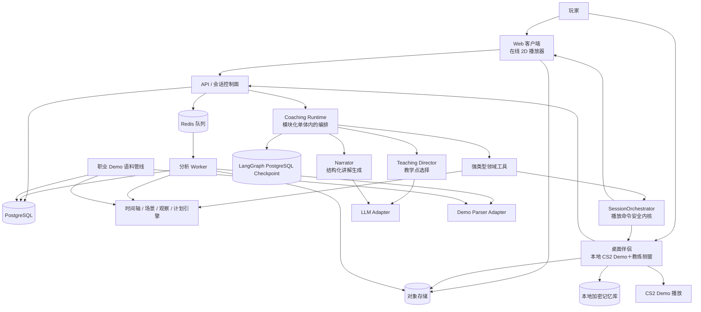
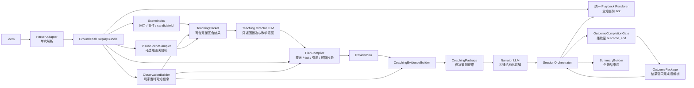
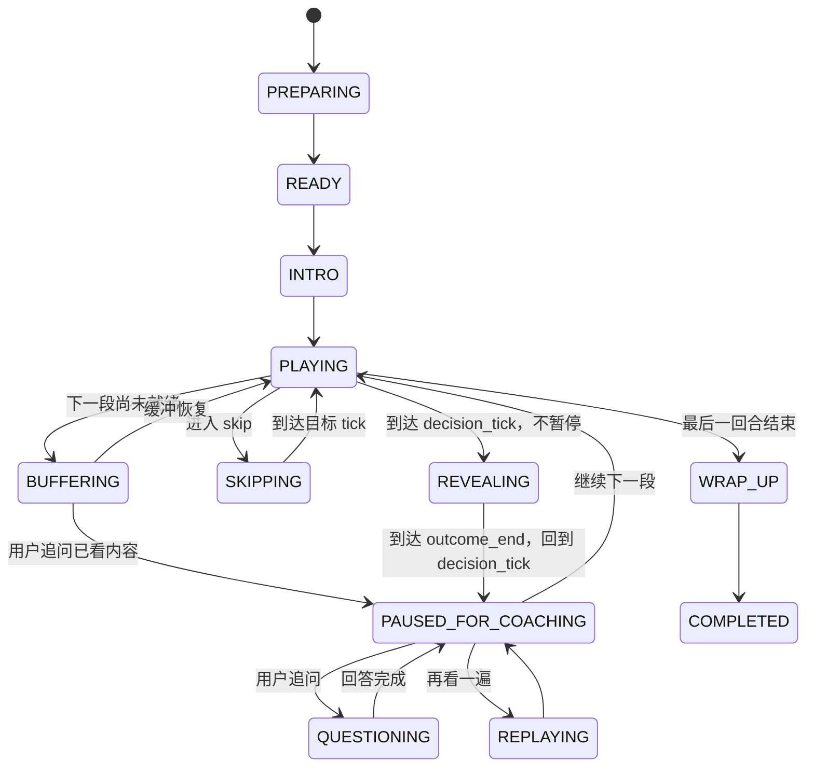
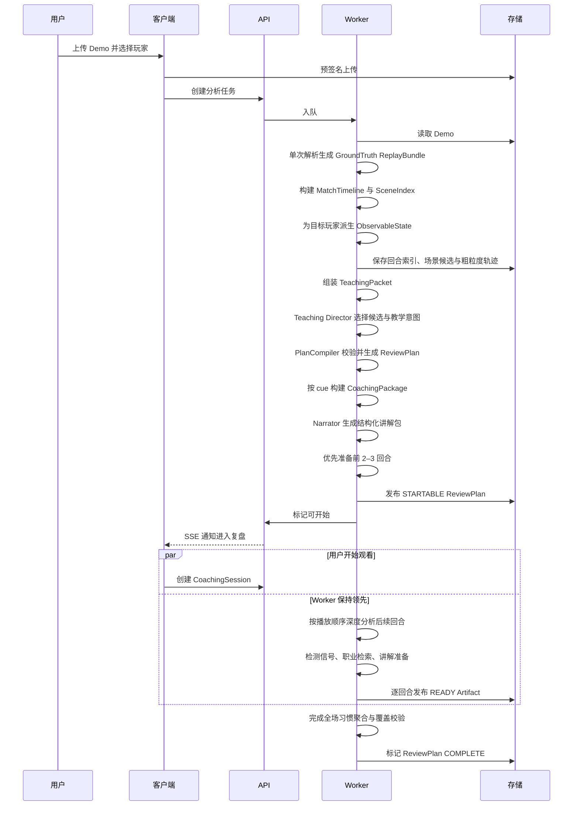

# CS2 AI Demo Coach 长期架构设计

> **文档状态：长期维护、架构唯一事实来源（Normative）**
> 版本：3.2.0
> 最后更新：2026-08-17
> 适用范围：Web 2D 到桌面端长期产品
> 产品定义：[PRD.md](./PRD.md)
> 当前产品范围：[MVP_SCOPE.md](./MVP_SCOPE.md)

## 0. 文档治理

### 0.1 维护责任

本文是项目唯一要求持续维护的设计文档。PRD 和产品范围文档用于产品范围，完成后可以冻结或归档；它们不覆盖本文的架构契约。

下列变化合并前必须更新本文，重大取舍同时新增 ADR：

- 改变核心领域模块、运行单元或信任边界；
- 改变标准时间轴、复盘计划、讲解点、播放器或个人记忆契约；
- 改变数据库、对象存储、队列、缓存或本地存储；
- 改变模型、规则、职业语料和 LLM 的职责；
- 增加新的播放载体，例如本地 CS2 Demo 控制；
- 改变隐私、版权、安全、数据保留和版本复现策略。

版本规则：Patch 用于澄清；Minor 用于兼容性扩展；Major 用于改变系统边界或不兼容契约。ADR 存放于 `/docs/adr/ADR-NNNN-title.md`，已接受的 ADR 不覆盖，使用后续 ADR 取代。

### 0.2 长期契约与实现记录分离

长期契约包括：事实模型、观察信息边界、教学决策与讲解的职责、`ReviewPlan`/`CoachingSession`/播放器协议、状态机、版本化和验证规则。实现可以替换，只要继续满足这些契约。

以下内容不是长期架构事实，只能出现在“当前实现快照”、ADR 或代码文档中：具体上游 commit、localhost 端口、CSS 尺寸/颜色/镜头倍率、当前测试 Demo 的数量，以及迁移期间保留的旧 renderer 或某次迁移的规则实现。FastAPI、异步 Worker、PostgreSQL、Redis、对象存储、Parquet/DuckDB、SSE、LangGraph Checkpoint、桌面适配器和本地记忆属于长期运行基线；变化时必须通过架构变更或 ADR 处理，不能因为某个当前切片尚未接入就删除。LangGraph 是 CoachingRuntime 的长期编排边界，但不是 Parser、Renderer 或事实存储的替代品。

### 0.3 架构审查问题

任何重要变更必须能回答：

1. 是否仍以“带用户过 Demo 的会话”为主产品，而非退化为报告生成？
2. 每个讲解能否追溯到 Demo 事实、教练规则或职业证据？
3. 决策讲解是否泄漏了玩家当时不可能知道的信息？
4. 同一输入和同一版本能否复现时间轴、复盘路线和结构化事实？
5. 新播放器是否无需改写分析内核和讲解协议？
6. 个人记忆是否由用户控制、默认本地保存且可以删除？
7. 是否增加了个人开发者不必要的基础设施和运维负担？

## 1. 架构目标

系统核心不是“大模型读 Demo 后写分析”，而是把比赛事实编排成一场可执行、可追问、可恢复的复盘会话：

```text
Demo
  → 单次解析的 GroundTruth ReplayBundle
  → 回合场景索引与 ObservableState
  → Teaching Director 选择可教候选
  → PlanCompiler 生成并校验 ReviewPlan
  → Narrator 根据决策侧 CoachingPackage 构建讲解
  → 播放器执行＋SessionOrchestrator 主持
  → 用户追问、回看与交互
  → 会后总结
  → 长期个人习惯记忆（后续）
```

优先级从高到低：

1. 时间轴和回放事实正确；
2. Teaching Director 选择的教学时刻可解释且可复现；
3. Narrator 的讲解只使用允许的决策侧证据；
4. 复盘会话连贯，关键时刻讲得清楚；
5. 播放载体可从 Web 2D 演进到本地 CS2；
6. 个人开发者可实现、测试和运维；
7. 长期记忆、学习模型和规模扩展。

## 2. 架构不变量

### 2.1 会话是主产物

`ReviewPlan` 和 `CoachingSession` 是核心领域对象。会后总结是已完成会话的派生产物，不得用一组问题卡或静态报告替代带看流程。

### 2.2 完整覆盖，显式跳过

复盘计划必须无缝覆盖从第一回合开始到最后一回合结束的比赛时间。每段都有明确处理方式和原因；跳过只能缩短观看时间，不能在产品上伪装成未发生。`FREEZE_TIME` 等完全确定、没有用户选择价值的系统等待段由 `SessionOrchestrator` 自动消费，不向用户询问，但仍保留在 `ReviewPlan` 覆盖和会话事件日志中；基于教学价值判断的普通 `SKIP` 仍显式说明原因并允许展开。

### 2.3 播放器与分析解耦

分析层只面向标准时间轴、`PlaybackPort` 和 `AnnotationPort`。在线 2D、本地 CS2 Demo 或未来视频播放器都只是适配器，不能拥有独立的教学逻辑。

### 2.4 完整处理先播放，结果结束后讲解

讲解点区分 `decision_tick`、`reveal_tick` 和 `outcome_range`，并满足 `decision_tick <= outcome_start_tick < reveal_tick <= outcome_end_tick`。播放器从决策点前约 1 秒进入片段，不在决策前暂停，也不要求用户先猜；它连续播放用户的真实选择与结果，到达 `outcome_end_tick` 后自动暂停并回到 `decision_tick`，再一次性展示当前情况、可验证 Outcome Fact 与一个可执行建议。在结果窗口完成前，任何用户可见讲解与问答都不得泄漏结果；决策侧判断始终只能读取 `decision_tick` 之前的 `ObservableState`。前置上下文和自动回看不得改变这些事实时间边界。

### 2.5 事实、推断、建议分层

- `Fact`：Demo 可直接验证；
- `Inference`：已知信息、意图、角色、危险程度等带置信度的判断；
- `Advice`：在事实和推断基础上的替代选择；
- `Evidence`：职业样本、规则或历史习惯依据。

四者分别存储并引用稳定 ID。Teaching Director 只能返回候选 ID、主题、优先级和理由引用；Narrator 可以组织和构建讲解，但不能创造事实、样本、数值或引用。所有模型输出都必须经过 Schema、引用和时间边界校验。

### 2.6 回放全知显示与教练证据边界

浏览器主地图始终显示 cs2d 在当前 canonical tick 的全知事实：双方位置、存活、装备、道具、C4、投掷物和事件不因会话阶段隐藏，也不向用户暴露“玩家已知 / 全知”模式切换。地图的职责是让用户看懂教练正在讲哪一段，不承担信息考试或 POV 模拟。

教学判断仍必须遵守独立的 `ObservableState` 边界。`.dem` 只完整解析一次，Adapter 从同一份结构化 Replay 派生 `MatchTimeline`、场景索引和 `ObservableState`，再由 Teaching Director 与 PlanCompiler 生成 `ReviewPlan`，不得二次解析 Demo，也不得把全知敌人坐标送给决策前 Narrator。地图显示全知不等于教练可以使用全知推理。

`ObservableState` 不是“可见圆”或 `observed: boolean`，也不是用户可见的第二套 renderer 输入。它是内部证据白名单，由带时间、来源、空间精度、身份精度、置信度和过期规则的 `ObservationClaim` 组成：直视可以形成较精确位置；脚步、枪声和伤害方向通常只形成区域或方向信息；最后已知位置随时间衰减；队友看见不自动等于所选玩家知道。Director 可以使用完整回合来判断教学价值，但其输出只能引用候选和证据 ID；Narrator 的决策侧 `CoachingPackage` 只能引用 decision tick 之前的 claim/fact。Outcome Fact 单独标记为 `OUTCOME`，不进入 observable refs 或决策侧模型输入，并且只在播放器确认完成结果区间后进入用户可见解释。

### 2.7 原始数据不可变，派生物版本化

原始 Demo 按内容哈希寻址且不原地修改。解析器、地图、信息重建、局面检测、计划编排、职业检索、讲解模板、Prompt、模型和总结均独立版本化。

### 2.8 结构化事实优先，LLM 负责教学判断与表达

Parser、SceneIndex、ObservationBuilder 和 PlanCompiler 先提供可追溯的结构化事实。LLM 在受限 `TeachingPacket` 上判断教学价值，在受限 `CoachingPackage` 上构建讲解；它不能读取原始 Demo、任意数据库或直接控制播放器。学习排序器、视觉模型和端到端模型只能替换明确的 Director 子模块，并且必须有黄金集、版本、回滚和确定性校验。

### 2.9 个人记忆本地优先

长期习惯、用户补充信息和改进历史默认保存在用户设备，可查看、编辑、导出和删除。云同步必须主动开启；记忆只能影响讲解优先级，不能改写当前 Demo 的客观事实。

### 2.10 模块化单体优先

在有量化扩展信号前，服务端采用模块化单体加异步 Worker，不使用微服务或 Kubernetes。模块边界通过契约和测试维持，而不是通过网络拆分。

### 2.11 渐进式就绪

用户无需等待整场深度分析完成。上传结束后系统先完成整场快速索引，再优先准备开场观看窗口；前 2–3 回合达到 `READY` 即可启动会话，后续回合按播放顺序在后台持续分析。

渐进式就绪不降低事实门槛：只有状态为 `READY` 的区间才能交给 CoachingRuntime；用户已观看的讲解冻结版本，不被后台分析静默改写；完整比赛覆盖和跨回合习惯聚合最迟在进入会后总结前完成。

## 3. 系统上下文与演进



### 3.1 两种产品运行形态

**Web 形态**：服务端预计算复盘计划；浏览器 2D 播放器按计划执行播放、暂停、跳过、回看和标注。它是当前运行基线，也是无游戏环境用户的长期入口。

**桌面形态**：桌面伴侣打开用户本地 Demo，通过受支持的控制方式驱动 CS2 Demo 播放；AI 教练以侧边窗口或悬浮窗口呈现。桌面端复用同一 `ReviewPlan`、讲解协议、问答和总结逻辑。

桌面端仅用于离线 Demo 复盘，不服务于实时比赛；不得读取或修改游戏进程内存，不注入 DLL，不规避反作弊。具体控制方式上线前需单独做安全兼容 ADR。

### 3.2 信任边界

- 用户 Demo、压缩包和职业语料都是不可信输入；
- Parser 在资源受限、默认无外网的 Worker 中运行；
- 浏览器和桌面端只通过授权 API 或短期签名 URL 访问对象；
- LLM 只接收最小化的结构化上下文，不接收原始 Demo 和非必要身份；
- 桌面端拥有本地文件与游戏控制权限，是独立高信任组件，必须签名、自动更新且可撤销权限；
- 本地习惯记忆不默认上传服务端。

### 3.3 教学分析主链路

这是长期架构的核心数据流。`GroundTruth ReplayBundle` 只产生一次；Renderer 使用全知事实，Director 使用回合教学包，Narrator 使用决策侧证据包，三者不能互换输入。



`DirectorPacket` 与 `CoachingPackage` 必须是两个不同的契约。Director 可以使用结果判断教学价值，但只能返回 `candidateId`、主题、优先级和引用；决策侧 Narrator 不能看到结果包或未到达 `decision_tick` 的事实。结果窗口完成后，Session 才能把已校验的决策侧讲解与独立 OutcomePackage 组合成用户可见复盘。模型可以更换，Renderer、PlanCompiler 和 SessionOrchestrator 的边界不能被模型绕过。

## 4. 技术基线

### 4.1 运行单元

1. `web`：上传、在线 2D 回放、教练侧栏、问答和总结；
2. `api`：资源、权限、会话控制、问答和 SSE；
3. `coaching-runtime`：运行于模块化单体内的 LangGraph CoachingRuntime，编排 Teaching Director、Narrator Adapter、PlanCompiler 和 SessionOrchestrator；
4. `worker`：解析、场景索引、Observation、Director 调度、计划校验、职业检索和讲解准备；
5. `desktop`（后续）：本地文件、CS2 播放控制、悬浮教练窗口和本地记忆；
6. `corpus-cli`：职业语料导入与离线批处理，复用领域库。

### 4.2 默认技术选型

| 层 | 基线 | 说明 |
|---|---|---|
| Web | Next.js、React、TypeScript | 上传、会话 UI 和总结 |
| 2D 回放 | 固定版本 `zenojunior/cs2d` Vue/Canvas renderer | 浏览器内真实雷达、多楼层、10 人 HUD、投掷物、事件与时间轴；主仓库保存 patch，不复制整仓源码 |
| API | Python 3.12、FastAPI、Pydantic v2 | 与数据分析生态一致 |
| 教练运行时 | LangGraph Python `StateGraph`＋确定性领域节点 | 编排 Director、Narrator、问答、揭示、总结和恢复；不取代领域服务或播放器 |
| Graph Checkpoint | LangGraph PostgreSQL Checkpointer | 只保存可恢复的编排状态和领域 ID，不保存 raw Replay 或事实主数据；存储实现可替换但不改变恢复语义 |
| LLM 接口 | Provider-neutral JSON/Schema Adapter | Director 与 Narrator 是不同调用和不同数据包，可使用同一模型 |
| LLM 可观测性 | LangSmith（可选） | 只用于调用追踪、成本和质量观测，不成为运行时依赖 |
| Worker | Dramatiq + Redis | 异步、重试和资源隔离 |
| Demo 解析 | 固定版本 `zenojunior/cs2d` Worker/WASM | `.dem` 在浏览器内解析一次；结构化 Replay 通过内部 Adapter 生成教练领域对象 |
| 数据库 | PostgreSQL 16 + pgvector | 元数据、会话、职业检索 |
| 轨迹文件 | Parquet + PyArrow / DuckDB | 不把全量 tick 塞入关系库 |
| 对象存储 | S3 兼容接口 | 本地 MinIO，生产可替换 |
| 实时状态 | REST + SSE | 控制请求走 REST，进度和会话事件走 SSE |
| 契约 | JSON Schema / OpenAPI | 生成 TypeScript 与 Python 类型 |
| 桌面端 | Tauri（候选，需 ADR 确认） | 小体积、系统窗口与 Rust 能力 |
| 本地记忆 | SQLite + OS Keychain 派生密钥 | 可迁移、可导出、可删除 |

整体采用“模块化单体＋异步分析流水线＋LangGraph CoachingRuntime＋Teaching Director/Narrator＋确定性播放器控制”。LangGraph 编排有状态的教学会话；模型只产生受限结构化提案和讲解，SessionOrchestrator、PlanCompiler 与领域服务负责事实、时间和执行。

Worker 使用至少三档队列优先级：`interactive` 处理用户即将观看的回合，`normal` 处理后续回合，`batch` 处理职业语料和非紧急重算。用户会话维护 3–5 回合的目标缓冲水位；水位下降时只提升未就绪相邻回合，不抢占已经开始的幂等任务。

不把微服务、Kubernetes、独立向量数据库、全量 tick 入关系库、LLM 任意 SQL/数据库权限或端到端模型控制产品作为架构前提。LangGraph 是当前 CoachingRuntime 的编排基线，但 Graph 外的领域模块不依赖它；只有测量到瓶颈或出现明确能力收益时，才在不改变领域契约的前提下替换实现。

### 4.3 当前实现快照（非规范）

当前运行切片同时支持 localhost 与单 Worker Cloudflare 发布：本地使用固定的 cs2d Worker/WASM、iframe bridge 和 Next 教练壳，生产把同一 Viewer 构建挂在同源 `/cs2d/`。上游源码不进入主仓库；CI 从固定 revision 生成 Viewer/WASM/地图/图标构建物并放入 Cloudflare 资产目录，权利状态和可重放 patch 记录在 `THIRD_PARTY_NOTICES.md` 与 ADR-0002。

本地 Demo 只进入浏览器 File/Worker/WASM 管线，不经过 Next 上传 API。cs2d 一次解析后同时驱动全知 renderer 与 Adapter；raw Replay 不跨 iframe，教练壳只接收白名单分析包。

当前 Adapter 仍可用确定性规则生成兼容的候选 ReviewPlan，作为 Director 尚未完全接入时的回退；目标流程必须通过 SceneIndex、Teaching Director 和 PlanCompiler 生成正式 ReviewPlan。两条路径共享同一 Replay、canonical tick、Observation 和校验器。

Host 只保留一套教练控制和一条整场时间轴；用户可自由接管，恢复时由 SessionOrchestrator 根据当前播放位置回到最近可讲 cue。具体布局、颜色、镜头倍率和端口属于实现记录，不是长期契约。

当前部署可以使用 DeepSeek 作为 LLM Provider；这是实现选择，不改变 Director 与 Narrator 的两个职责和两个输入契约。目标运行时同时支持 Teaching Director 的结构化教学决策与 Narrator 的结构化讲解生成，二者都必须经过 Provider-neutral Schema 校验。缺 key、超时、上游失败或输出校验失败时，保留确定性计划与模板讲解，不阻塞播放。密钥注入和 Cloudflare 构建规则记录在 README 与部署脚本，不在此重复实现细节。

`ReviewSegment` 继续使用半开区间 `[start_tick, end_tick)` 并完整覆盖正式回合、冻结时间、回合判定后区间与回合间隙。cs2d 的 `Round 0` 刀局/初始化段不伪装成正式第 1 回合；`winner: null` 不被猜测。cue 只允许位于 live/decided 边界之前；GrenadePath 的 0.1 秒时间只作为近似，精确 canonical tick 优先取 Round、Frame 与 GameEvent。

旧 Python `demoparser2` Adapter、旧 PixiJS renderer 和合成 fixture 只保留为迁移回归与故障对照，不再是默认产品数据流，也不得与 cs2d Replay 混合成一场会话。当前 localhost 可以绕过部分服务端路径，但长期部署仍以 FastAPI、异步 Worker、PostgreSQL、Redis、对象存储、Parquet/DuckDB、SSE、LangGraph Checkpoint 和本地记忆为基线；这些基础设施不能因为当前切片尚未全部接入而从架构中删除。

## 5. 建议仓库结构

```text
/
├── apps/
│   ├── web/                       # Web 会话与 2D 播放器
│   ├── api/                       # FastAPI 控制面
│   └── desktop/                   # 后续桌面伴侣
├── workers/analysis/              # 异步任务入口
├── libs/
│   ├── contracts/                 # 跨端协议与生成类型
│   ├── demo_domain/               # 标准时间轴、事件、Parser Adapter
│   ├── map_semantics/             # 区域、路径、视线和显示坐标
│   ├── scene_index/               # 回合、事件、关键帧与 candidateId
│   ├── observation/               # 当时可知信息重建
│   ├── teaching_director/         # Director 输入包、输出 Schema 与调用适配
│   ├── plan_compiler/             # ReviewPlan 编译、覆盖与时间边界校验
│   ├── coaching/                  # EvidenceBuilder、Narrator、问答与总结
│   ├── session/                   # 确定性会话约束与命令校验
│   ├── playback/                  # 播放器与标注端口
│   ├── retrieval/                 # 职业局面过滤、排序和分布
│   ├── memory/                    # 本地优先个人记忆契约
│   └── evaluation/                # 黄金集、指标和回归测试
├── tools/corpus/                  # 职业 Demo 语料管线
├── tools/video-annotation/        # 已授权教学视频弱标注与 Demo 对齐工具
├── configs/
│   ├── maps/
│   ├── taxonomy/
│   ├── planner/
│   ├── retrieval/
│   └── prompts/
├── infra/
├── tests/fixtures/
└── docs/adr/
```

## 6. 核心领域模块

### 6.1 Ingestion

负责上传、分块、格式与压缩安全校验、哈希去重、状态机、保留策略和失败重试。它只产生可信文件引用，不解释比赛。

### 6.2 DemoDomain

Parser Adapter 将解析器输出转换为稳定的 `MatchTimeline`：比赛、半场、回合、tick、玩家状态、事件和轨迹。玩家状态以 CS2 world 坐标保存，不在解析层转换为屏幕百分比；状态快照至少保留存活、位置、高度、视角、生命、护甲、头盔、金钱、当前手持物、库存/道具数量、拆弹器和 C4 携带。下游回放可以读取全知事实，但 Observation 必须另行推导观察者当时可知的信息。

当前默认解析入口是固定版本 cs2d 的浏览器 Worker/WASM；其结构化 Replay 是 renderer 的全知事实来源。同一次解析还保留 Source engine 的 `m_szLastPlaceName` 字符串，作为玩家状态事实进入 Replay；不得为了中文报点二次解析 Demo。Adapter 只依赖 Replay 的结构化端口，把 Round/Frame/GameEvent/GrenadePath 转成稳定的 `MatchTimeline`、warnings、SceneIndex 和 `ObservableState`。ReviewPlan 必须由 Teaching Director 与 PlanCompiler 生成；确定性规则计划只能作为兼容回退。不导入上游实现、不重读 `.dem`、不猜测缺失 winner，也不把 raw Replay 序列化到教练壳。旧 parser、canonical tick 兼容修复和 server-side 备选只属于迁移回归，不是默认数据流。

Parser Adapter 还要规范化击杀、伤害、开火、换弹、投掷物、炸弹和解析器能够提供的声音发射事件。声音事件只能证明“某处发生了一个可能发声的动作”，不能直接证明某个玩家一定听到；字段不可得时输出带 parser/game 版本的 warning，绝不补造默认值。所有下游只依赖标准模型，不依赖解析器私有字段或 DataFrame 列名。

### 6.3 MapSemantics

维护版本化的真实雷达资源清单、world→radar 仿射变换、楼层、点位多边形、区域层级、相邻关系、常见路径、掩体、简化视线和声音传播近似。`MatchTimeline` 永远保留 world X/Y/Z；只有渲染边界使用 `MapAssetManifest` 转换为雷达像素。固定锚点与固定 tick 截图必须做坐标回归，禁止靠 CSS 百分比手调位置。

中文报点优先使用同一 player frame 的 Source engine place token，经版本化 `@cs-coach/map-semantics` 精确映射为玩家熟悉的 CS 报点；未知 token 保持未知，不做模糊匹配或坐标猜测。报点是可追溯事实的本地化，打法术语属于推断/建议层；二者不得混写成 parser 事实。

地图图片、武器/道具图标、坐标参数和区域配置必须锁定到地图/游戏构建版本，记录来源 URI、内容哈希、生成清单和权利状态。用户已确认 localhost 可以使用参考站点提供的 Valve 游戏雷达/游戏图标，也可以使用版本锁定的公开工具数据包或用户本机 CS2 安装；这些资产下载为本地缓存，不做运行时热链。该授权不包含第三方站点的 UI、布局、组件、品牌或自有图标，也不自动扩大为公开再分发许可。公开构建发布 Valve 资产前仍需单独复核。资产来源可替换，领域坐标和回放协议不随供应方变化。

### 6.4 Observation

为指定 `observer_player_id` 在指定 tick 重建 `ObservableState`，输入包括 spotted、视线、脚步/枪声等声音发射、伤害方向、道具、炸弹、最后已知位置和显式用户上下文。输出不是敌人真值的删减版，而是一组 `ObservationClaim`；每条都包含证据来源、首次可用时间、过期时间、空间估计、身份分辨率、共享范围、置信度和限制。

关键规则如下：

- 直接视觉或可靠 spotted 可以形成较精确的位置与身份主张，但仍引用原始事实；
- 脚步、枪声和伤害方向默认只产生方向、区域、数量下界或声源类别，不能把全知敌人坐标画成“听到的位置”，也不能无证据锁定具体玩家；
- Demo 中的声音发射是事实，“某观察者可能听到”是基于距离、遮挡、地图声学近似和同时噪声的推断；只有用户明确补充时才可记录为 `user_asserted` 的“确实听到”；
- 最后已知位置保留最后确认点与时间，随时间降低置信度并扩大可能区域，不跟随隐藏敌人的真实轨迹移动；
- 队友视觉信息按队友自己的 `ObservableState` 保存；只有游戏内可靠共享状态、可验证消息或用户补充沟通时，才能进入所选玩家的状态；
- 敌方武器、道具、金钱等全知装备事实不会自动进入玩家视角；可见手持、已使用道具或经济推断分别标注来源与精度；
- 任何 `decision_tick` 的查询只返回 `available_from_tick <= decision_tick` 的 claim，结果区间和未来事件不可回灌。

`ObservableState` 只进入 TeachingPacket、CoachingEvidenceBuilder、Narrator 的决策侧 `CoachingPackage` 与未来泄漏测试，不进入 cs2d renderer，也不作为用户可见模式。cs2d 地图始终渲染当前 tick 的全知 Replay；语音无法可靠获得时，教练证据不假装已知，系统继续输出来源、时间、置信度与 limitation。

### 6.5 SceneIndex 与候选场景

SceneIndex 把完整 Replay 按回合组织成可寻址场景和候选锚点，例如重复 peek、优势处理、补枪关系、接触后生存、转点、回防、保枪和道具时机。它只回答“哪些事实窗口可被模型引用”，不判断最终是否值得教学，也不写自然语言长评。

候选场景带有稳定 `candidateId`、事件/帧引用、决策窗口、结果窗口、可用的 ObservableState 引用和可选视觉 storyboard。它们是 Director 的输入边界，也是 PlanCompiler 的寻址边界。

### 6.6 TeachingDirector 与 PlanCompiler

Teaching Director 读取每回合或批量回合的 `TeachingPacket`，判断是否值得教学、选择 `candidateId`、主题、优先级、教学理由和置信度。Director 可以看到完整回合的结果来判断教学价值，但不得输出未经索引的 tick、事实、样本比例或播放器命令。

PlanCompiler 把 DirectorDecision、GroundTruth、ObservableState 和用户配置编译为连续的 `ReviewPlan`，并执行确定性校验：

- 完整覆盖、半开区间和无重叠；
- `decision_tick`、`reveal_tick`、outcome 区间合法且来自真实事实；
- 每个 cue 的 facts、claims、advice 和 evidence 引用有效；
- 深讲预算、同类去重、回合分布和用户配置满足约束；
- Director 超时、拒答或输出无效时使用可追溯的确定性候选回退。

PlanCompiler 最终划分 `SKIP`、`BRIEF`、`OBSERVE`、`DEEP_DIVE` 和 `HABIT_CHECK`，但“是否值得深讲”的主要判断来自 Director，而不是由播放器或 Narrator 临时决定。PlanCompiler 是模型与播放器之间不可绕过的硬边界。

### 6.7 SessionOrchestrator

LangGraph `StateGraph` 是 CoachingRuntime 的有状态编排骨架。它读取 `ReviewPlan`，维护当前 segment、cue、已讲习惯、用户追问、待执行播放动作和完成进度，并协调播放器、教练侧栏、标注、问答、用户接管与恢复。Graph 节点调用 Teaching Director、Narrator、Question、Outcome 和 Summary Adapter，但不直接读取 raw Replay 或向播放器发任意命令。

Graph 内的 `SessionOrchestrator` 节点仍是确定性的：它校验完整时间轴覆盖、允许的状态转移、目标 tick、播放器 ACK、未来信息边界和恢复位置。Director 只在计划生成阶段选择候选；Narrator 只在已校验的 CoachingPackage 上生成讲解。会话状态、业务事件和播放器确认状态分别保存；checkpoint 只能保存可恢复的编排状态和领域 ID，不能成为 Demo 事实、ReviewPlan 或 CoachingSession 的唯一来源。

典型节点包括：

- `load_review_plan`：载入已校验的复盘计划；
- `present_segment` / `advance_segment`：按覆盖约束推进；
- `narrate_cue`：调用 Narrator 生成决策侧讲解；
- `await_user` / `answer_question`：等待继续、追问或播放控制；
- `reveal_outcome` / `replay_segment`：在授权后生成结果包并播放；
- `habit_check`：复查已讲习惯；
- `wrap_up` / `propose_memory_update`：总结并提出记忆候选。

`SessionOrchestrator` 同时包含一层与 LLM 无关的确定性安全内核，负责校验完整时间轴覆盖、允许的状态转移、目标 tick、播放器 ACK、未来信息边界和恢复位置。LLM 可以提出教学动作，但不决定未经校验的下一个 tick，也不直接向播放器发送任意命令。

#### 6.7.1 CoachingRuntime 工具边界

CoachingRuntime 通过强类型领域工具访问系统能力，不把数据库连接或任意 SQL 暴露给模型。首批工具包括：

```text
get_current_scene(cue_id)
get_observable_state(cue_id)
get_round_context(round_number)
search_similar_pro_scenes(scene_id)
get_habit_history(taxonomy_id)
pause_demo(tick)
replay_segment(start_tick, end_tick, speed)
add_annotation(annotation)
propose_memory_update(proposal)
```

每个工具自动限定当前用户、Demo、session 和 cue，执行参数 Schema、`decision_tick`、证据门槛和审计校验。读取工具只返回经过领域层验证的结构化数据；写入工具只能产生白名单命令或待确认提案。用户提供的“如果队友报了两个”等信息只进入当前会话条件上下文，不回写为 Demo 事实。

### 6.8 Playback

`PlaybackPort` 抽象加载、播放、暂停、跳转、速度、视角和状态确认。适配器包括：

- `Web2DPlaybackAdapter`：浏览器按标准轨迹渲染；
- `CS2DemoPlaybackAdapter`：桌面端驱动本地 CS2 Demo；
- 未来可能的录像或导出适配器。

当前 localhost bridge 使用严格的单 iframe、有序命令流，不额外引入 command ID：父窗口只在 Session 状态转换时发命令，cs2d 用后续 `PLAYBACK_STATE` 回报 canonical tick、playing 与 speed；reducer 只根据该事实状态消费 `TICK`。未来跨进程或桌面播放器需要重试/乱序恢复时，再为 `PlaybackPort` 增加 command ID 与 ACK。

当前 `Web2DPlaybackAdapter` 直接复用固定版本 cs2d 的解析器、播放器和 renderer，主仓库仅维护最小 host patch：

1. `.dem` 由 cs2d File → Worker/WASM 解析一次，raw Replay 始终留在 iframe；
2. cs2d renderer 直接消费 Replay，并始终显示当前 canonical tick 的全知地图、10 人 HUD、投掷物、炸弹、掉落武器、效果、多楼层、缩放和平移；
3. `@cs-coach/cs2d-analysis-adapter` 在 iframe 内从同一 Replay 派生严格白名单 `Cs2dAnalysisBundle`；它是分析端口，不是 renderer frame builder；
4. Next 教练壳只通过 `cs2d-playback-bridge.v1` 接收摘要、选择、播放状态与 AnalysisBundle，并发送 `play/pause/seekCanonicalTick/selectRound/setSpeed/setCamera`；bridge 对 envelope 与 payload 使用精确字段校验；
5. `SessionOrchestrator` 根据 `ReviewPlan` 控制同一个 cs2d 播放头，从 cue 前约 1 秒连续播放到 outcome end，自动回到 decision tick 讲解，必要时重播，再继续下一段。

用户界面不提供 `PLAYER_KNOWLEDGE` renderer。`ObservableState` 是教练内部证据边界；renderer 不根据它隐藏敌人，教练也不得因为地图上显示全知事实而读取这些事实。当前投掷物只显示播放位置以前的轨迹，C4/HUD 只能读取 `t <= currentT` 的状态，禁止用数组首项或未来落点补值。

旧 `/pixi-poc` 的 `PlaybackFrameViewModel`、Freezetime 审查与 `csgo-2d-demo-viewer` 参考结论保留为实验记录和回滚证据，不再是生产迁移方向；不得继续为默认产品扩展第二套 renderer。cs2d 上游没有明确许可证，故只从固定 commit 生成忽略的本地/CI 构建物，当前 MVP 暂部署到同源 `/cs2d/`，不把源码提交进仓库；公开商业化或扩大再分发前必须解决权利或替换底座，并新增 ADR。

Renderer 必须显示当前 canonical tick 的真实地图、双方玩家、装备、道具、事件和轨迹；字段不可得时显示未知，不使用看似精确的默认值。HUD、镜头、地图楼层和资产可以替换，但必须消费同一 PlaybackPort 和同一事实快照。

Host 不复用上游产品的业务控制逻辑。普通播放和用户自由查看保持稳定全图；未揭示 cue 可以聚焦问题区域；结果播放仍使用同一全知 Renderer，只改变时间窗口，不切换用户可见视角。具体镜头倍率、布局和视觉样式属于前端实现，不是领域契约。

### 6.9 Annotation

地图点、线、区域、高亮、视野和文本标记使用与播放器无关的 world 坐标与生命周期。2D 端在渲染边界通过 `MapAssetManifest` 转换；桌面端无法叠加在游戏世界时，可在侧窗同步小地图呈现。

### 6.10 ProCorpus 与 Retrieval

职业 Demo 使用相同标准化管线，存储局面、动作、选手、赛事、来源、授权状态和版本。检索先硬过滤，再以可解释权重或后续学习排序器排序。

职业样本用于回答“相似条件下高手常怎么做”，不是用于宣称唯一正确答案。小样本、角色不匹配或版本过旧时必须降级。

### 6.11 Coaching

Coaching 包分成两个不可互换的契约：

- `TeachingPacket` 给 Director 使用，可以包含一个回合的完整结构化事实、结果、候选场景、ObservableState 摘要和可选视觉 storyboard；它不包含 raw Replay 或任意数据库权限；
- `CoachingPackage` 给 Narrator 使用，只包含当前 cue 的匿名 facts、inferences、advice、evidence、decision-side claims、表达约束和限制，不包含结果事实、未到达 `decision_tick` 的事件、原始 Demo、稳定身份、路径或播放器控制。

Teaching Director 负责从 TeachingPacket 中选择 `candidateId`、教学主题、优先级、教学意图和引用；它不生成最终播放器命令。Narrator 负责根据 CoachingPackage 构建完整、具体的教练讲解，包括标题、局面解释、风险、替代动作和触发条件；它不能新增事实或引用。结果说明必须使用单独的 outcome-scoped package，并只能在播放器确认结果窗口完成后解锁。MVP 可以确定性组合已准备的决策侧讲解与 Outcome Fact，不要求额外模型调用。

问答和总结可以复用 Narrator Adapter，但必须分别构建当前 cue 或已消费内容的最小输入包。模型供应商只属于实现层；每次调用都使用版本化 JSON Schema、Prompt、模型标识和输出校验。

所有 DirectorDecision、Narration、QuestionAnswer 和 Summary 先通过字段全集、引用 ID、时间边界和禁止未来泄漏校验。模型失败时回退到确定性计划或结构化模板，不阻塞会话。

### 6.12 PersonalMemory（长期）

保存用户跨 Demo 的稳定信息：角色偏好、学习目标、反复习惯、代表证据、上次建议、后续是否改善和用户纠正。

记忆生命周期：

```text
候选 → 已观察 → 反复出现 → 改善中 → 稳定改善 → 已解决 / 已归档
```

单场检测不能直接写成永久习惯。达到最低跨场证据门槛后，由用户确认或系统以“候选”保存。新 Demo 的 Director 可以提高未解决习惯相关候选的复查优先级，但分析事实仍完全来自当前 Demo。

浏览器无本地记忆时可不启用；桌面端默认加密保存在 SQLite。跨设备同步是独立、可选、端到端加密能力。

### 6.13 Summary

总结只使用本次用户实际经历或主动跳过确认的讲解内容、问答和当前场习惯聚类。不得把未展示的检测结果突然作为主要结论。总结生成后可成为未来个人记忆的候选输入。

### 6.14 VideoWeakAnnotation（离线启动管线）

已授权的看 Demo 教学视频只用于学习“真人教练如何主持复盘”的行为结构，不作为精确比赛事实来源。离线工具按视频原始时间轴检测播放、暂停、回放、快进、讲解起止、ASR 文本、问题类型、讲解结构、习惯复查和 HUD OCR，输出 `VideoTeachingEvent`。每个检测结果保留模型/规则版本、来源片段、置信度和人工校订状态。

该管线与 DemoDomain 分离：只有视频时，时间字段统一使用 `video_time_ms`，不得命名为 `tick`、`decision_tick` 或“黄金标注”。拿到对应原 Demo 后，才可通过显式的 `VideoDemoAlignment` 使用回合号、HUD 时钟、比分、击杀、暂停边界等锚点进行对齐；通过一致性阈值和人工抽检后，才能派生 `DemoCoachCue` 候选。原始 `VideoTeachingEvent` 保持不可变，对齐结果单独版本化，不覆盖视频来源事实。

视频处理顺序固定为：登记授权与来源 → 单条视频产出完整事件时间轴 → 人工核对播放动作和讲解边界 → 再决定是否批量。首条样本未确认前不得批处理。无原 Demo 时可用于教学节奏、提问 taxonomy 和讲解模板研究，但不得进入需要精确局面事实的 `CoachCue`、`ObservableState` 或评测黄金集。

## 7. 核心数据契约

以下为语义契约，真实 Schema 放在 `libs/contracts` 并生成两端类型。

### 7.1 MatchTimeline 与逐时刻比赛事实

```text
MatchTimeline
  id, demo_id, source_kind
  map_name, game_build?, tick_rate
  start_tick, end_tick
  players[]                 # 稳定身份，不把阵营永久绑在玩家上
  rounds[]
  player_state_tracks[]     # world 坐标；允许按变化点/分块压缩
  match_events[]
  timeline_version, generation_manifest

PlayerStateSample
  player_id, tick, side
  world_position { x, y, z }
  yaw, pitch, velocity?
  alive, health, armor, has_helmet
  money?, equipment_value?
  active_item? { item_id, item_class, ammo_clip?, ammo_reserve? }
  inventory[] { item_id, item_class, count, ammo_clip?, ammo_reserve? }
  has_defuse_kit?, carries_c4?
  fact_refs[], missing_fields[]

MatchEvent
  id, tick, event_type
  actor_player_id?, target_player_id?
  world_origin?, item_id?, payload
  source_parser_event, fact_confidence, missing_fields[]
```

`PlayerStateSample` 是全知回放事实，不代表所选玩家知道敌方库存或金钱。阵营是随回合/状态变化的属性，不能像当前合成夹具一样永久绑在 `MatchPlayer` 上。声音相关 `MatchEvent` 只记录可验证的发声动作与位置，不包含“谁听到了”的结论。

### 7.1.1 cs2d AnalysisBundle 传输契约

当前 localhost 不再把逐帧 ReplayBundle 复制到 Next。raw cs2d Replay 留在 iframe 驱动 renderer；教练壳只接收版本化 `Cs2dAnalysisBundle`：

```text
Cs2dAnalysisBundle
  demo_id, selected_steam_id
  match_timeline
  review_plan
  observation_evidence[]     # INTERNAL_LLM_EVIDENCE_ONLY
  win_probability_timeline   # FULL_MATCH signal; not ObservableClaim
  outcome_impacts[]          # outcome-scoped, unlocked after playback gate
  metadata
    adapter/source commit/input boundary
    canonical tick range
    excluded rounds
    limitations[], warnings[]
```

Adapter 输入是固定 commit 的结构化 Replay 端口，输出不包含 frames、grenadePaths、raw Replay 或二进制 Demo。序列化和反序列化都重新执行顶层白名单、ReviewPlan、ObservableState、版本 pin、selected-player 绑定与 future-boundary 校验。旧 `replay-bundle.v1` 只供 `/legacy` 和 Python 回归测试，不进入当前 cs2d 会话。

### 7.1.2 WinProbabilityTimelineV1 与 OutcomeImpact

`WinProbabilityTimelineV1` 是来自固定 cs-net win-rate head 的整场分析信号。它覆盖所有正式回合和播放头之后的时间，和唯一整场时间轴共用 canonical tick 横坐标；Host 不按当前 tick、cue 或决策/结果边界裁剪它。曲线可以显示回合边界、50% 中线、死亡/明显摆动和双方独立的 `PISTOL`、`ECO`、`FORCE`、`FULL`、`UNKNOWN` 经济分类，但不冒充 `ObservableState`，也不改变决策侧未来信息边界。换边时由当前选手在 Replay 中的回合状态派生“你方胜率”。

cs-net 的特征适配器只读取同一份 cs2d 结构化 Replay：31 个 token（10 名玩家、C4、20 个投掷物），模型在 cs2d iframe 的独立 Web Worker 中以 ONNX Runtime Web/WASM fallback 执行。模型 revision、checkpoint/config/tokenizer/feature-builder SHA、temperature、量化类型、资产 SHA 和大小必须记录在 `WinProbabilityModelManifest`；当前发布资产为固定 INT8 weight-only ONNX，单文件低于 Cloudflare Worker Static Assets 25 MiB 限额。下载与分块推理必须报告真实进度；模型失败只产生 `UNAVAILABLE`，继续使用确定性 Director/ReviewPlan 回退，不阻塞基础回放。浏览器可以按 revision/SHA 缓存模型，但不把 raw Replay、`.dem` 或模型输入发给 Next/LLM。

Runtime 的长期契约是“能力证明后才启用优化”：只有顶层文档和 `/cs2d/` iframe 同时满足 `crossOriginIsolated`、`SharedArrayBuffer` 与共享 WASM memory probe，才允许显式的 2/4-thread candidate；否则 Worker 以单线程运行并在结构化 telemetry 中记录 fallback reason。`ort.env.wasm.proxy` 固定为 `false`，线程数和 SIMD 资产在该 Worker 第一次 ORT backend/session 初始化前设置。切换线程 candidate 必须终止并重建 Worker/session，session cache key 至少包含 model URL、revision、SIMD 和 resolved thread count；`auto` 使用已完成的同输入浏览器矩阵测得的稳定候选（当前基线为 4 threads × batch 16），不把设置值冒充实测线程数；无隔离能力时始终回退到单线程。

模型输入以 canonical frame 顺序通过 `buildCsNetFeatureBatches` 流式生成，一次只保留一个 batch。batch 尺寸由固定候选矩阵（`1/8/16/32/64/128`）和真实 TypedArray `byteLength` 预算约束；若动态 batch 维度被 backend 拒绝，则按原顺序递归拆分，单样本仍失败时才降级，绝不静默丢样本。每次推理都校验输出样本数与输入一致，释放输入/output tensor。Worker 用 request id + `AbortController` 使新 Demo、重选玩家或取消的旧请求不能回写 AnalysisBundle、进度或 telemetry。

`cs-net-runtime-telemetry.v1` 分开记录 `fetch/sessionCreate/warmup/featureBuild/tensorPrepare/inference/serialization/total`、sample count、requested/resolved threads、batch、peak bytes、samples/s 和 capability evidence。warmup 只运行可释放的首样本副本，不进入正式 logits、sample count 或 total progress。生产模型/ORT mjs/wasm、iframe、Worker 和静态资产都必须经 COOP/COEP/CORP 覆盖；Cloudflare 用生成 Worker 外壳统一补响应头，localhost 的 Next 与 Vite 两侧各自补头，并保留单线程回退以应对第三方资源被 `require-corp` 阻断。

WebGPU + FP16 只属于隔离性能实验：它独立导入 `onnxruntime-web/webgpu`，只允许内部 `csProvider=webgpu-fp16` 查询分支，默认 provider 永远是 INT8 WASM `auto → 4 threads × batch 16`。实验必须在 Worker 首个 session 前创建并记录 `navigator.gpu`、adapter、device、`shader-f16`、ORT WebGPU session 和 `env.webgpu.profiling.ondata`；session 只配置 WebGPU EP。若无法完成节点级无 CPU/WASM fallback 证明，`fallbackDetection` 必须为 `UNKNOWN`；session 创建失败则为 `FAILED`，不得把失败当成可测性能。WebGPU provider、batch 或模型切换都要重建 Worker/session；失败确定性回退同一 Replay 的 INT8 WASM，并发送结构化失败 telemetry，不改变 `WinProbabilityTimelineV1`、Director 或 OutcomeImpact。FP16 与 ORT 匹配的 asyncify WASM 资产是 local-only 实验，不进入默认 Cloudflare 资产；只有 FP32-WASM parity、关键 cue 稳定、无 fallback、warm 性能相对既有 86.882 秒 inference 达到至少 1.3×，才另行评估默认切换。用户 UI 不显示 provider、batch、GPU 或性能调参。

本轮真实 Edge 验收采用独立 GUI/远程调试设计：Edge `151.0.4129.93`、macOS `26.5.2 (25F84)`、Apple M1 Metal；主页面、`/cs2d` iframe 和 Worker 均报告 `crossOriginIsolated=true`、`SharedArrayBuffer`、adapter/device 与 `shader-f16` 可用。实际仅配置 WebGPU EP 的 ORT `1.27.0` session 在 test_demo 的 FP16 batch16 创建阶段失败（`Failed to wait for the operation:3`），并报告部分 shape 节点未分配给首选 EP；结构化 telemetry 标记 `ortSessionCreated=false`、`fallbackDetection=FAILED`，同 Replay 回退 INT8。没有有效 WebGPU 性能矩阵或纯度结论，也没有达到 1.3× 的证据；继续保持默认 provider。证据在 `.local-data/acceptance-csnet-webgpu-fp16/edge-capability.json`、`edge-gpu.png` 和 `continuation-batch16-v3/edge-webgpu-benchmark.json`。

Teaching Director 可以综合所选玩家死亡、负向胜率摆动与该回合经济语境来排序候选；ECO 中预期较低的死亡不应自动获得与 FULL 相同的归因权重，FORCE 反映投入风险，UNKNOWN 维持保守回退。`OutcomeImpact` 只引用已完成结果窗口内的前后曲线点和已验证事件，记录百分点、相对变化、归因置信度和并发事件限制；Session 只有在播放器连续播放到 outcome end 并自动回到 decision 一次后才把它与 Outcome Fact 合并到用户可见复盘。LLM 仍只接收短 ID、decision-side facts/inferences/advice；模型曲线不是 LLM 的 ObservableClaim。

### 7.2 MapAssetManifest 与 GameAssetCatalog

```text
MapAssetManifest
  map_name, map_build_id?, asset_version
  raster_ref, width, height, content_sha256
  layers[]
  world_to_radar_affine [a, b, c, d, e, f]
  world_bounds?, floor_rules[]
  source_uri, source_revision
  rights_status, redistribution_policy

GameAssetCatalog
  game_build_id?, asset_version
  maps[]: MapAssetManifest
  item_icons[]:
    canonical_item_id, item_class
    display_name, aliases[]
    raster_ref, width, height, content_sha256
    source_uri, source_content_sha256
    media_type, render_mode, rights_status
  generated_at, generation_manifest
```

仿射矩阵定义为 `radar_x = a*world_x + c*world_y + e`、`radar_y = b*world_x + d*world_y + f`。显示坐标只在 MapSemantics/renderer 边界产生，标准时间轴、观察证据和教练标注继续使用 world 坐标。

Parser Adapter 的原始武器/物品名先通过版本化 alias 表规范化为 `canonical_item_id`，renderer 只能以该 ID 查询图标，不得把不可信的 Demo 字符串拼进文件路径或 URL。图标缺失时保留文字名称并显式降级，不用错误图标代替。

`tools/fetch_valve_item_icons.mjs` 使用显式映射与逐项上游 SHA-256 pin 缓存 CS2 HUD 单色 SVG 到 `apps/web/public/generated-assets/items`，拒绝 script、foreignObject、image、事件处理器、href/xlink 等 active content，重建白名单根属性，并把可见 fill/stroke 归一为 `currentColor`。目录同时生成 source URI、source/content SHA-256、media type、render mode 与权利状态。地图和物品图标的固定快照现在作为小型静态 release 资产随 Web 应用发布，运行时只读取 `/generated-assets/items/<safe-id>.svg|png`，不热链；本机上传产生的 `generated-data/**` 仍是本地缓存，Cloudflare 部署脚本会显式排除它，避免泄露 Demo 或超过 Workers 单文件大小限制。任何商业化或大规模公开再分发仍需单独复核上游权利。

### 7.3 ObservableState

```text
ObservableState
  id, demo_id, timeline_version
  observer_player_id, at_tick
  observation_version
  claims[]
  limitations[]

ObservationClaim
  id, claim_type
  knowledge_kind: OBSERVED | INFERRED | USER_ASSERTED
  source_type:
    DIRECT_VISION | SPOTTED | FOOTSTEP | GUNSHOT |
    DAMAGE_DIRECTION | UTILITY | BOMB | LAST_KNOWN |
    TEAM_SHARED | USER_CONTEXT
  subject_ref?
  subject_resolution: EXACT_PLAYER | TEAM_ONLY | UNKNOWN_ACTOR
  available_from_tick, evidence_tick, expires_at_tick?
  spatial_estimate:
    EXACT_POINT | UNCERTAIN_POINT | DIRECTION_SECTOR |
    AREA | LAST_KNOWN_POINT | NONE
  confidence
  sharing_scope: SELF | VERIFIED_TEAM_SHARED | USER_CONTEXT_ONLY
  evidence_refs[], derived_by, limitations[]
```

空间估计按类型携带 point/sector/polygon、距离或半径范围以及随时间增长的不确定性。声音 claim 不得携带隐藏敌人的实时真值坐标；最后已知 claim 固定在最后确认点并增长年龄与不确定范围。`ObservableState` 的构建测试必须覆盖：视觉精确确认、脚步区域信息、最后已知衰减、队友信息不自动继承、未来事件拒绝。

### 7.4 TeachingPacket 与 DirectorDecision

```text
TeachingPacket
  id, demo_id, round_number
  timeline_version, scene_index_version, observation_version
  candidate_scenes[]
  round_facts[], outcome_refs[]
  observable_state_refs[]
  visual_storyboard_ref?
  limitations[], generation_manifest

CandidateScene
  candidate_id
  start_tick, decision_window_end_tick
  event_refs[], frame_refs[]
  observable_state_id
  topic_hints[], available_evidence_refs[]

DirectorDecision
  packet_id, candidate_id?
  teach: boolean
  topic?, teaching_intent?
  priority, confidence
  reason_refs[], limitation_refs[]
  director_version, model_manifest
```

`candidate_id` 是 Director 能选择的最小寻址单位。Director 可以拒绝整回合，也可以选择一个或多个候选，但不能凭空创造 tick、事实、样本比例或播放器命令。PlanCompiler 负责把有效的 DirectorDecision 编译成 ReviewPlan。

### 7.5 ReviewPlan

```text
ReviewPlan
  id, demo_id, player_id
  match_timeline_version
  observation_version
  scene_index_version
  director_version
  compiler_version
  estimated_duration_seconds
  segments[]
  habit_clusters[]
  generation_manifest
```

### 7.6 ReviewSegment

```text
ReviewSegment
  id, round_number
  start_tick, end_tick
  mode: SKIP | BRIEF | OBSERVE | DEEP_DIVE | HABIT_CHECK
  reason_code, display_reason
  playback_speed
  cue_ids[]
  expandable
```

约束：按 tick 排序后完整分区；相邻区间边界统一；不允许未解释空洞。

### 7.7 CoachCue

```text
CoachCue
  id, segment_id, cue_type
  decision_tick
  reveal_tick
  outcome_start_tick, outcome_end_tick
  observable_state_id
  fact_refs[], inference_refs[], advice_refs[], evidence_refs[]
  annotation_set_id
  script_template_id
  question_scope
  confidence, limitations[]
```

强制时序为 `decision_tick <= outcome_start_tick < reveal_tick <= outcome_end_tick`。承载 cue 的 `ReviewSegment` 可以包含必要的前置上下文，但不改变任何事实授权时间。自动路线从前置上下文连续展示决策到结果，不在 `decision_tick` 停顿；播放器确认到达 `outcome_end_tick` 后才解锁 outcome 文本事实，并自动回到 `decision_tick` 展示复盘。地图始终使用同一全知 renderer。Outcome Fact 必须标记 `availability: OUTCOME` 且 `available_at_tick >= reveal_tick`，不得进入 `observable_fact_refs` 或决策侧模型输入。

```text
CoachingPackage
  cue_id, session_id
  decision_tick, observable_state_id
  facts[], inferences[], advice[], evidence[]
  allowed_claim_ids[], forbidden_refs[]
  language_profile, player_context?
  package_version, model_context_manifest
```

Narrator 只能读取 `CoachingPackage`；`forbidden_refs`、可用时间和引用集合由代码生成并在请求前后校验。结果讲解使用独立的 `OutcomePackage`，不得复用决策前包的对象引用。

### 7.8 Playback 协议

当前浏览器 Web 形态的逐帧事实留在 cs2d iframe，不跨 bridge 复制 `Replay` 或自建 `PlaybackFrameViewModel`。localhost 使用 `:5174`，Cloudflare 使用同源 `/cs2d/`；控制面契约为：

```text
PlaybackEventEnvelope
  channel: cs2d-playback-bridge.v1
  direction: event
  payload:
    REPLAY_READY(map, tickRate, canonical range, rounds[], players[])
    PLAYER_SELECTED(playerId, displayName, side, selectionIndex)
    PLAYBACK_STATE(roundIndex, canonicalTick, playing, speed)
    ANALYSIS_READY(selectedPlayerId, bundleJson)
    ANALYSIS_FAILED(selectedPlayerId, message)

PlaybackCommandEnvelope
  channel: cs2d-playback-bridge.v1
  direction: command
  payload:
    play | pause
    seekCanonicalTick(canonicalTick)
    selectRound(roundIndex)
    setSpeed(speed)
    setCamera(full | target)
```

`ANALYSIS_READY.bundleJson` 只能是 `serializeCs2dAnalysisBundle` 的白名单结果：`demo_id`、`selected_steam_id`、`match_timeline`、`review_plan`、`observation_evidence` 与版本/限制 metadata；raw Replay、二进制 Demo、上游私有状态或额外顶层字段必须拒绝。`ANALYSIS_READY` 与 `ANALYSIS_FAILED` 使用不同的 schema version，避免错误结果被误认为成功产物。父窗口同时校验 iframe source、同源或明确的 localhost origin、channel、direction 与精确 payload shape。

Session 只在 phase/segment/cue/result 状态变化时发送新的 playback directive，不随每个 `PLAYBACK_STATE` tick 重复 seek。冻结时间和确定性低价值段由 reducer 记录后自动跳过；`PLAYING` 与 `REPLAYING` 都从 `max(segment.start_tick, decision_tick - tickRate)` 的前置上下文开始，到结果事件后约 `tickRate` 的 `outcome_end_tick` 连续播放；若 canonical Demo 或合法 round 边界更早则截断并记录边界。到达 decision tick 后无停顿进入内部 `REVEALING` 阶段，以 1 倍速度和目标聚焦镜头连续播放至 outcome end；seek 落位确认前到达的旧 `PLAYBACK_STATE` 不得推进 UI 或 reducer。完成后进入 `PAUSED_FOR_COACHING`，保持目标聚焦并只 seek 一次回 `decision_tick`。`REPLAYING` 结束后同样回到 decision tick。

外层单一整场时间轴始终可 seek，并以不同颜色展示教练重点、低价值和普通区间。手动命令把 UI 置为 `UserTakeover`，此时侧栏按 `PLAYBACK_STATE.canonicalTick` 使用半开区间定位实际回合和 `ReviewSegment`，隐藏自动路线的复盘操作；恢复教练路线时按当前播放头选择最近 cue，等距时优先后一个，从目标 segment 的前置上下文开始，并从已消费/已揭示集合中移除该 cue 以重新讲解。该交互状态只属于前端协调层，不写回领域会话或分析产物。

旧 `PlaybackFrameViewModel` 契约只服务 `/pixi-poc` 迁移回归，不是当前 Web 主入口协议。

### 7.9 CoachingSession

```text
CoachingSession
  id, review_plan_id, user_id?
  state
  current_segment_id, current_cue_id, current_tick
  renderer_type, renderer_capabilities
  consumed_cue_ids[]
  user_events[]
  started_at, completed_at?
```

用户事件以追加日志保存：播放控制、展开跳过片段、追问、回看、反馈和补充语音/战术信息。会话快照可从事件重建。

### 7.10 PersonalHabit

```text
PersonalHabit
  local_id
  taxonomy_id, title
  status
  first_seen_at, last_seen_at
  evidence_refs[]
  occurrence_count, opportunity_count
  trend
  last_advice
  user_note?
  consent_and_schema_version
```

个人记忆引用可撤销的本地证据映射；服务端对象过期后不能造成记忆库无法打开。

### 7.11 CoachingRuntimeState

LangGraph Graph State 只保存会话编排所需的轻量状态和领域对象 ID：

```text
CoachingRuntimeState
  session_id, review_plan_id
  current_segment_index, current_cue_id, current_tick
  coaching_mode, playback_state
  explained_habit_ids[]
  consumed_cue_ids[]
  user_context[]
  pending_action?
  last_playback_ack?
  error_and_retry_state?
```

不得把原始 tick 流、完整轨迹、职业样本全集、长期个人记忆或数据库 ORM 对象放入 Graph State。状态中的 ID 必须能通过领域服务重新解析；checkpoint 丢失时，应可从 `CoachingSession` 事件和播放器状态恢复到安全边界。

### 7.12 ProgressiveReviewArtifact

复盘计划可以在分析期间增长，但已发布部分必须有明确状态和版本：

```text
ReviewPlan
  status: BUILDING | STARTABLE | COMPLETE | FAILED
  available_until_round
  target_buffer_rounds
  full_match_index_ready
  global_aggregation_ready

RoundArtifact
  demo_id, player_id, round_number
  status: DRAFT | READY | CONSUMED | FROZEN | FAILED
  replay_chunk_ref
  fact_bundle_ref
  observable_state_refs[]
  signal_refs[]
  cue_refs[]
  pro_evidence_refs[]
  artifact_version
```

- `DRAFT`：后台可重算，不得向用户展示；
- `READY`：事实和基础讲解通过校验，可交给 CoachingRuntime；
- `CONSUMED`：用户已经开始观看，内容不再做破坏性修改；
- `FROZEN`：该回合会话版本固定，只允许追加带版本的补充证据；
- `FAILED`：保留错误码，可单回合重试或模板降级。

`STARTABLE` 要求完整快速索引完成、开场窗口全部 `READY`、播放器资源可加载。`COMPLETE` 要求所有回合有明确处理方式并完成全场聚合。总结只能在 `COMPLETE` 后生成。

### 7.13 VideoTeachingEvent

```text
VideoTeachingEvent
  id, source_video_id
  start_video_time_ms, end_video_time_ms
  event_type:
    PLAY | PAUSE | REPLAY | FAST_FORWARD |
    EXPLANATION | QUESTION | HABIT_RECHECK | HUD_OBSERVATION
  asr_span_ref?, ocr_observation_refs[]
  question_type?, teaching_structure_tags[]
  detected_by, detector_version
  confidence, review_status
  limitations[]
```

```text
VideoDemoAlignment
  id, source_video_id, demo_id
  video_time_ms, canonical_tick
  anchor_type, anchor_refs[]
  alignment_version, confidence
  review_status, residual_error_ms?
```

`VideoTeachingEvent` 的时间基准永远是媒体时间；只有已验证的 `VideoDemoAlignment` 才能引用 `canonical_tick`。对齐派生的 `DemoCoachCue` 必须重新通过完整覆盖、决策前事实和未来信息边界校验，不能继承视频讲解者可能使用的上帝视角假设。

## 8. 会话状态机



原则：

- 图的流程由 LangGraph 编排；所有播放命令和关键状态转移仍由确定性约束层校验；
- Director、Narrator、问答和总结只在允许的 Graph 分支内调用，不可绕过 `ReviewPlan` 覆盖约束；
- 用户可随时暂停或跳转，称为 `USER_CONTROLLED` 子状态；
- 恢复时以播放器确认的 tick 为准，而不是仅信任服务端快照；
- Web 断线可本地继续播放，但进入新讲解点前必须重新同步；
- Graph 只能进入 `READY` 的 segment；缓冲耗尽时进入显式 `BUFFERING`，不得临时生成无证据讲解；
- 桌面适配器漂移超过阈值时先暂停校准，不在错位画面上讲解。

## 9. 数据流

### 9.1 准备阶段



当前 cs2d Worker/WASM 在浏览器读取完整本地文件并生成一份 Replay，不把文件上传到 Next，也不为全知/教练证据重复解析。Host 解析 UI 只展示阶段和真实百分比，不暴露 parser tick；Replay 就绪后才允许选择分析主体。未来若接入 cs2d 的逐回合 `header_ready → index_ready → round_ready`，只允许增量发布同一 Replay 的索引/切片，不改变 canonical tick 或下游领域契约。

“轻量整场扫描”和逐回合发布是同一次 Parser 事实产物的索引、切片与缓存，不是为全知/玩家视角分别解析 Demo。逐回合 `header_ready → index_ready → round_ready` 只改变可消费范围；任何已发布 round artifact 都引用同一个内容哈希、parser version、timeline version 和 canonical tick 空间。Director、PlanCompiler 和 Narrator 只处理对应的结构化包，不重新读取 Demo。

每个阶段幂等并写入版本清单。LLM 失败不回滚已完成的解析和计划，可重试讲解文本或使用模板。

### 9.2 调度与缓冲

会话启动时默认要求前 2–3 回合就绪，之后维持 3–5 回合领先量。调度器根据 `current_round`、用户播放速度和每回合预计观看时间动态计算优先级：

```text
priority = proximity_to_playhead
         + buffer_shortage_penalty
         + required_for_current_cue
         + retry_urgency
         - optional_evidence_cost
```

当缓冲下降时，依次降级：延后额外职业案例、使用已验证模板讲解、暂停非交互批处理；不得跳过事实校验。若仍追上后台，界面显示真实准备状态，允许回看或追问已看内容。

### 9.3 复盘阶段

客户端加载轻量 session package 和分块轨迹。LangGraph 根据当前 segment 和用户交互路由 Graph 节点；`SessionOrchestrator` 安全内核将节点产生的动作转换成受限播放命令，从 cue 前置上下文连续播放到结果结束，再回到决策点暂停；用户追问时 Question Adapter 只能通过领域工具取得当前 cue 和允许的上下文。Graph checkpoint 和业务会话事件分别持久化，均不能阻塞播放器基本控制。

地图在所有会话状态都显示当前 tick 的 cs2d 全知 Replay，不提供显式视角切换。信息授权发生在教练输入而非 renderer：自动播放结果窗口时侧栏不显示判断、建议或 Outcome Fact；只有播放器确认到达 `outcome_end_tick` 后，Session 才允许同时展示决策侧 `ObservableState` 事实、独立 Outcome Fact 与教练建议。进入下一个 cue 时重新绑定下一份内部 ObservableState，并重新锁定该 cue 的结果事实。

自动路线继续主持完整 Demo；用户主动操作时仅暂时交出播放头，不丢弃会话。自由查看侧栏显示实际回合与覆盖该位置的 segment，地图/HUD/事件均由同一播放头更新。用户可随时返回离当前播放位置最近的教练节点并从约 1 秒前置上下文重看；未接管时冻结时间直接自动消费、低价值段显式快进、关键 cue 连续播放完整处理并在结束后回到决策点讲解，结果播放、重播和结束暂停维持同一聚焦镜头。

### 9.4 会后阶段

最后一回合完成后，由已消费 cue、用户问答和反馈生成 `SessionSummary`。启用个人记忆时，系统只产生 `MemoryProposal`，经规则或用户确认后由桌面端写入本地库。

## 10. 存储设计

### 10.1 PostgreSQL

保存用户/匿名访问凭证、Demo 元数据、解析任务、回合索引、事实引用、教学信号、复盘计划、讲解点、会话事件、总结、职业局面索引、反馈和版本清单。

### 10.2 对象存储

保存原始 Demo、Parquet 轨迹、回放分块、地图资源、讲解包快照和可选导出。对象键包含租户/匿名主体、内容哈希和派生版本，禁止公开桶。

### 10.3 Redis

仅用于任务队列、短期进度、幂等锁和限流，不作为事实来源。Redis 清空后可从 PostgreSQL 与对象存储恢复。

### 10.4 本地记忆库

桌面端 SQLite 保存个人习惯和本地证据映射。敏感字段加密，密钥材料通过操作系统 Keychain/Credential Manager 管理。用户可一键导出 JSON、清空单项或整个记忆库。

### 10.5 分层缓存

缓存键必须包含内容哈希和所有影响语义的版本，不能只用文件名或 Demo ID：

```text
demo_sha256
+ parser_version
+ map_semantics_version
+ observation_version
+ scene_index_version
+ director_version
+ compiler_version
+ narrator_version（讲解产物）
+ player_id（玩家相关产物）
+ round_number（回合分块）
```

缓存分层：

| 产物 | 复用范围 | 存储 |
|---|---|---|
| 原始 Demo 哈希与完整时间轴 | 同一 Demo | 对象存储＋PostgreSQL 索引 |
| 基础事件、轨迹和回放分块 | 同一 Demo 的所有玩家 | Parquet / 压缩回放块 |
| `ObservableState` | 同一 Demo、玩家、版本 | 对象存储＋事实索引 |
| `RoundArtifact` / `ReviewPlan` | 同一 Demo、目标玩家、配置版本 | PostgreSQL＋对象存储 |
| 职业检索候选 | 相同局面指纹和语料版本 | PostgreSQL / Redis 短期缓存 |
| LLM 讲解 | 完全相同证据包、Prompt 与模型版本 | 对象存储或数据库 |
| 已下载回合 | 当前设备和会话 | 浏览器 Cache Storage / 桌面本地缓存 |

Cache 主要加速重复上传、同场不同玩家和回看；不能消除首次新 Demo 的快速扫描成本。跨用户复用派生数据时仍须维持逻辑隔离、删除引用计数和隐私边界，不能因去重暴露“另一用户上传过该文件”。

## 11. 职业行为学习与 Director 演进

### 阶段 A：结构化事实与 LLM Director 基线

建立有来源、版本和质量标记的职业局面库；Parser、SceneIndex、ObservationBuilder 和规则提取器负责产生可验证候选，Teaching Director 使用 `TeachingPacket` 判断哪些候选值得教学。PlanCompiler、证据引用和未来信息校验始终是硬边界，不能由模型替代。

### 阶段 B：Director 的监督式排序

积累教练标注、用户反馈和回合级选择后，训练候选排序或 learning-to-rank，只替换 Director 的候选优先级与去重策略。硬过滤、样本门槛、输入包白名单和可回滚的结构化输出仍保留。

### 阶段 C：多模态与行为先验

在地图语义和结构化事实稳定后，引入 `VisualSceneSampler` 或视觉模型帮助 Director 处理遮挡、道具落点、视角和讲解画面结构；视觉模型只能补充带来源的观察证据，不能成为事实主库。数据量足够后可学习条件行为分布 `P(action | observable_state, role, context)`，用于比较玩家选择与职业常见选择，不直接宣判唯一正确答案。

### 阶段 D：长期个性化

结合本地习惯历史调整讲解顺序、复查间隔和难度。个性化层只影响优先级、示例选择和表达适配，不污染职业基线、当前场事实或 Observation 边界。

强化学习不是架构前提。除非存在可靠环境、奖励定义、反事实评测和安全约束，否则不训练一个声称直接给出最优动作的端到端系统。

## 12. 问答与生成约束

- 问答上下文默认限制在当前 cue、之前已展示内容和用户主动补充的信息；
- “如果……”问题以条件化回答，不回写成 Demo 事实；
- 全知回放可以展示某 tick 的真实装备与位置，但决策前问答只能引用该观察者 `ObservableState` 中到期可用的 claim；
- 不得因为 Demo 记录了脚步、枪声或队友 spotted，就直接断言所选玩家确实听到、得到报点或知道敌人身份；
- 所有数值、tick、人数、经济和样本量由代码计算；
- LLM 输出引用 ID，服务端校验后才能显示为正式讲解；
- 决策前 Director/Narrator 请求使用当前会话内匿名短 ID，禁止携带 Demo/玩家身份、原始稳定 ID、结果事件、tick、路径或完整事件流；
- 引用缺失、矛盾或越过 `decision_tick` 时拒绝该句并模板降级；
- LLM Provider 缺 key、超时、HTTP/JSON/完成状态失败、额外字段或 ID 不一致时返回 `DISABLED/FALLBACK`，保留模板且不把上游正文或密钥写入响应与日志；
- 用户要求“再放一遍”等控制意图先映射到白名单命令，再由 Orchestrator 执行；
- Prompt injection 内容不得从 Demo 元数据、昵称或职业语料进入系统指令。

## 13. 质量与评测

### 13.1 解析与回放

- 黄金 Demo 的回合、比分、击杀、炸弹、手持/库存、生命护甲和位置快照一致率；
- 真实雷达资源哈希、world→radar 固定锚点、2D 坐标、回合边界、seek 和变速后的 tick 偏差；
- CS2 桌面播放器适配器的命令成功率与漂移分布。

Observation 单独评测视觉确认、脚步/枪声的空间精度、最后已知衰减、队友共享边界和未来信息泄漏。解析器没有的声音/装备字段按“不可得”计数，不能以默认值通过正确率测试。

### 13.2 复盘计划

- 时间轴覆盖率必须为 100%；
- 区间不得重叠或出现未解释空洞；
- 前置上下文、decision 与 outcome 终点定位准确率；
- 教练对关键点选择、优先级和重复聚类的一致率；
- 预计时长与实际完成时长偏差。

### 13.3 讲解质量

- 事实准确率、引用完整率、未来泄漏率；
- 建议是否具体、可执行、符合当时信息；
- 职业案例是否真的相似；
- 用户能否复述原因和下一场目标；
- “像有人带看，而非收到报告”的用户评分。

### 13.4 会话体验

- 进入复盘率、完成率、平均接管次数；
- 深讲停留、回看和追问行为；
- 跳过片段展开率；
- 断线恢复成功率和播放器/讲解错位率；
- 上传完成到 `STARTABLE` 的 P50/P95 时间；
- 回合缓冲水位、`BUFFERING` 发生率和等待时长；
- 缓存命中率，以及冷启动/热启动耗时差；
- 再次上传意愿和真实付费转化。

### 13.5 个人记忆

- 重复习惯的跨场精度；
- 改善趋势与人工判断一致率；
- 用户纠正率、删除率和错误记忆率；
- 未授权上传次数必须为零。

所有模型、规则、Director、PlanCompiler 和 Narrator 版本上线前必须跑固定黄金集；关键指标退化则阻止发布。

## 14. 安全、隐私与版权

- 上传前说明处理目的、保存时间和删除方式；
- 原始 Demo 默认私有、加密传输、服务端加密存储并按策略删除；
- 压缩包防路径穿越、压缩炸弹和异常文件名；
- Parser 限制 CPU、内存、时间、磁盘和网络；
- 匿名会话链接使用高熵令牌，数据库只存哈希；
- 日志不得记录签名 URL、原始 Demo、完整身份或用户记忆；
- 职业语料记录来源、赛事、许可/公开状态、导入时间和删除能力；
- 雷达与其他游戏资产记录来源、构建版本、内容哈希和权利状态；Cloudflare `/cs2d/` 只接收 CI 从固定上游生成的构建物，公开发布前仍必须确认再分发边界；本地缓存不直接进入发布包；
- 对外展示以短片段、坐标和派生统计为主，不重新分发完整职业 Demo；
- 桌面端只控制离线 Demo，不向实时比赛提供建议；
- 发布桌面端前完成反作弊、游戏条款、代码签名和自动更新威胁评审。

## 15. 可靠性与成本

- 任务阶段幂等，重试不产生重复派生物；
- 原始文件哈希去重，派生结果按版本缓存；
- 轨迹按回合分块，客户端按需加载；
- 交互队列优先于普通与批处理队列，按会话水位提升相邻回合优先级；
- 目标为前 2–3 回合就绪即可启动并保持 3–5 回合领先；具体数值由基准测试校准；
- `CONSUMED/FROZEN` 产物不可原地覆盖，新分析只能生成新版本；
- SSE 断开不取消分析；会话事件批量、异步写入；
- LLM 设置每场 token 与调用预算，模板降级必须可用；
- 职业检索先结构化过滤，避免无界向量搜索；
- 删除任务用状态机记录，覆盖数据库、对象和缓存；
- 数据库每日备份并定期执行恢复演练。

## 16. 可观测性

每个请求、任务、会话和播放器命令关联 `trace_id`。核心指标包括：

- 上传、解析、计划生成和讲解准备耗时与失败率；
- 每场 segment/cue 数、覆盖校验和置信度分布；
- 播放命令延迟、失败、重试和 tick 漂移；
- 会话完成、追问、回看、跳过展开和恢复；
- LLM 延迟、成本、模板降级和引用校验失败；
- 职业检索样本量与低证据比例；
- 删除请求完成时间和残留扫描结果。

日志以 ID 和错误码为主，不记录用户讲解全文或个人记忆明文。

## 17. 演进阶段与触发条件

所有阶段共用同一套 `ReplayBundle`、Observation、TeachingPacket、ReviewPlan、CoachingPackage、PlaybackPort 和 LangGraph CoachingRuntime 契约。阶段推进只能增加实现能力或替换适配器，不能删除已经确立的事实存储、异步任务、缓存、会话恢复和本地记忆基础设施。

### 17.1 Web 2D 运行基线

以模块化单体、异步 Worker、真实地图回放、完整时间轴、结构化职业检索和 LangGraph 会话作为可持续运行基线。先确保单次解析、SceneIndex、Observation、全场覆盖、自由 seek、完整处理播放、自动回到决策点和结果事实解锁在真实 Demo 上稳定工作。

### 17.2 Director/Narrator 完整落地

将确定性候选回退逐步替换为受 Schema 约束的 Teaching Director；让 Narrator 根据 `CoachingPackage` 直接构建局面讲解、替代动作和触发条件。两者都保留模板降级、引用校验、版本缓存和会话恢复，不把模型调用变成播放器依赖。

### 17.3 桌面播放器适配

在 ReviewPlan、PlaybackPort 和会话协议稳定，且用户明确需要原生 POV 后启动。先验证离线 Demo 控制和漂移校准，再接入侧窗、同步、自动恢复和本地记忆。若游戏控制不稳定，继续使用桌面侧窗＋同步 2D 回放，不改写分析内核。

### 17.4 学习型、视觉增强与个性化

只有在授权语料、稳定 taxonomy、教练标注集、离线指标、线上反馈闭环和可回滚模型同时具备时，引入监督式 Director 排序、视觉场景采样、行为先验和长期个性化。学习模块只替换明确的 Director/检索子模块，不越过事实、观察和编译边界。

### 17.5 按瓶颈拆分

仅当模块化单体出现已测量瓶颈时拆分，例如职业批处理持续挤占用户任务、单模块需要独立 GPU、团队边界明确或数据库负载无法隔离。优先拆异步计算，不先拆同步会话控制；拆分后仍复用领域契约、对象存储、队列和可恢复事件。

## 18. 当前架构决策

| 决策 | 状态 | 结论 |
|---|---|---|
| 会话而非报告为核心产物 | Accepted | ReviewPlan + CoachingSession 是主对象 |
| Web 2D 播放入口 | Accepted | 在线 2D，完整时间轴与显式跳过 |
| 关键片段教学时序 | Accepted | 从 decision 前约 1 秒连续播放至 outcome end，不在决策前打断；完成后自动回到 decision，一次性展示当前情况、Outcome Fact 与教练分析 |
| Web 2D 地图 | Accepted | 固定版本 cs2d renderer；当前 tick 全知显示；紧凑 5+5 HUD；地图是教练证据画布而非独立产品 |
| 浏览器 cs2d Replay | Accepted | localhost 使用 `:5174`、Cloudflare 使用同源 `/cs2d/`；浏览器 Worker/WASM 单次解析，raw Replay 留在 iframe；白名单 AnalysisBundle 进入教练壳 |
| 全知比赛状态 | Accepted | 每 tick/变化点保留位置、朝向、生命护甲、当前手持、库存道具、经济和 C4 等解析器可得事实 |
| 内部观察证据 | Accepted | `ObservationClaim` 仅约束规则/LLM 决策证据；不作为用户可见 renderer 模式，不用布尔可见性 |
| 单次解析与分析派生 | Accepted | `.dem` 只生成一份 GroundTruth ReplayBundle；Adapter 从同一 Replay 派生 MatchTimeline/SceneIndex/Observation，Director 与 PlanCompiler 生成 ReviewPlan，不二次解析 |
| SceneIndex 与候选寻址 | Accepted | 规则/领域代码只生成可验证的 candidateId 和事实窗口，不替 Director 判断教学价值 |
| Teaching Director | Accepted | LangGraph 节点调用结构化 LLM，从 TeachingPacket 选择教学候选、主题和优先级，不输出任意 tick 或播放器命令 |
| PlanCompiler | Accepted | 确定性校验完整覆盖、时间边界、引用、预算、去重和 Director 回退结果 |
| Narrator 与证据防火墙 | Accepted | Narrator 只读取 decision-side CoachingPackage；结果讲解使用独立 OutcomePackage，模型不能读取 raw Replay |
| Web 2D cs2d 底座 | Accepted | 浏览器 Worker/WASM 单次解析与真实地图 renderer；具体 revision、可重放 patch 和权利状态记录在 ADR；源码不入仓库，MVP 由 CI 生成 `/cs2d/` 构建物随 Cloudflare 发布，权利解决前不扩大再分发 |
| Host 控制与接管 | Implementation | 当前 Web Host 只保留一套中文控制和一条整场时间轴；手动接管暂停 Graph/Session，恢复到当前播放头最近 cue；用户 UI 不显示 tick |
| 地图镜头与目标主体 | Accepted | Renderer 与 Session 共享播放头；普通状态保持稳定全图，未揭示 cue 可聚焦，结果只推进同一全知地图；分析主体锁定且标为“你” |
| 中文报点事实 | Accepted | 同次 cs2d 解析保留 `m_szLastPlaceName`，由版本化精确词典本地化；未知不猜测，不二次解析 |
| 自研 PixiJS renderer | Superseded | `/pixi-poc` 与旧 renderer 只保留回归；默认产品不再扩展第二套 renderer |
| 桌面长期形态 | Proposed | 本地 CS2 Demo＋教练侧窗，通过 PlaybackPort 接入 |
| 服务端架构 | Accepted | 模块化单体＋异步 Worker |
| 分析启动策略 | Accepted | 完整快速索引后渐进式按回合分析，前 2–3 回合就绪即可开始 |
| 回合缓存策略 | Accepted | 内容寻址、版本化、按回合分块，保持 3–5 回合目标水位 |
| CoachingRuntime 编排 | Accepted | 使用 LangGraph `StateGraph` 主持长期、有状态、可中断恢复的教练会话；Graph 不取代领域事实和播放器 |
| Graph 与确定性底座边界 | Accepted | Graph 路由 Director/Narrator/问答/结果/总结；领域服务计算事实，PlanCompiler 与 SessionOrchestrator 校验状态和播放命令 |
| 模型数据访问 | Accepted | Director/Narrator/Question 只通过强类型领域工具和白名单包访问数据，不授予 LLM 任意 SQL 或数据库连接 |
| 职业行为路线 | Accepted | 结构化数据库/规则提供可追溯证据，Director 可使用其结果；监督排序与行为先验只替换明确子模块 |
| LLM 职责 | Accepted | Director 决定教学候选与意图，Narrator 构建讲解，模型不解析原始 tick、不创造事实、不直接控制播放器 |
| LLM Provider | Accepted | Director 与 Narrator 通过 Provider-neutral Adapter 调用；当前可使用 DeepSeek，必须严格 Schema 校验、引用校验和模板降级 |
| 全场胜率模型 | Accepted | 固定 cs-net win-rate head 经独立 feature adapter 接入 cs2d iframe Worker；`WinProbabilityTimelineV1` 全场常显并与唯一时间轴共用横坐标；模型不可用时显式 `UNAVAILABLE`，不阻塞回放 |
| OutcomeImpact | Accepted | 结果窗口完成后才解锁前后胜率、百分点和保守归因；并发死亡/下包降低归因，不把全知曲线当 Observation |
| 个人记忆 | Accepted | 本地优先、用户可控、只影响优先级 |
| 视频弱标注 | Accepted | 仅作为已授权离线教学行为启动语料；无原 Demo 时只使用媒体时间，不产生精确 tick 或黄金集 |
| 强化学习 | Deferred | 无可靠环境与奖励前不采用 |
| 实时比赛建议 | Rejected | 产品只服务离线 Demo 复盘 |

## 19. 变更记录

| 版本 | 日期 | 变化 |
|---|---|---|
| 0.1.0 | 2026-08-12 | 初版：证据型 Demo 分析与职业局面检索架构 |
| 0.2.0 | 2026-08-12 | 将核心改为时间轴驱动的带看会话；新增复盘计划、播放器协议、桌面 CS2 适配与本地个人记忆架构 |
| 0.3.0 | 2026-08-12 | 明确使用 LangGraph 作为 CoachingRuntime 编排层；补充 Graph State、领域工具、checkpoint 和确定性执行边界 |
| 0.4.0 | 2026-08-12 | 增加快速索引、渐进式回合分析、优先队列、缓冲水位、产物冻结和分层缓存设计 |
| 0.5.0 | 2026-08-12 | 记录 localhost 首个纵向切片与半开 tick 区间；增加已授权教学视频弱标注、VideoTeachingEvent 和显式 Demo 对齐边界；记录 demoparser2 单样本可行性 |
| 1.0.0 | 2026-08-12 | 用真实雷达与 world 坐标取代百分比示意图；将全知逐时刻装备状态和多来源 ObservationClaim 设为正式契约；明确声音事实、可听推断、队友共享与未来信息边界 |
| 1.1.0 | 2026-08-12 | 固化 localhost `replay-bundle.v1` 传输形状、24-tick 单样本采样与全知显示插值边界；记录真实 Mirage 雷达/10 回合 Web 回放已接入，Observation 与 ReviewPlan 尚未接入 |
| 1.2.0 | 2026-08-12 | 接入真实 Demo 的 20 个 ObservableState 检查点与 38 段完整 ReviewPlan；默认入口改为 5 个 cue 的 AI 全场带看，地图降为证据画布/自由复查；固化保守声音方向与结果前无未来标注边界 |
| 1.3.0 | 2026-08-13 | 增加 localhost 本机 Demo 选择与可恢复作业记录、10 人分析主体选择、按主体重建 ReviewPlan；接入 150 条真实投掷物轨迹/生命周期与地图两侧紧凑玩家栏；增加版本锁定的 Valve/Steam 物品图标本地清单，维持地图为 AI 讲解证据画布 |
| 1.4.0 | 2026-08-13 | 冻结时间改为保留覆盖但自动消费；决策点改为教练直接讲、decision→outcome 播放并在用户揭示后切全知结果；声音标注改为短小无填充方向提示；修复无 winner 占位 round_end；固化安全 HUD SVG 管线与 Cloudflare DeepSeek 匿名讲解边界 |
| 1.5.0 | 2026-08-13 | 固化单次全知解析、Observation 独立派生、空白白名单 `PlaybackFrameViewModel` 与统一 renderer 边界；将 Freezetime/PixiJS 迁移设为需经真实 Demo、未来泄漏和性能证据验证的隔离 PoC |
| 2.0.0 | 2026-08-14 | 默认回放底座切换为固定版本 cs2d 浏览器 Worker/WASM＋renderer；地图始终显示当前 tick 全知事实，Observation 收敛为内部 LLM 证据；新增严格 iframe bridge、Replay→ReviewPlan Adapter、最多 8 个跨回合教学停顿、同图 outcome 播放与 localhost-only 权利边界 |
| 2.1.0 | 2026-08-14 | Host 收敛为一套中文播放控制和自由 seek 时间轴；新增手动接管/恢复、目标玩家锁定与“你”、固定全图/关键 cue 聚焦、用户 UI 隐藏 tick；同次解析保留 Source place token 并用版本化中文 CS 报点驱动讲解 |
| 2.1.1 | 2026-08-17 | 修正 OpenNext 会打包 development/test `.env` 的边界：localhost DeepSeek key 改为 `.local-data/deepseek.env` 进程级注入，并为 Cloudflare 构建增加 source＋bundle secret 阻断 |
| 2.1.2 | 2026-08-17 | 收紧 Host 播放边界：自由查看和已揭示结果保持固定全图，只有未揭示 cue 聚焦；canonical seek 不落入目标之后的采样状态；分析失败使用独立 schema |
| 2.2.0 | 2026-08-17 | 深度讲解增加冻结边界内约 1 秒前置上下文；Host 收敛为一条分色可自由 seek 的整场时间轴；恢复路线改为当前播放头最近 cue；结果、回看和结果结束暂停保持 2.45 倍目标聚焦，播放仍为 1 倍。 |
| 3.0.0 | 2026-08-17 | 将目标架构整理为长期契约：以 GroundTruth ReplayBundle、SceneIndex、Observation、Teaching Director、PlanCompiler、Narrator 和 LangGraph CoachingRuntime 组成完整教学链路；明确模型职责与确定性边界；保留 Web、Worker、存储、队列、缓存、桌面适配和本地记忆基础设施，移除易变实现细节与旧阶段演进叙事。 |
| 3.1.0 | 2026-08-17 | 将 Cloudflare 生产入口收敛为单 Worker：CI 从固定 cs2d commit 构建 `/cs2d/` Viewer，Host 使用同源 iframe；`.dem` 仍只在访问者浏览器内由 Worker/WASM 解析，补充上游构建物再分发权利待确认边界。 |
| 3.2.0 | 2026-08-17 | 关键教学时序改为“先连续看完整处理与结果，再回到决策点统一复盘”；Outcome Fact 继续独立于决策侧证据，并只在 outcome 窗口完成后解锁。 |
| 3.3.0 | 2026-08-18 | 接入固定 cs-net win-rate head 的真实 ONNX/INT8 资产和 iframe Worker 推理；新增全场常显 `WinProbabilityTimelineV1`、经济分类、Director 摆动排序与结果窗口 gated `OutcomeImpact`；模型/下载失败显式降级，不改变单次 cs2d Replay 与 Observation 边界。 |
