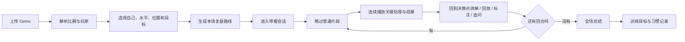

# CS2 AI Demo Coach 产品需求文档

> 版本：0.3
> 日期：2026-08-14
> 产品暂名：CS2 AI Demo Coach
> 技术实现依据：[ARCHITECTURE.md](./ARCHITECTURE.md)

## 1. 产品定义

本产品是一项由 AI 交付的 CS2 看 Demo 服务，目标是替代高手主播和教练按场收费的看 Demo 业务。

用户上传 Demo 后，产品不是先分析完再交付几条结论，也不是让用户自己浏览数据面板。产品会像真人教练共享屏幕看 Demo 一样，控制复盘节奏，陪用户从比赛开始看到比赛结束：

- 快速带过没有教学价值的部分；
- 在关键处理前约 1 秒进入片段，连续看完玩家的选择与结果；
- 自动回到决策点，还原当时局势与可用信息；
- 一次性说明玩家做了什么、问题在哪里，以及更好的选择；
- 必要时回放、画线、标点位，并在同一张全知 2D 地图上复查结果；
- 用相似职业回合作为补充证据；
- 回答用户针对当前画面的追问；
- 完整看完后，再总结习惯、优先问题和训练方向。

长期产品形态是一位坐在玩家旁边的私人 CS 教练，而不是一份赛后报告。

## 2. 产品愿景

让任何玩家都能随时获得一次接近真人高手看 Demo 的复盘体验，并且随着长期使用，教练会记住玩家的角色、打法、反复出现的坏习惯和已经改掉的问题。

理想状态下，用户不需要学习复杂数据，也不需要自己知道该看哪一回合。用户只需上传 Demo，然后跟着教练完成一次复盘。

## 3. 目标用户

### 3.1 核心用户

- 在 5E、完美、官匹或 Faceit 持续比赛；
- 已掌握基础枪法、点位和常用道具；
- 意识到自己存在决策、位置、时机或配合问题；
- 自己看 Demo 看不出问题，或觉得过于枯燥；
- 想购买主播/教练看 Demo，但认为价格、等待时间或服务稳定性不理想；
- 愿意用 15–40 分钟完成一次有引导的复盘。

### 3.2 延伸用户

- 需要提高看 Demo 交付效率的主播和教练；
- 高校、半职业战队及青训队；
- 希望系统学习特定位置或职业选手的内容创作者。

## 4. 用户核心任务

> 当我打完一场不知道自己为什么输、也不知道应该复盘什么时，我希望一名懂 CS 的教练陪我快速过完整场 Demo，在关键处停下来讲清楚，并在最后告诉我下一步最该改什么。

用户需要获得的不是“本场有三处错误”，而是一次完整的学习过程：

1. 看到问题发生前的局势；
2. 理解自己当时掌握的信息；
3. 识别自己做出的选择；
4. 理解该选择的风险和替代方案；
5. 在后续回合中观察同类问题是否再次出现；
6. 看完整场后形成对自身习惯的认识。

## 5. 产品定位

### 5.1 一句话定位

像高手主播一样，陪你从头到尾看一场 Demo 的 AI 教练。

### 5.2 与数据分析产品的区别

| 数据分析产品 | 本产品 |
|---|---|
| 上传后等待报告 | 解析后进入一场教练带看的复盘会话 |
| 用户自己浏览页面 | 教练主动控制节奏、暂停和跳转 |
| 以统计面板和问题列表为核心 | 以 Demo 画面、时间轴和讲解为核心 |
| 只展示结果 | 展示问题形成的上下文和决策过程 |
| 每个问题彼此独立 | 在整场比赛里追踪同一习惯是否反复出现 |
| 用户被动阅读 | 用户可以暂停、回看和追问当前局面 |
| 报告是主要交付物 | 复盘会话是主要交付物，总结只是收尾 |

### 5.3 与真人看 Demo 服务的关系

产品直接对标以下真人流程：

- 教练打开学员 Demo；
- 快进没有价值的部分；
- 在失误前后暂停和回放；
- 解释站位、信息、预判、道具、补枪和团队关系；
- 根据学员水平决定讲多深；
- 在后续回合指出重复问题；
- 最后归纳主要习惯和训练计划。

产品成功的标准不是分析指标更多，而是用户认为“这次就像有人认真帮我看完了 Demo”。

## 6. 核心产品原则

### 6.1 先看 Demo，后下结论

任何总结都必须来自用户刚刚经历过的复盘过程。系统不得用一页结论代替整场带看。

### 6.2 完整覆盖，选择性停留

“带用户过完整场”不等于逐秒播放。所有回合都必须出现在复盘路径中，但系统可以：

- 跳过冻结时间和无意义等待；
- 加速低价值移动；
- 用一句话概括普通回合；
- 深入讲解关键回合；
- 回到前面已讲过的相似问题。

系统必须让用户清楚知道跳过了什么以及为什么跳过，不能暗中遗漏整段比赛。

### 6.3 先看完整处理，再回到决策点

理想教学片段从玩家仍有选择的时刻前约 1 秒开始，并连续播放到这次处理的可验证结果结束。系统不在决策前打断，也不让用户先猜；片段结束后自动回到决策点，一次性展示当时局势、玩家实际动作与教练建议。不能只截取死亡瞬间，也不能用结果倒推当时不存在的信息。

### 6.4 画面是主界面

复盘时，Demo 画面或 2D 战术回放始终占据主要空间。教练窗口、字幕、证据和提问区域围绕画面服务，不能把体验退化成阅读文章。

### 6.5 事实、推断和建议分开

- 事实：Demo 中可直接验证的事件；
- 推断：角色、意图、信息状态和空间关系；
- 建议：结合教练规则和职业样本提出的替代方案。

系统必须对推断和不确定性保持诚实。

### 6.6 全知画面不等于全知教育

2D 地图为了让用户看懂局面，始终显示当前 tick 的全知回放；产品不向用户显式提供“玩家已知”模式。分析决策时仍只使用玩家当时看见、可靠共享或由事件合理推断的信息。完整敌人坐标可以出现在复盘画面，但不能进入决策侧规则/LLM并被假装成玩家当时知道。

### 6.7 职业案例是教学证据，不是唯一答案

职业案例用于回答“相似条件下高手通常如何处理”。职业多数行为不等于唯一最优解；缺少语音、战术和角色上下文时必须降低置信度。

### 6.8 一场复盘形成一条教学主线

系统不把十几个失误平铺展示，而要在观看过程中逐渐形成主题：例如重复 peek、拿到优势后继续找人、回防过早暴露、道具没有为队友创造价值。

## 7. 标准用户流程

### 7.1 上传

- 支持上传 Demo 或支持的压缩包；
- 显示支持的平台、地图、版本和文件限制；
- 显示解析进度和失败原因；
- 解析完成后让用户选择自己的玩家身份；
- 用户可以提供分段、常用位置、希望重点关注的问题。

### 7.2 复盘预处理

系统在用户进入会话前完成：

- 还原完整比赛时间轴；
- 识别所有回合与关键事件；
- 为每段时间计算教学价值；
- 找出适合回看和讲解的“决策前时刻”及完整结果窗口；
- 识别可能反复出现的行为；
- 准备职业相似局面和讲解证据；
- 生成复盘路线，而不是生成最终问题列表。

复盘路线把时间轴分为：

- **跳过**：没有与用户相关的教学内容；
- **带过**：需要知道上下文，但无需停留；
- **观察**：值得提醒，但不需要完整讲解；
- **深入讲解**：需要暂停、回放或对照；
- **习惯复查**：验证前面讲过的问题是否再次出现。

### 7.3 进入带看会话

会话启动时，教练用很短的开场说明：

- 本场地图、比分和用户角色；
- 预计复盘时长；
- 本次会重点关注哪些类型的时刻，但不提前泄露所有结论；
- 用户随时可以暂停、重播、继续或提问。

### 7.4 普通片段

对于低教学价值片段，系统可：

- 自动加速；
- 自动跳到下一事件；
- 用一句旁白说明当前回合发生了什么；
- 明确显示“跳过 42 秒无接触移动”等信息；
- 允许用户展开被略过的片段。

### 7.5 关键时刻

标准讲解节奏：

1. 从决策点前约 1 秒进入片段；
2. 不打断地播放用户真实选择和可验证结果；
3. 结果结束后自动回到决策点并暂停；
4. 同时展示“当前情况”“你做了什么”“教练分析”；
5. 标出玩家、队友、关键区域和风险枪线；
6. 说明一个优先动作及其触发条件，不要求用户先预测或作答；
7. 用户可以再看一遍、继续下一段或补充当时意图；
8. 必要时展示相似职业回合或职业行为分布；
9. 继续播放，并在后续验证是否重复发生。

每次讲解默认控制在 30–90 秒内。复杂问题可以更长，但不能把整个会话变成长篇文字课。

### 7.6 用户交互

用户在会话中可以：

- 暂停 / 继续；
- 前后跳转；
- 重放当前片段；
- 查看始终同步当前 tick 的全知 2D 地图；玩家信息边界由内部分析保证，不作为 UI 模式；
- 展开职业案例；
- 询问“这里为什么不能打”“队友没跟怎么办”“职业选手为什么能这样做”等当前局面问题；
- 告知系统当时存在语音、战术或个人意图；
- 标记讲解不准确或没有帮助。

问答只围绕当前片段、已解析证据和产品知识库回答。系统无法确认时必须明确表示不确定。

### 7.7 全场总结

完整带看结束后才生成总结。总结包括：

- 本场最值得保留的优点；
- 反复出现的行为模式；
- 已讲解问题之间的共同根因；
- 最优先改正的一个习惯；
- 下一场的一个主目标和最多两个检查点；
- 推荐的训练内容；
- 所有讲解节点的可回看目录。

总结不是新的独立分析，而是对用户刚刚看过内容的归纳。

## 8. 复盘会话界面

### 8.1 在线形态

- 左侧或中央：2D 战术回放；
- 底部：完整比赛时间轴、回合、讲解节点和被跳过区间；
- 右侧：教练讲解、当前证据、职业案例和提问框；
- 画面层：玩家轨迹、队友覆盖、枪线、道具、风险区域和标注；
- 顶部：玩家视角模式、播放速度、当前回合与本次复盘进度。

### 8.2 未来桌面形态

未来产品打开本机 CS2 Demo，主画面使用游戏自身的 3D 回放。产品以桌面侧边窗口或悬浮小窗存在，类似屏幕共享时右侧的教练窗口：

- 控制 Demo 暂停、继续、速度、回合和视角；
- 在关键时刻自动停下；
- 同步展示讲解、字幕、图示和职业案例；
- 允许用户使用游戏原生视角查看细节；
- 会话逻辑与在线 2D 版本一致，仅替换播放和标注适配层。

桌面形态只用于离线 Demo 复盘，不介入实时对局，不读取游戏进程内存，不提供比赛中的敌情提示。

## 9. 教练行为要求

### 9.1 讲解风格

- 像真人教练说话，先讲当前最重要的问题；
- 结合用户分段，不向低分玩家一次灌输过多职业队细节；
- 允许指出枪法失误，但重点解释决策是否合理；
- 不把结果不好自动判断为决策错误；
- 不因为玩家打赢了就忽略错误决策；
- 先说明上下文，再给替代方案；
- 后续回合复现同一问题时，引用前面的讲解。

### 9.2 证据要求

每个正式讲解节点必须关联：

- 用户 Demo 回合、时间和 tick；
- 玩家当时已知状态；
- 玩家实际动作；
- 可验证结果；
- 讲解依据：教练规则、职业样本或两者；
- 置信度与限制。

### 9.3 不允许的讲解

- 使用玩家当时未知的敌人位置批评玩家；
- 编造队友语音或战术；
- 只说“提高意识”“注意配合”等空话；
- 将职业样本相关性包装成因果结论；
- 为了增加讲解数量而重复同一问题；
- 使用未经输入或检索验证的选手、比赛、回合和数字。

## 10. 职业行为能力

职业行为库服务于带看会话，而不是单独的数据展示功能。

在关键节点，系统可以回答：

- 相似角色的职业选手通常选择保持、换位、后撤、前压还是转点；
- 哪些真实职业回合与当前局面最接近；
- 当前用户与职业案例在信息、队友覆盖和资源上的关键区别；
- 为什么职业选手可以做出看似激进、但当前用户不宜照搬的选择。

样本不足时，系统只展示个案或教练规则，不展示虚假的“职业共识”。

## 11. 长期个人记忆

产品在用户明确同意后，建立可控的个人教练记忆。原始 Demo 与回放仍保持本地优先；本轮 MVP 的跨 Demo 记忆使用 PostgreSQL 云端真相源，默认关闭，必须经过匿名 principal consent 明确开启。localhost 的无数据库模式仅提供明确标注的进程内临时存储，不冒充可恢复的长期记忆。

### 11.1 记忆内容

- 用户常用地图、角色、位置和打法偏好；
- 反复出现的坏习惯；
- 每个习惯的证据回合和首次/最近出现时间；
- 教练曾给出的训练目标；
- 后续比赛中是否改善、复发或已经稳定改掉；
- 用户对讲解的反馈和偏好；
- 用户主动补充的语音、战术或个人意图。

### 11.2 后续分析方式

新 Demo 复盘时，教练不只是找新问题，还会主动复查：

> 上次我们重点要求你在拿到人数优势后停止重复 peek。这场共有四个可观察样本，其中三个已经正确换位，一个再次前压死亡。这个习惯正在改善，但还没有稳定。

### 11.3 记忆原则

- 原始证据和教练结论分开保存；
- 单场表现不能直接固化为长期习惯；
- 只有跨场重复或用户确认后才提升习惯置信度；
- 用户可以查看、纠正和删除记忆；
- 云端跨 Demo 保存必须单独授权；当前 MVP 不提供正式账号恢复或跨匿名主体合并；
- 删除记忆后，不应继续影响后续讲解。

## 12. 完整能力范围

### 12.1 Demo 与播放

- 手工上传和平台自动导入；
- 完整比赛时间轴；
- 在线 2D 带看；
- 本机 CS2 Demo 控制与桌面教练窗口；
- 关键片段完整播放、自动回到决策点、重播和标注；
- 用户自定义播放和跳过策略。

### 12.2 分析与教学

- 决策、站位、信息处理、补枪、道具、经济、转点、残局和团队协同；
- 职业相似局面；
- 当前片段问答；
- 难度自适应讲解；
- 整场教学主线；
- 总结和训练计划；
- 跨场习惯追踪。

### 12.3 教练与商业化

- 通用 AI 教练；
- 与真人主播/教练合作的审核和风格版本；
- 单场付费、订阅和真人增强服务；
- 教练工作台和学员管理；
- 报告/片段分享，但不以报告代替带看会话。

## 13. 成功指标

### 13.1 核心体验指标

- 用户完成整场带看会话的比例；
- 用户实际观看的复盘时长；
- 深入讲解节点的完成率和重放率；
- 用户在讲解节点的追问率；
- 用户认为“像有人陪我看 Demo”的比例；
- 用户完成后能否准确复述首要坏习惯和下一场目标。

### 13.2 分析质量指标

- 关键讲解节点选择准确率；
- 客观事实错误率；
- 上帝视角信息泄漏率；
- 职业案例 Top-K 可比率；
- 教练对建议正确性和教学价值的评分；
- 严重误导性讲解比例；
- 用户反馈为准确、有帮助的节点比例。

### 13.3 商业指标

- 单场复盘的付费转化；
- 二次购买率；
- 完成第一次复盘后上传第二场 Demo 的比例；
- 与真人看 Demo 服务相比的用户偏好；
- 每场复盘的模型、计算和客服成本；
- 长期记忆启用后的留存和改善感知。

## 14. 关键风险

| 风险 | 产品影响 | 应对原则 |
|---|---|---|
| 自动跳过导致用户认为没有认真看 | 失去信任 | 时间轴完整可见，说明跳过原因，允许展开 |
| 停顿太多导致复盘冗长 | 完成率低 | 控制讲解密度，将同类问题串成主线 |
| 停顿太少退化成报告 | 核心体验缺失 | 为关键回合设置带看覆盖门槛 |
| 只截死亡瞬间评价 | 看不懂问题如何形成 | 从决策前约 1 秒连续播放完整处理，再回到决策点讲解 |
| 使用上帝视角 | 建议不公平 | 独立建模玩家已知信息 |
| 职业案例表面相似 | 误导用户 | 先硬过滤，显示差异和置信度 |
| 当前问答出现幻觉 | 破坏信任 | 限定当前片段证据，无法确认时拒答 |
| 桌面控制触发平台或安全风险 | 产品不可发布 | 只使用允许的 Demo 接口，独立合规审查 |
| 长期记忆把偶发失误固化为标签 | 错误教学 | 多场证据、置信度、用户纠正和删除 |
| 体验像网页课件而不像看 Demo | 无法替代主播 | 以播放器、节奏控制和连续讲解为核心验收 |

## 15. 产品验收标准

产品达到目标体验时，应满足：

1. 用户上传后进入的是复盘会话，而不是问题列表；
2. 所有回合都能在时间轴上看到，低价值片段可被明确跳过；
3. 关键节点从决策前约 1 秒连续播放到真实结果，结束后自动回到决策点统一讲解；
4. 用户可以针对当前画面追问并得到有证据的回答；
5. 后续回合会引用前面已经讲过的习惯；
6. 完整看完后才生成总结和训练目标；
7. 在线 2D 和未来本机 CS2 播放共享同一套复盘会话协议；
8. 启用个人记忆后，后续 Demo 能复查旧习惯是否改善；
9. 用户将其视为真人看 Demo 服务的可替代方案，而不是另一个数据网站。
